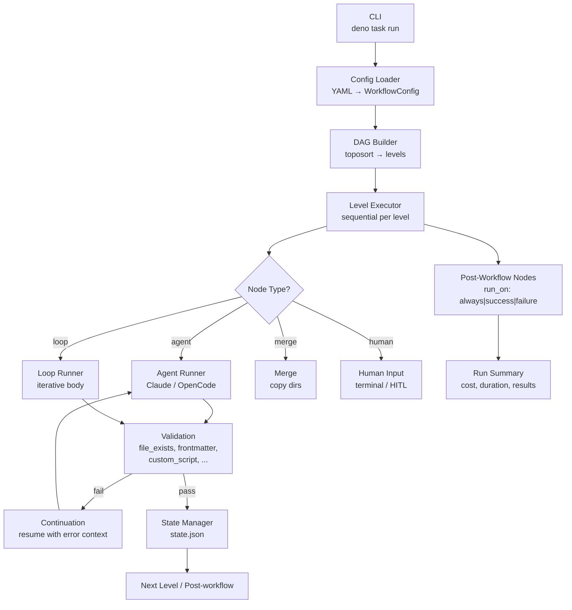
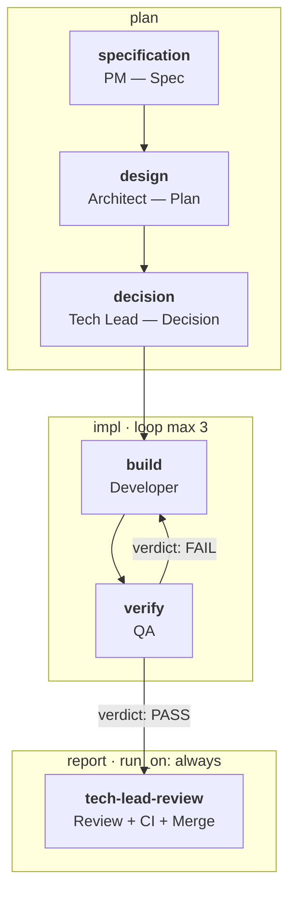

# flowai-workflow

Universal DAG-based engine for orchestrating AI agents. Define agent workflows as YAML configs — the engine handles execution, inter-agent communication, validation, loops, resume, and runtime selection.

## Install

### Via Deno (recommended)

Requires [Deno](https://deno.com/) 2.x.

```bash
deno install -g -A -n flowai-workflow jsr:@korchasa/flowai-workflow
```

The CLI checks JSR for newer versions on startup (fail-open, non-blocking).
Pass `--skip-update-check` to suppress the check.

### Pre-built binary

Grab the binary for your platform from [GitHub Releases](https://github.com/korchasa/flowai-workflow/releases/latest).

## Engine Architecture



## Core Concepts

The engine (Deno/TypeScript modules at repo root) reads a YAML workflow config and builds a directed acyclic graph (DAG) of nodes. Nodes are topologically sorted into levels and executed sequentially.

Four node types:

- **agent** — invokes the configured runtime (`claude` by default, `opencode` also supported)
- **merge** — combines outputs from multiple predecessor nodes
- **loop** — iterative body with frontmatter-based exit condition
- **human** — terminal prompt for manual input; agent-initiated HITL is supported on both Claude and OpenCode runtimes

Inter-agent communication uses structured Markdown artifacts in `<runs-dir>/<run-id>/[<phase>/]<node-id>/`, linked via `{{input.<node-id>}}` template variables. On validation failure, the engine resumes the agent in the same session with error context (continuation mechanism).

## Features

- **YAML-driven DAG** — declarative workflow definition, no hardcoded stage order
- **Domain-agnostic** — engine contains no git/GitHub/SDLC logic; any workflow expressible as a DAG
- **Workflow-independent** — engine does not reference concrete node names or artifact filenames; one engine, many workflows
- **Multi-runtime agents** — runtime selectable per workflow or per node: `claude` (default) or `opencode`
- **Loop nodes** — iterative cycles with configurable exit conditions and max iterations
- **HITL support** — human interaction nodes for manual decisions or approvals; agent-initiated HITL works on Claude and OpenCode
- **Validation** — rule-based checks per node (file_exists, file_not_empty, contains_section, custom_script, frontmatter_field)
- **Resume** — failed/interrupted runs resumable via `--resume <run-id>`; completed nodes skipped
- **Observability** — 4 verbosity levels (`-q` / default / `-s` / `-v`); status lines with timestamps; final summary

## Quick Start: New Project

Scaffold a ready-to-run workflow folder into an existing project in one
command:

```bash
cd your-project
flowai-workflow init
```

The wizard asks five questions (project name, workflow name — defaults to
`default`, default branch, test command, lint command) with autodetected
defaults read from `deno.json`, `package.json`, `go.mod`, `pyproject.toml`,
or `Cargo.toml`. On success, the bundled SDLC template (PM → Architect →
Tech Lead → Developer/QA loop → Tech Lead Review) is written into
`.flowai-workflow/<workflow-name>/`, ready for:

```bash
flowai-workflow run .flowai-workflow/<workflow-name>
```

The workflow folder path is a mandatory positional argument; there is
no autodetect.

### Workflow folder

Every workflow lives in its own self-contained directory:

```
.flowai-workflow/<name>/
    workflow.yaml          # required
    agents/agent-*.md      # required iff workflow.yaml references agent files
    memory/                # optional; agent-*.md gitignored (runtime state)
    scripts/               # optional
    runs/                  # generated, gitignored
    worktrees/             # generated, gitignored
```

Multiple workflows in one project: keep them as siblings under
`.flowai-workflow/`; each is fully isolated. `git mv` a folder to share
it with another repo — it carries everything it needs.

### Non-interactive init (CI)

```bash
cat > init-answers.yaml <<EOF
PROJECT_NAME: my-project
WORKFLOW_NAME: default
DEFAULT_BRANCH: main
TEST_CMD: npm test
LINT_CMD: npm run lint
EOF

flowai-workflow init --answers init-answers.yaml
```

### Hard dependencies

Init preflight verifies all of these before writing any files:

- `git` — version control.
- `gh` — GitHub CLI (issue triage, PR creation, merge).
- `claude` — Claude Code CLI (agent runtime).
- A `github.com` remote on `origin` (HTTPS, SCP-SSH, or URL-SSH).

Missing dependencies are reported together in a single summary so the
first run can be fixed in one pass. Init writes **only** inside
`.flowai-workflow/<workflow-name>/` — no native-IDE subagent registry
writes, no top-level `.gitignore` append, no files outside the target
directory. Run `flowai-workflow init --dry-run` to preview the file
list before committing.

### What's inside the template

The `sdlc-claude` template is framework-independent: generic agent
prompts with no hardcoded project-specific references. Review and tune
`.flowai-workflow/<workflow-name>/agents/agent-*.md` for your project
conventions after scaffold. A separate `flowai-workflow update`
command will pull upstream template changes in a future release —
metadata in `.flowai-workflow/.template.json` records the engine +
template version at init time for the diff.

## Quick Start

```bash
# Run a workflow
deno task run

# Pass additional context
deno task run --prompt "Focus on performance issues"

# Resume a failed/interrupted run
deno task run --resume <run-id>

# Dry run (validate config, show DAG, no execution)
deno task run --dry-run
```

## CLI Flags

```
flowai-workflow run <workflow> [OPTIONS]

Positional:
  <workflow>          Path to workflow folder containing workflow.yaml
                      (mandatory; no autodetect).

Options:
  --prompt <text>     Additional context passed to first agent
  --resume <run-id>   Resume a previous run (skip completed nodes)
  --dry-run           Validate config and show DAG without executing
  --skip <nodes>      Comma-separated node IDs to skip
  --only <nodes>      Run only specified nodes
  --env KEY=VAL       Set environment variable for the run
  -q                  Quiet output (minimal status)
  -s                  Show text output only (suppress tool calls)
  -v                  Verbose output (detailed agent diagnostics)
```

## Configuration

Workflow behavior is defined in a YAML config file. Key settings under `defaults:`:

- `runtime` — agent runtime: `claude` (default), `opencode`, or `cursor`
- `runtime_args` — extra CLI args forwarded to the selected runtime
- `max_continuations` — max agent re-invocations on validation failure (default: 3)
- `max_parallel` — concurrent node execution limit (default: 2)
- `timeout_seconds` — per-node timeout (default: 1800)
- `permission_mode` — permission mode override (Claude: full support; opencode/cursor: only `bypassPermissions`)
- `hitl` — Human-in-the-Loop config: `ask_script`, `check_script`, `poll_interval`, `timeout` (used by Claude directly and by OpenCode via injected local MCP)

Node-level overrides are supported for all defaults.

Minimal runtime example:

```yaml
defaults:
  runtime: opencode
  model: anthropic/claude-sonnet-4-5
  runtime_args: ["--variant", "high"]

nodes:
  build:
    type: agent
    label: Build
    prompt: "Implement the change and summarize the result."
```

## Example: SDLC Workflow

The engine is developed using its own SDLC workflow (dogfooding). This workflow automates the full software development lifecycle — from GitHub Issue triage to merged PR — via a chain of specialized AI agents.



Workflow config: `.flowai-workflow/<workflow-name>/workflow.yaml`

| Node | Phase | Role | Output |
|------|-------|------|--------|
| `specification` | plan | Project Manager — Specification | `01-spec.md` |
| `design` | plan | Architect — Design-Solution Plan | `02-plan.md` |
| `decision` | plan | Tech Lead — Decision + Branch + PR | `03-decision.md` |
| `implementation` | impl | Developer+QA loop (max 3 iterations) | implementation + `05-qa-report.md` |
| `tech-lead-review` | report | Tech Lead Review — Final Review + Merge (run_on: always) | `06-review.md` |

All 6 workflow agents are framework-independent Markdown files at
`.flowai-workflow/<workflow-name>/agents/agent-<role>.md`:

- `agent-pm` — Project Manager (specification)
- `agent-architect` — Architect (design-solution plan)
- `agent-tech-lead` — Tech Lead (decision & branch & PR)
- `agent-developer` — Developer (implementation)
- `agent-qa` — QA (verification)
- `agent-tech-lead-review` — Tech Lead Review (final review & merge)

## Project Structure

```
cli.ts, engine.ts, agent.ts, ... # DAG executor engine modules (root)
init/                            # Project scaffolder (`flowai-workflow init`)
repl/                            # Interactive REPL
scripts/                         # Dev tooling (check, compile, dashboard, release-notes)
.flowai-workflow/                # One folder per workflow (FR-S47)
  github-inbox/                  # Workflow folder = portable unit
    workflow.yaml
    agents/agent-*.md            # Agent prompts (per-workflow copy)
    memory/                      # reflection-protocol.md tracked; agent-*.md gitignored
    scripts/                     # HITL & hook scripts
    runs/                        # Per-run artifacts and state (gitignored)
    worktrees/                   # Isolated git worktrees (gitignored)
  github-inbox-opencode/         # Sibling workflow with different runtime
    …
documents/
  requirements-engine.md         # SRS — Engine scope
  requirements-sdlc.md           # SRS — SDLC Workflow scope
  design-engine.md               # SDS — Engine scope
  design-sdlc.md                 # SDS — SDLC Workflow scope
scripts/
  check.ts                       # Full verification: fmt, lint, test, gitleaks
```

## Installation

Download a pre-built binary from the [latest release](../../releases/latest) — no Deno required:

```bash
# Linux x86_64
gh release download --repo <owner>/flowai-workflow --pattern flowai-workflow-linux-x86_64
chmod +x flowai-workflow-linux-x86_64 && mv flowai-workflow-linux-x86_64 flowai-workflow

# macOS Apple Silicon
gh release download --repo <owner>/flowai-workflow --pattern flowai-workflow-darwin-arm64
chmod +x flowai-workflow-darwin-arm64 && mv flowai-workflow-darwin-arm64 flowai-workflow

# Verify
./flowai-workflow --version

# Run a workflow
./flowai-workflow run .flowai-workflow/<workflow-name>
```

Alternatively, run directly with Deno (see Prerequisites below).

## Prerequisites

- [Deno](https://deno.land/) runtime (required only if not using a pre-built binary)
- Docker / devcontainer (runtime environment)
- [Claude Code CLI](https://docs.anthropic.com/en/docs/claude-code) (`claude`) for Claude runtime
- [OpenCode CLI](https://opencode.ai/) (`opencode`) for OpenCode runtime
- [`gh` CLI](https://cli.github.com/) for GitHub API interaction (SDLC workflow)
- Git

## Development Commands

```bash
deno task run              # Run the workflow
deno task check            # Full verification: format, lint, test, gitleaks
deno task test             # Run all tests
deno task test:engine      # Run engine tests only
deno task fmt              # Format code
deno task run:validate     # Type-check engine modules
```

## Authentication

- **Claude Code CLI** — OAuth session (`claude login`) or `ANTHROPIC_API_KEY` env var
- **OpenCode CLI** — configured providers/models in local OpenCode config
- **`GITHUB_TOKEN`** — required for PR creation and issue comments (set manually or via `gh auth login`)

## License

Private project.
