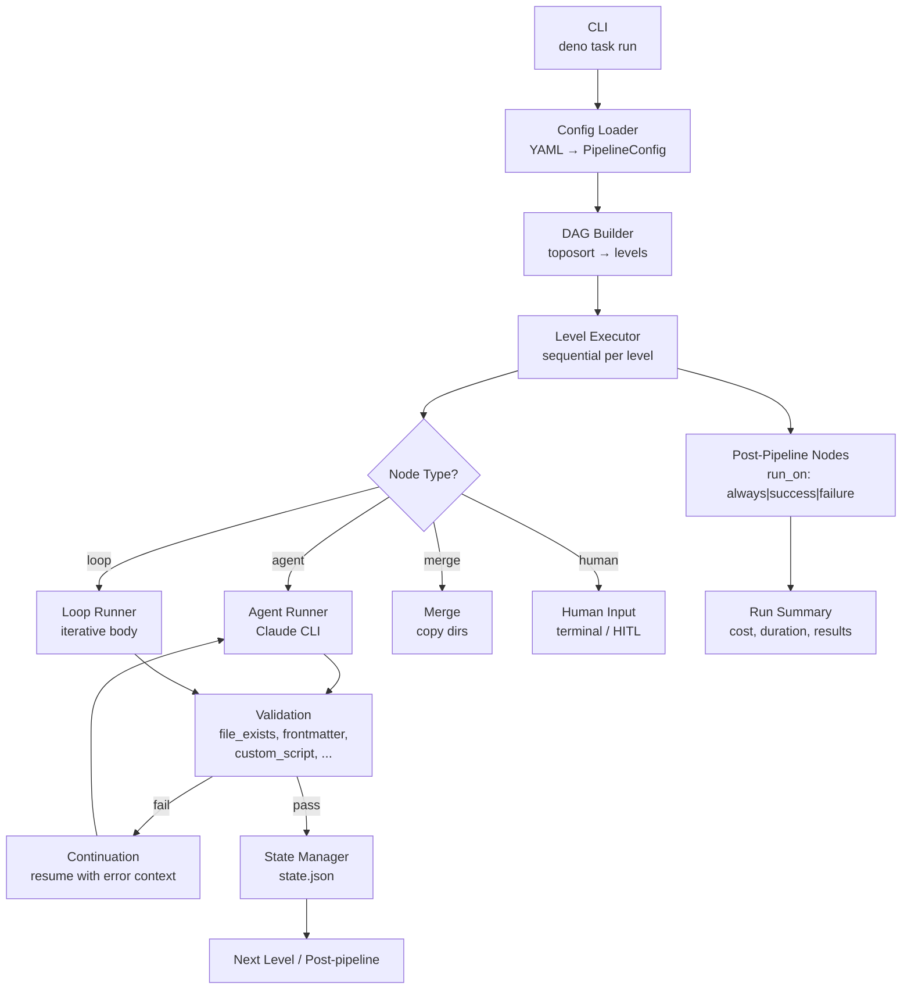
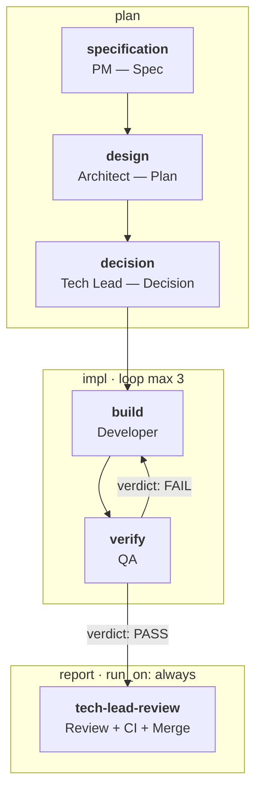

# auto-flow

Universal DAG-based engine for orchestrating AI agents. Define agent workflows as YAML configs — the engine handles execution, inter-agent communication, validation, loops, and resume.

## Engine Architecture



## Core Concepts

The engine (`engine/`, Deno/TypeScript) reads a YAML pipeline config and builds a directed acyclic graph (DAG) of nodes. Nodes are topologically sorted into levels and executed sequentially.

Four node types:

- **agent** — invokes Claude Code CLI with a role-specific prompt
- **merge** — combines outputs from multiple predecessor nodes
- **loop** — iterative body with frontmatter-based exit condition
- **human** — terminal prompt for manual input; supports Human-in-the-Loop (HITL) via GitHub issue comments

Inter-agent communication uses structured Markdown artifacts in `<runs-dir>/<run-id>/[<phase>/]<node-id>/`, linked via `{{input.<node-id>}}` template variables. On validation failure, the engine resumes the agent in the same session with error context (continuation mechanism).

## Features

- **YAML-driven DAG** — declarative pipeline definition, no hardcoded stage order
- **Domain-agnostic** — engine contains no git/GitHub/SDLC logic; any workflow expressible as a DAG
- **Pipeline-independent** — engine does not reference concrete node names or artifact filenames; one engine, many pipelines
- **Loop nodes** — iterative cycles with configurable exit conditions and max iterations
- **HITL support** — human interaction nodes for manual decisions or approvals
- **Validation** — rule-based checks per node (file_exists, file_not_empty, contains_section, custom_script, frontmatter_field)
- **Resume** — failed/interrupted runs resumable via `--resume <run-id>`; completed nodes skipped
- **Observability** — 4 verbosity levels (`-q` / default / `-s` / `-v`); status lines with timestamps; final summary

## Quick Start

```bash
# Run a pipeline
deno task run

# Pass additional context
deno task run --prompt "Focus on performance issues"

# Resume a failed/interrupted run
deno task run --resume <run-id>

# Dry run (validate config, show DAG, no execution)
deno task run --dry-run
```

## CLI Flags

```
deno task run [OPTIONS]

Options:
  --prompt <text>     Additional context passed to first agent
  --resume <run-id>   Resume a previous run (skip completed nodes)
  --dry-run           Validate config and show DAG without executing
  --config <path>     Custom pipeline config (default: .auto-flow/pipeline.yaml)
  --skip <nodes>      Comma-separated node IDs to skip
  --only <nodes>      Run only specified nodes
  --env KEY=VAL       Set environment variable for the run
  -q                  Quiet output (minimal status)
  -s                  Show text output only (suppress tool calls)
  -v                  Verbose output (detailed agent diagnostics)
```

## Configuration

Pipeline behavior is defined in a YAML config file. Key settings under `defaults:`:

- `max_continuations` — max agent re-invocations on validation failure (default: 3)
- `max_parallel` — concurrent node execution limit (default: 2)
- `timeout_seconds` — per-node timeout (default: 1800)
- `hitl` — Human-in-the-Loop config: `ask_script`, `check_script`, `poll_interval`, `timeout`

Node-level overrides are supported for all defaults.

## Example: SDLC Pipeline

The engine is developed using its own SDLC pipeline (dogfooding). This pipeline automates the full software development lifecycle — from GitHub Issue triage to merged PR — via a chain of specialized AI agents.



Pipeline config: `.auto-flow/pipeline.yaml`

| Node | Phase | Role | Output |
|------|-------|------|--------|
| `specification` | plan | Project Manager — Specification | `01-spec.md` |
| `design` | plan | Architect — Design-Solution Plan | `02-plan.md` |
| `decision` | plan | Tech Lead — Decision + Branch + PR | `03-decision.md` |
| `implementation` | impl | Developer+QA loop (max 3 iterations) | implementation + `05-qa-report.md` |
| `tech-lead-review` | report | Tech Lead Review — Final Review + Merge (run_on: always) | `06-review.md` |

All 7 pipeline agents are also available as Claude Code slash commands via `.auto-flow/agents/agent-<name>/SKILL.md`:

- `/agent-pm` — Project Manager (specification)
- `/agent-architect` — Architect (design-solution plan)
- `/agent-tech-lead` — Tech Lead (decision & branch & PR)
- `/agent-developer` — Developer (implementation)
- `/agent-qa` — QA (verification)
- `/agent-tech-lead-review` — Tech Lead Review (final review & merge)
- `/agent-meta-agent` — Meta-Agent (prompt optimization)

## Project Structure

```
engine/                          # DAG executor engine (Deno/TypeScript)
.auto-flow/
  pipeline.yaml                  # SDLC pipeline config (example)
  agents/                        # Agent prompts (symlinked from .claude/skills/)
    agent-pm/SKILL.md
    agent-architect/SKILL.md
    agent-tech-lead/SKILL.md
    agent-developer/SKILL.md
    agent-qa/SKILL.md
    agent-tech-lead-review/SKILL.md
    agent-meta-agent/SKILL.md
  runs/                          # Per-run artifacts and state
  scripts/                       # HITL scripts
documents/
  requirements-engine.md         # SRS — Engine scope
  requirements-sdlc.md           # SRS — SDLC Pipeline scope
  design-engine.md               # SDS — Engine scope
  design-sdlc.md                 # SDS — SDLC Pipeline scope
scripts/
  check.ts                       # Full verification: fmt, lint, test, gitleaks
```

## Installation

Download a pre-built binary from the [latest release](../../releases/latest) — no Deno required:

```bash
# Linux x86_64
gh release download --repo <owner>/auto-flow --pattern auto-flow-linux-x86_64
chmod +x auto-flow-linux-x86_64 && mv auto-flow-linux-x86_64 auto-flow

# macOS Apple Silicon
gh release download --repo <owner>/auto-flow --pattern auto-flow-darwin-arm64
chmod +x auto-flow-darwin-arm64 && mv auto-flow-darwin-arm64 auto-flow

# Verify
./auto-flow --version

# Run a pipeline
./auto-flow --config .auto-flow/pipeline.yaml
```

Alternatively, run directly with Deno (see Prerequisites below).

## Prerequisites

- [Deno](https://deno.land/) runtime (required only if not using a pre-built binary)
- Docker / devcontainer (runtime environment)
- [Claude Code CLI](https://docs.anthropic.com/en/docs/claude-code) (`claude`)
- [`gh` CLI](https://cli.github.com/) for GitHub API interaction (SDLC pipeline)
- Git

## Development Commands

```bash
deno task run              # Run the pipeline
deno task check            # Full verification: format, lint, test, gitleaks
deno task test             # Run all tests
deno task test:engine      # Run engine tests only
deno task fmt              # Format code
deno task run:validate     # Type-check engine modules
```

## Authentication

- **Claude Code CLI** — OAuth session (`claude login`) or `ANTHROPIC_API_KEY` env var
- **`GITHUB_TOKEN`** — required for PR creation and issue comments (set manually or via `gh auth login`)

## License

Private project.
