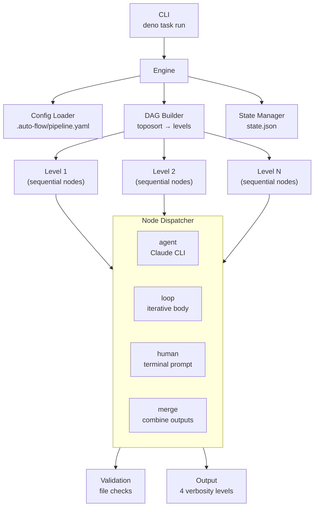

# SDS: Engine

## 1. Intro

- **Purpose:** Implementation details for the domain-agnostic DAG pipeline
  engine.
- **Rel to SRS:** Implements FRs from `documents/requirements-engine.md`.

## 2. Architecture

- **Diagram:**

### 2.1 Configurable Node Engine (Deno/TypeScript)



- **Subsystems:**
  - **Pipeline Engine** (`engine/`): Deno/TypeScript DAG-based executor
    with YAML config, template interpolation, sequential levels, loop nodes,
    human nodes, resume support
  - **Artifact Store**: Git-tracked files in `.auto-flow/runs/<run-id>/[<phase>/]<node-id>/`
    (phase subdir present when node has `phase` field in config)
  - **Validation Engine**: Rule-based checks (file_exists, file_not_empty,
    contains_section, custom_script, frontmatter_field)
  - **Continuation Engine**: `--resume` based re-invocation on validation
    failure or safety-check violation (shared `max_continuations` budget)

## 3. Components

### 3.1 Pipeline Engine (`engine/`)

- **Purpose:** Configurable DAG-based pipeline executor. Replaces hardcoded
  shell script orchestration with YAML-driven node graph.
- **Modules:**
  - `types.ts` — type declarations (incl. `ValidationRule.type` union
    (`"artifact"` added — FR-E33: composite rule with `sections?: string[]`;
    `"scope_check"` added — FR-E37: internal-only, engine auto-injects when
    `allowed_paths` present, not user-configured in YAML),
    `NodeConfig.allowed_paths` (`string[]`, optional — FR-E37: glob patterns
    defining allowed file modifications for scope-based detection),
    `NodeConfig.run_on` (`"always"|"success"|"failure"`), `NodeConfig.phase`,
    `NodeConfig.env`, `NodeConfig.model` (per-node Claude model override),
    `PipelineDefaults.model` (default model for all nodes),
    `LoopNodeConfig.nodes` (inline body node definitions),
    `LoopResult.bodyResults`, `ErrorCategory` (structured failure enum),
    `NodeState.error_category`, `NodeState.cost_usd` (FR-32 per-node cost),
    `RunState.total_cost_usd` (FR-32 aggregated run cost),
    `PipelineDefaults.on_failure_script` (FR-34 configurable failure hook),
    `PipelineDefaults.prepare_command` (FR-E30 post-config/pre-node shell hook),
    `HitlConfig.artifact_source` (renamed from `issue_source`),
    `HitlConfig.exclude_login` (renamed from `bot_login`),
    `Verbosity` union: `"quiet"|"normal"|"semi-verbose"|"verbose"` (FR-41))
  - `template.ts` — `{{var}}` interpolation for prompts/paths.
    `resolve()` handles `file("path")` pattern within `{{...}}` matches
    (FR-E32): detects `/^file\("(.+)"\)$/`, reads file via
    `Deno.readTextFileSync()` relative to `Deno.cwd()`, returns content
    as-is (no re-interpolation — single-pass). Missing file → throw with
    diagnostic. Size > `FILE_INCLUSION_SIZE_WARN_BYTES` (100KB) →
    `console.warn()` (non-fatal).
    `validateTemplateVars(template: string, knownInputs: string[]): string[]`
    (FR-E7): extracts all `{{...}}` patterns, validates each against known
    prefixes (`input` — suffix ∈ `knownInputs`, `env`, `args`, `loop` —
    only `loop.iteration`) and direct keys (`run_dir`, `run_id`, `node_dir`).
    `file("...")` accepted. Unknown prefix/key → error string. Returns error
    array (empty = valid). Pure function, no I/O. Co-located with `resolve()`
    to maintain single source of truth for valid template variables
  - `config.ts` — YAML parsing, schema validation, defaults merge,
    `run_on` normalization. `extractPreRun()`: lightweight pre-parse
    extracting only `pre_run` field for two-phase loading (FR-E24). `validateNode()`: if `run_on` present, must be
    one of `"always"|"success"|"failure"`; error:
    `Node '<id>' has invalid run_on value '<val>'. Must be one of: always, success, failure`.
    `validateFileReferences(config)` (FR-E32): scans all `task_template`
    and `prompt` fields (incl. loop body nodes) for `{{file("...")}}` regex,
    checks file existence via `Deno.statSync()`. Skips paths containing `{{`
    (unresolvable at load time). Called from `mergeDefaults()` alongside
    `validatePromptPaths()`.
    **Hook template variable validation (FR-E7):** In `validateNode()`, after
    existing type-specific checks: calls `validateTemplateVars()` (imported
    from `template.ts`) on `node.before` and `node.after` strings. Passes
    `allNodeIds` as `knownInputs` (for top-level nodes) or
    `[...allNodeIds, ...bodyNodeIds]` (for loop body nodes — can reference
    both external and sibling nodes). Errors formatted with hook type
    (`before`/`after`) and node ID. Non-empty errors → config validation
    error at load time (fail-fast).
    `validateAllowedPaths()` (FR-E37): when `allowed_paths` present on node,
    validates array of non-empty strings. Invalid → config error at parse time.
    Called from `validateNode()`.
    `validateValidationRule()` (FR-E33, FR-E38): `"artifact"` added to
    `validTypes`. When `type === "artifact"`: at least one of `sections` or
    `fields` required (both optional individually). `sections` validated as
    non-empty string array when present. `fields` validated as non-empty
    string array (no empty strings) when present. Missing both → config error.
    Invalid entries → config error at parse time.
    **Phase mutual-exclusivity validation (FR-E33):** After existing `phases:`
    block structure validation (~line 128), new pass iterates all nodes checking
    for `phase:` field while `config.phases` is defined. If both mechanisms
    detected: throws diagnostic error naming both mechanisms and ≥1 affected
    node ID. Format: `"Config uses both 'phases' block and per-node 'phase'
    field (node '<id>'). Use one mechanism only."`. Runs in `mergeDefaults()`
    alongside existing validation passes.
    `normalizeRunOn()` pass (in `mergeDefaults()`):
    if `node.run_always === true && !node.run_on` → sets `run_on = "always"`;
    if both present, `run_on` wins; deletes `run_always` from config
    post-normalization (downstream code only sees `run_on`).
    Loop nodes: parses `nodes` sub-object, validates body node ordering
    (>1 entry requires `inputs` declarations), validates `condition_node`
    references valid key in `nodes`. Skips top-level existence check for
    body node IDs referenced in `inputs`.
    **Loop input forwarding validation (FR-E35):** After body node validation
    loop (~line 261-271), iterates each body node's `inputs`. For each input
    NOT in `bodyNodeIds` (external reference), checks presence in
    `node.inputs ?? []` (loop node's declared inputs). Missing → throws:
    `"Loop '<loopId>' body node '<bodyId>' references external input(s)
    [<missing>] not listed in loop inputs"`. Runs inline in `validateNode()`
    loop branch — no new function or signature change. `node.inputs` accessed
    directly from the loop node object already in scope.
    **Loop condition_field validation (FR-E36):** After FR-E35 input forwarding
    check, inspects condition node's `validate` array for a `frontmatter_field`
    rule whose `field` matches `condition_field`. If condition node HAS a
    `validate` block but NO matching `frontmatter_field` rule → throws:
    `"Loop '<id>' condition_field '<field>' is not declared as a
    frontmatter_field in condition node '<condId>' validate block"`. If
    condition node has no `validate` block at all → skip (no contract to
    enforce). Inline in `validateNode()` loop branch — consistent with FR-E35
    pattern. No new function or signature change.
  - `dag.ts` — topological sort, cycle detection, level grouping.
    Excludes loop body nodes (from `nodes` sub-object) from top-level
    graph; loop node itself remains in DAG with its declared `inputs`.
  - `validate.ts` — artifact validation rules (file_exists, not_empty,
    contains_section, custom_script, frontmatter_field, artifact).
    `checkArtifact(path, sections, fields)` (FR-E33, FR-E38): self-contained
    private function. Stat → read → heading-regex loop → field-presence check
    → aggregate. Fail-fast order: absent file → empty file → missing sections
    → missing/empty fields. All missing sections collected into one aggregate
    `ValidationResult`. Heading regex duplicated from `checkContainsSection()`
    (~1 line) — intentional. Frontmatter field presence: parse frontmatter via
    `^---\n([\s\S]*?)\n---` regex (same approach as `checkFrontmatterField`),
    extract key-value pairs, check each `fields` entry exists with non-empty
    value. Missing/empty fields aggregated into single error. Regex duplication
    intentional — distinct semantic context (presence-only vs value-constraint)
  - `state.ts` — RunState persistence to `state.json`, resume logic,
    phase registry (`setPhaseRegistry()`, `getPhaseForNode()`,
    `clearPhaseRegistry()` — see §3.2),
    cost aggregation (`updateRunCost()` sums
    `nodes[*].cost_usd` → `total_cost_usd`; called from
    `markNodeCompleted()` when optional `costUsd` param provided, FR-32).
    `markNodeCompleted()` also accepts optional `result?: string` param
    (FR-E22) — persists excerpt to `NodeState.result` in `state.json`
  - `agent.ts` — Claude CLI invocation, continuation loop, retry.
    ADR-001: `--system-prompt-file` replaces base system prompt (~5-7K dead
    tokens eliminated). Useful base prompt sections replicated in pipeline
    shared-rules.md.
    `AgentRunOptions.model` and `InvokeOptions.model`: optional string for
    per-node model selection. `buildClaudeArgs()` emits `--model <value>` when
    `opts.model` is set AND `opts.resumeSessionId` is NOT set (resume inherits
    original model from session). Resolution: `node.model ?? defaults.model ??
    undefined` (computed in engine.ts/loop.ts, passed as field).
    `executeClaudeProcess()` uses `--output-format stream-json` and reads
    stdout line-by-line. Each JSON line appended to `streamLogPath` file
    (crash-resilient incremental write via `Deno.writeFile({ append: true })`).
    **Stream log timestamps (FR-33):** `tsPrefix()` returns `[HH:MM:SS]`
    wall-clock prefix; `stampLines()` prepends it to each non-empty line (empty
    lines pass through). Applied to log file writes only — terminal output via
    `onOutput` callback receives raw text without timestamps.
    On `result` event: extracts `ClaudeCliOutput` fields (`result`,
    `session_id`, `is_error`, `total_cost_usd`, `duration_ms`,
    `duration_api_ms`, `num_turns`, `permission_denials`). `is_error` derived
    from `subtype !== "success"`. No `result` event → throws descriptive error.
    `streamLogPath` accepted as required parameter in `executeClaudeProcess()`.
    Append semantics: multiple invocations (continuation) with same path
    produce concatenated JSONL. `--verbose` flag removed from
    `buildClaudeArgs()` (unrelated to streaming, changes stderr globally).
    **Repeated file read warning (FR-39):** `FileReadTracker` class in
    `agent.ts`. `track(path): string | null` — maintains `Map<string, number>`,
    returns `[WARN] repeated file read: <path> (<N> times)` when count >
    threshold (default 2), else null. Instantiated per `executeClaudeProcess()`
    call (counter resets per invocation). In event loop: for `tool_use` blocks
    with `name === "Read"`, calls `tracker.track(block.input.file_path)`. Non-
    null result written to `logFile` via `stampLines()`. Log-file-only (terminal
    `onOutput` unchanged). Pure-logic class — unit-testable without I/O.
    **Turn separators and summary footer (FR-40):** `executeClaudeProcess()`
    maintains `turnCount` counter. On each `event.type === "assistant"`:
    increments counter, writes `--- turn N ---` line to `logFile` via
    `stampLines()` (timestamped, consistent with existing log writes). After
    `result` event extraction: writes `--- end ---` + one-line summary via
    `formatFooter(output: ClaudeCliOutput): string`. Footer format:
    `status=<ok|error> duration=<X>s cost=$<Y> turns=<N>`. Both separators and
    footer are log-file-only (terminal `onOutput` callback unchanged).
    `formatFooter()` is a pure function — unit-testable without CLI.
    **Stream event processor extraction (FR-E30):** `processStreamEvent(event,
    state): Promise<void>` — extracted helper consolidating duplicated event-
    processing logic from main loop and buffer-remainder block in
    `executeClaudeProcess()`. Receives parsed JSON event + mutable
    `StreamProcessorState` bag (`turnCount`, `resultEvent`, `tracker:
    FileReadTracker`, `logFile`, `encoder`, `onOutput?`, `verbosity?`).
    Performs: turn counting + separator writing, file-read tracking (warns on
    repeated reads), result event extraction, log file writes via `stampLines()`,
    footer generation via `formatFooter()`, terminal output forwarding via
    `onOutput` callback (with optional semi-verbose filtering). Both call sites
    in `executeClaudeProcess()` reduce to: parse JSON → `await
    processStreamEvent(parsed, state)`. Net ~40-line reduction. Pure-ish
    function — unit-testable with synthetic events, no CLI spawn.
    **Repeated file read warning (FR-40):** `executeClaudeProcess()` maintains
    `readCounts: Map<string, number>` tracking per-path `Read` tool-use events.
    On each `assistant` event: iterates `message.content` blocks, detects
    `tool_use` with `name === "Read"`, extracts `input.file_path`, increments
    count. When count > 2: writes warning to `logFile` via `stampLines()`.
    `checkRepeatedRead(readCounts, filePath): string | null` — helper: increments
    map, returns formatted warning when count > 2, else null.
    `formatRepeatedReadWarning(path, count): string` — pure function returning
    `[WARN] repeated file read: <path> (<N> times)`. Exported for unit testing.
    Warning is log-only (no `onOutput` callback). Counters reset per invocation
    (map is local to `executeClaudeProcess()` call). Execution not blocked.
    **Semi-verbose filtering (FR-41):** `formatEventForOutput(event,
    verbosity?)` accepts optional `Verbosity` param. When
    `verbosity === "semi-verbose"`, skips `tool_use` content blocks in
    `assistant` events — emits only `text` blocks. Default `undefined` =
    all blocks (backward-compatible). Log file writes call without verbosity
    (full output preserved). `onOutput` callback path passes verbosity from
    `AgentRunOptions` so terminal output is filtered at source
  - `loop.ts` — loop node execution with condition extraction, per-iteration
    `AgentResult` accumulation into `LoopResult.bodyResults`.
    `buildLoopBodyOrder()` reads from inline `nodes` sub-object (replaces
    `body` array), topo-sorts body nodes by their `inputs` declarations.
    `buildContext()` resolves `inputs` against both sibling body nodes and
    top-level nodes. Accepts `streamLogPath` pattern from engine; computes
    iteration-qualified path `${nodeId}-iter-${i}.jsonl` per body node
    invocation; forwards to inner `runAgent()` calls.
    **Runtime condition_field presence check (FR-E36):**
    `extractConditionValue()` — after search loop completes, if return value
    is `undefined`, throws:
    `Error("Loop '<loopId>': condition_field '<field>' not found in condition
    node '<condId>' output at '<nodeDir>'")`. Requires `loopId` threaded
    through call (closure capture or param addition). Prevents silent undefined
    behavior on missing field — fail-fast at first loop iteration
  - `hitl.ts` — HITL detection (`detectHitlRequest`) and poll loop
    (`runHitlLoop`); injectable `scriptRunner`/`claudeRunner` for testing
  - `human.ts` — terminal user input, abort logic
  - `scope-check.ts` — scope-based file modification detection (FR-E37).
    Exports:
    - `snapshotModifiedFiles(): Promise<Set<string>>` — runs
      `git diff --name-only HEAD` + `git ls-files --others --exclude-standard`.
      Returns combined set of modified/untracked files relative to repo root.
    - `findViolations(before: Set<string>, after: Set<string>, allowedPaths: string[]): string[]`
      — pure function. Computes `after − before` (new modifications since
      snapshot), filters against `allowedPaths` globs. Returns violation paths
      (empty = no violations). Glob matching via path prefix or pattern.
    Integration: `agent.ts` calls `snapshotModifiedFiles()` before each
    `invokeClaudeCli()` when `node.allowed_paths` exists. After invocation,
    snapshots again, calls `findViolations()`. Violations → synthetic
    `ValidationResult` (type `scope_check`, failed) injected into validation
    results array. Shares `max_continuations` budget with artifact validation.
    Skipped entirely when `allowed_paths` undefined on node (AC #1).
    Pre-existing uncommitted changes excluded by before/after diff (AC #5).
    Sub-second latency for ≤1000 tracked files (AC #6) — git index-based.
  - ~~`git.ts`~~ — **deleted** (FR-29: domain-specific git code removed from
    engine). Functions relocated to `.auto-flow/scripts/rollback-uncommitted.sh`.
    Failure handling replaced by configurable `on_failure_script` hook
  - `output.ts` — terminal output manager (quiet/normal/semi-verbose/verbose),
    verbose methods for detailed agent-node diagnostics.
    `nodeOutput()` gate: shown when `verbosity === "verbose"` or
    `verbosity === "semi-verbose"`. In semi-verbose, tool-call lines already
    excluded upstream by `formatEventForOutput()` — `nodeOutput()` passes
    through whatever it receives.
    `dryRunPlan(levels, labels, postPipelineNodeIds?, runOnMap?)`: renders
    regular DAG levels, then optional "Post-pipeline" section listing `run_on`
    nodes with their conditions (FR-28).
    `nodeResult(nodeId, output: ClaudeCliOutput)`: multi-line agent result
    display (FR-E15). Guarded by `verbosity !== "quiet"`. Format:
    line 1: `[HH:MM:SS] <nodeId padded>  RESULT:` (header),
    lines 2..N: each non-empty line of `output.result` indented 2 spaces,
    last line: `  cost=$X.XXXX | duration=Xs | turns=N` (footer).
    `extractResultExcerpt()` removed — excerpt logic inlined at state-
    persistence call sites in `engine.ts` and `node-dispatch.ts`.
    `RunSummary.nodeResults?: Record<string, string>` (FR-E22): optional
    per-node result excerpts. `summary()` renders per-node result lines after
    "Nodes:" when `nodeResults` present: `  <nodeId padded>  <excerpt>`.
    Imports `ClaudeCliOutput` from `types.ts`
  - `node-dispatch.ts` — node-type executor dispatch module (FR-E30).
    Exports `EngineContext` interface (parameter bag: `config`, `state`,
    `output`, `options`, `userInput`, `buildContext()`, `saveState()`) and
    4 free functions: `executeAgentNode()` (agent invocation, HITL check,
    log save), `executeMergeNode()` (directory copy), `executeLoopNode()`
    (loop delegation + callbacks), `executeHumanNode()` (terminal prompt),
    plus `copyDir()` utility. Enables `engine.ts` to act as pure orchestrator
    by delegating all node-type-specific logic to this module.
  - `engine.ts` — main orchestrator: config loading, state management,
    level iteration, delegation to `node-dispatch.ts` executors (FR-E30),
    node result summary display (FR-E15/E22),
    phase registry init via `setPhaseRegistry(config)` at engine startup,
    pre-post-pipeline `on_failure_script` execution.
    Two-phase config loading (FR-E24): `run()` reads raw YAML →
    `extractPreRun()` → `runPreRunScript()` if present → `loadConfig()`
    re-reads (potentially updated) config.
    **Pipeline Prepare Command (FR-E30):** `runPrepareCommand(cmd, runDir,
    runId, env, args, output): Promise<void>` — exported free function.
    Builds pipeline-level `TemplateContext` (`node_dir: ""`, `input: {}`,
    real `run_dir`/`run_id`/`env`/`args`), calls `interpolate()` from
    `template.ts`, executes via `Deno.Command("sh", ["-c", interpolated])`.
    Non-zero exit throws → caught by `run()` → state saved → pipeline aborts.
    Call site: `runWithLock()`, after `ensureRunDirs()` + `saveState()`,
    before level loop. Guarded by `!this.options.resume && cmd` (skipped on
    resume — environment already prepared by original run).
    `executeNode()`: passes `extractResultExcerpt(result.output.result)` to
    `markNodeCompleted()` as `result` param (FR-E22).
    `executeLoopNode()`: passes result excerpt in `onNodeComplete` callback.
    `printSummary()`: builds `nodeResults` from `state.nodes[*].result`,
    passes to `summary()` for per-node result rendering.
    Dry-run path (FR-28): applies `collectPostPipelineNodes()` +
    `sortPostPipelineNodes()` + level filtering before calling
    `dryRunPlan()`, passing filtered levels and post-pipeline node IDs with
    `run_on` conditions — mirrors normal execution path's filtering logic.
    On config load: iterates all nodes; for loop nodes with `nodes`
    sub-object, flattens nested body node IDs into master ID list passed
    to `createRunState()` (ensures state.json tracks both top-level and
    nested body node IDs).
    Computes `streamLogPath = ${runDir}/logs/${nodeId}.jsonl` for each agent
    node; passes to `runAgent()`. For loop nodes: passes path pattern to
    loop executor for iteration-qualified derivation
  - `cli.ts` — CLI entry point: argument parsing, .env loading.
    `VERSION` constant: `Deno.env.get("VERSION") ?? "dev"` — injected at
    compile time via `deno compile --env VERSION=<tag>`. `--version` / `-V`
    flag: prints `auto-flow <VERSION>` and exits (FR-E39). Added to
    `parseArgs()` alongside existing `--help`
  - `mod.ts` — barrel re-export serving as `deno doc --lint` entry point
    (not a runtime public API; sole non-redundant consumer is
    `scripts/check.ts` JSDoc validation)
- **Module JSDoc and Why-Comments (FR-E30):** All 6 engine modules require
  module-level `/** @module */` JSDoc (purpose, responsibility, deps) and
  function-level JSDoc on exported functions. 4 complex functions require
  inline `// Why:` comments explaining non-obvious design decisions:
  (1) `runAgent()` in `agent.ts` — continuation/resume semantics with shared
  session_id; (2) `validateNode()` in `config.ts` — recursive validation with
  dual input-ID namespace; (3) `mergeDefaults()` in `config.ts` — 3-tier
  cascade order and legacy normalization; (4) `checkFrontmatterField()` in
  `validate.ts` — regex-over-YAML-parser for partial-document handling.
- **Legacy Test Task Removal (FR-E29):** Verified complete. No `test:*` tasks
  referencing `.auto-flow/scripts/stage-*_test.ts` remain in `deno.json`. No "Stage
  Scripts" section in SDS (§3.2 is Phase Registry). No `.auto-flow/scripts/stage-*`
  references in this document. Current valid test tasks: `test`, `test:lib`,
  `test:engine`.
- **Test Suite Integrity (FR-E27):** Every `engine/` test function must
  contain ≥1 explicit assertion. `lock_test.ts` "releaseLock — no error if
  lock file already removed" test: `assertEquals(result, undefined)` +
  `Deno.stat` file-absence verification (asserting `NotFound` error).
  Pattern consistent with adjacent test at line 122-138.
- **`scripts/check.ts` CLI help (FR-E23):** `printUsage()` static function
  outputs: description of checks performed, usage line, note about no accepted
  options, example. `--help`/`-h` in `Deno.args` → `printUsage()` +
  `Deno.exit(0)`. Any other arg → error referencing `--help` + `Deno.exit(1)`.
  Follows `engine/cli.ts` format. Exported `printUsage()`/`checkArgs()` for
  unit testing
- **Interfaces:**
  - CLI: `deno task run [--prompt <text>] [--config <path>] [--resume <run-id>]
    [--dry-run] [-v|-s|-q] [--env KEY=VAL] [--skip nodes] [--only nodes]
    [--version|-V]`
  - Config: `.auto-flow/pipeline.yaml` (YAML, version "1")
  - State: `.auto-flow/runs/<run-id>/state.json` (JSON)
- **Node types:** `agent`, `merge`, `loop` (with inline `nodes` sub-object
    for body node definitions), `human`
- **Node flags:**
  - `run_on?: "always" | "success" | "failure"` — execution condition for
    post-pipeline nodes. When set, node is excluded from DAG levels and executes
    in a post-pipeline step after all DAG levels complete:
    - `"always"` — execute regardless of pipeline outcome.
    - `"success"` — execute only if pipeline succeeded.
    - `"failure"` — execute only if pipeline failed. Skipped nodes get
      `markNodeSkipped()` status.
    Backward compat: `run_always: true` in YAML normalized to `run_on: "always"`
    by config loader (see `config.ts` normalization). `run_always` deleted
    post-normalization — not visible to engine runtime.
  - `phase?: string` — optional phase grouping label (e.g., `plan`, `impl`,
    `report`). When set, node artifacts are stored under
    `<run-dir>/<phase>/<node-id>/` instead of `<run-dir>/<node-id>/`. User-
    defined (no enum constraint). Validated: must be non-empty string if present.
    Backward-compatible: omitting `phase` preserves flat layout.
  - `env?: Record<string, string>` — optional node-level environment variables.
    Merged with global env (node-level overrides global defaults). Accessible
    in template context via `{{env.<key>}}`.
  - `model?: string` — per-node Claude model override (FR-27, implemented).
    Overrides `defaults.model`. Absent = defaults.model or CLI default (no flag).
    Emitted as `--model <value>` on initial invocations only; `--resume` calls
    exclude `--model` (session inherits original). Resolution chain:
    `node.model ?? defaults.model ?? undefined`. Centralized in
    `buildClaudeArgs()` via `InvokeOptions.model` field.
- **Commit strategy:** Engine does not auto-commit. Developer agent owns commits
  (`git add`, `git commit`, `git push` per task). No dedicated committer nodes.
- **Verbose Output (Direct Injection pattern):**
  - `output.ts` exposes 4 verbose-guarded methods on `OutputManager`:
    `verbosePrompt(nodeId, prompt)`,
    `verboseInputs(nodeId, inputs: {path, sizeBytes}[])`,
    `verboseValidation(nodeId, results: {rule, passed, detail?}[])`,
    `verboseContinuation(nodeId, attempt, max, failures)`.
    `verboseSafety()` and `verboseCommit()` removed (engine no longer performs
    safety checks or commits — FR-29 domain-agnostic cleanup).
    All no-op when `verbosity !== "verbose"`. Output: human-readable stderr with
    section headers. Note: AC #5 (agent stdout streaming) already implemented
    via existing `nodeOutput()` method — no new work needed.
  - `agent.ts`: `AgentRunOptions` gains optional `output?: OutputManager` and
    `nodeId?: string`. `runAgent()` calls `verbosePrompt()` after prompt
    construction, `verboseValidation()` after each `runValidations()` call,
    `verboseContinuation()` before resume invocation. Guarded by `if (output)`.
  - `loop.ts`: `LoopRunOptions` gains optional `output?: OutputManager`.
    Forwarded to `runAgent()` calls. Enables prompt/validation/continuation
    verbose for loop body nodes. Safety/commit verbose for loop body nodes:
    deferred (loop body bypasses `executeAgentNode()`).
  - `engine.ts`: `executeAgentNode()` resolves input artifact paths+sizes by
    walking `ctx.input` directories via `Deno.stat()`; calls
    `this.output.verboseInputs()` before `runAgent()`. Passes `this.output`
    and `nodeId` to `runAgent()`. Safety check and commit verbose removed
    (engine no longer performs these — FR-29). `runFailureHook(script?)`:
    private method (~10 lines), executes `on_failure_script` via
    `Deno.Command()` on pipeline failure. Swallows errors (failure hook must
    not crash engine). Replaces hard-wired `rollbackUncommitted()`.
  - All existing callers pass no `output` arg — zero behavioral change.
- **Deps:** `claude` CLI, `deno`, `git`, `jsr:@std/yaml`.

### 3.2 Phase Registry (`state.ts`) — IMPLEMENTED

- **Status:** Implemented. `getNodeDir()` in `engine/state.ts` resolves
  phase-aware artifact paths. Evidence: `engine/state.ts:20-36`
  (`setPhaseRegistry()` — builds nodeId→phase map from config),
  `engine/state.ts:98-104` (`getNodeDir()` — phase-aware path resolution),
  `engine/state.ts:44-46` (`getPhaseForNode()` — lookup),
  `engine/engine.ts:135` (`setPhaseRegistry(config)` call at engine init).
- **Purpose:** Module-scoped mapping from nodeId → phase string, enabling
  `getNodeDir()` to resolve phase-aware artifact paths without signature change.
- **Data:** `phaseRegistry: Map<string, string>` — populated from
  `PipelineConfig` via exactly one mechanism (mutual exclusivity enforced by
  config validation — FR-E33).
- **Interfaces:**
  - `setPhaseRegistry(config: PipelineConfig)` — exclusive if/else: if
    `config.phases` exists, populates registry from `phases:` block (iterates
    phase→nodeIds mapping); else iterates config nodes, builds map from
    `nodeId → node.phase` (skips nodes without `phase`). Dual-mechanism merge
    logic removed — config validation guarantees only one mechanism is present.
    Called once at engine init (both fresh-run and `--resume` paths).
  - `clearPhaseRegistry()` — resets map. Used in tests for isolation.
  - `getPhaseForNode(nodeId: string): string | undefined` — lookup.
  - `getNodeDir(runId, nodeId)` — signature unchanged. Internally: if registry
    has phase for nodeId, returns `${runDir}/${phase}/${nodeId}/`; otherwise
    `${runDir}/${nodeId}/` (backward-compatible fallback).
- **Deps:** `types.ts` (`PipelineConfig`, `NodeConfig`).
- **Design rationale:** Module-scoped global state (not instance state) because
  `getNodeDir()` is a free function called from multiple contexts (engine,
  templates, tests). Single-instance engine guarantee prevents sequential
  mutation. `clearPhaseRegistry()` ensures test isolation.

### 3.3 Process Registry (`process-registry.ts`) — IMPLEMENTED

- **Status:** Implemented. FR-E25.
- **Purpose:** Global singleton tracking spawned `Deno.ChildProcess` instances
  and shutdown callbacks. Enables graceful cleanup on SIGINT/SIGTERM.
- **Data:** `processes: Set<Deno.ChildProcess>`, `shutdownCallbacks: Array<() => Promise<void> | void>`.
- **Interfaces:**
  - `register(p)` / `unregister(p)` — add/remove process from tracked set.
  - `onShutdown(cb): () => void` — register cleanup callback, returns disposer.
  - `killAll()` — SIGTERM all, wait 5s, SIGKILL survivors, run callbacks.
  - `installSignalHandlers()` — idempotent; adds SIGINT+SIGTERM listeners
    that call `killAll()` then `Deno.exit(130|143)`.
- **Integration points:**
  - `agent.ts:executeClaudeProcess()` — register/unregister in try/finally.
  - `engine.ts:Engine.run()` — onShutdown for lock release + state save;
    disposers called in finally to prevent leak in loops.
  - `cli.ts`, `self_runner.ts`, `loop_in_claude.ts` — installSignalHandlers()
    at entry point.
- **Design rationale:** Module-scoped global state (same pattern as Phase
  Registry) because signal handlers are process-wide. `_reset()` for test
  isolation. `onShutdown` disposer pattern prevents callback accumulation
  when `Engine.run()` called in a loop (`self_runner.ts`).

### 3.4 Binary Distribution (`scripts/compile.ts`) — FR-E39

- **Status:** Pending.
- **Purpose:** Cross-platform standalone binary compilation via `deno compile`.
  Eliminates Deno prerequisite for end users.
- **Compile Script** (`scripts/compile.ts`):
  - Accepts `--target <triple>` for single-target or no args for all 4 targets.
  - Targets: `x86_64-unknown-linux-gnu`, `aarch64-unknown-linux-gnu`,
    `x86_64-apple-darwin`, `aarch64-apple-darwin`.
  - Output naming: `auto-flow-<os>-<arch>` (e.g., `auto-flow-linux-x86_64`).
  - Invokes: `deno compile --target <t> --env VERSION=<v> --output <name>
    engine/cli.ts` per target.
  - `--version` flag value: reads `VERSION` env var, falls back to `"dev"`.
- **deno.json task:** `"compile": "deno run -A scripts/compile.ts"`.
- **GitHub Actions Workflow** (`.github/workflows/release.yml`):
  - Trigger: `push` with `tags: ["v*"]`.
  - Matrix strategy: 4 jobs (one per target triple).
  - Each job: checkout → setup Deno → `deno task compile --target <triple>`
    → upload artifact.
  - Final `release` job (`needs: [build]`): download all artifacts → create
    GitHub Release (`GITHUB_REF_NAME` as tag) → attach binaries.
  - Version string: extracted from `GITHUB_REF_NAME` (strips `v` prefix),
    passed via `VERSION` env to compile script.
- **Deps:** Deno compile toolchain, GitHub Actions.
- **Design rationale:** Compile script is both local-dev tool (`deno task
  compile`) and CI building block. Matrix CI parallelizes builds (~1× instead
  of 4× wall time). Version embedding via `--env` avoids code generation or
  build-time file patching.

### 3.5 Shared Backoff Utility (`scripts/backoff.ts`) — FR-E28

- **Status:** Pending.
- **Purpose:** Single authoritative source for exponential backoff logic used by
  both `scripts/self_runner.ts` and `scripts/loop_in_claude.ts`. Eliminates
  duplicated `nextPause()` function and associated constants.
- **Exports:**
  - `MIN_PAUSE_SEC` (60) — minimum pause / reset value on success.
  - `MAX_PAUSE_SEC` (14400) — 4h cap.
  - `BACKOFF_FACTOR` (2) — multiplier per iteration.
  - `nextPause(current: number): number` — returns
    `Math.min(current * BACKOFF_FACTOR, MAX_PAUSE_SEC)`.
- **Consumers:** `self_runner.ts`, `loop_in_claude.ts` — both import
  `nextPause` and `MIN_PAUSE_SEC` (used for pause reset on success).
- **Tests:** `scripts/backoff_test.ts` — 3 tests (doubling, max cap, min floor)
  moved from `self_runner_test.ts`.
- **Deps:** None (pure function, no imports).

## 4. Data

- **Entities:**
  - Run State: JSON (`.auto-flow/runs/<run-id>/state.json`)
  - Pipeline Config: YAML (`.auto-flow/pipeline.yaml`). Top-level keys: `name`,
    `version`, `defaults`, `phases`, `nodes`. `phases` key declares
    named phase groups with member stage IDs. Engine treats `phases` as opaque
    config data. `defaults.prepare_command` (FR-E30): optional string, shell
    command executed post-config/pre-node with template interpolation
    (supports `{{run_dir}}`, `{{run_id}}`, `{{env.*}}`, `{{args.*}}` only).
  - ValidationRule: `{ type: "file_exists"|"file_not_empty"|"contains_section"|
    "custom_script"|"frontmatter_field"|"artifact", path?, field?, allowed?,
    sections?: string[], fields?: string[], ... }` — when `type === "artifact"`:
    at least one of `sections` or `fields` required (FR-E33, FR-E38).
    `fields` = frontmatter field names for presence-only checks
  - LoopResult: `{ ..., bodyResults: AgentResult[] }` — accumulated per-iteration
    agent results; consumed by `executeLoopNode()` callback for log saving
  - LoopNodeConfig: `{ ..., nodes: Record<string, NodeConfig> }` — inline
    body node definitions replacing `body: string[]`. Each key is a body
    node ID, value is its full node config. `condition_node` must reference
    a key in `nodes`. Body node ordering derived from `inputs` declarations
    via topo-sort (>1 entry requires at least one `inputs` reference to
    prevent disconnected graph with arbitrary order).
  - NodeState: `{ ..., cost_usd?: number, result?: string }` — per-node cost
    from `ClaudeCliOutput.total_cost_usd` and result excerpt (≤400 chars) from
    inline excerpt logic (filter empty → take 3 → join ` | ` → truncate 400),
    both set at completion via `markNodeCompleted()` optional params (FR-32,
    FR-E22)
  - RunState: `{ ..., total_cost_usd?: number }` — sum of all
    `nodes[*].cost_usd`, recomputed by `updateRunCost()` on each node
    completion (FR-32)
  - NodeConfig: `{ ..., run_on?: "always"|"success"|"failure", phase?: string,
    env?: Record<string, string>, model?: string,
    allowed_paths?: string[] }` — `run_on` for conditional post-pipeline
    execution; `phase` for artifact directory grouping; `env` for node-level
    env vars; `model` for per-node Claude model override (FR-27);
    `allowed_paths` for scope-based file modification detection (FR-E37) —
    glob patterns defining permitted file modifications during agent invocation
- **ERD:** N/A (file-based, no database).
- **Migration:** N/A.

### 4.1 Inter-Node Data Flow

- **Mechanism:** Filesystem-based. Each node reads input via `{{input.<node-id>}}`
  template variable pointing to predecessor's output directory. No manifest.
- **Directory structure:** `.auto-flow/runs/<run-id>/[<phase>/]<node-id>/` per node
  output. Phase subdir present when node's `phase` field is set in config.
- **Validation:** Engine validates output via configurable rules (file_exists,
  file_not_empty, contains_section, custom_script, frontmatter_field) after
  each node. Validation failures trigger continuation (resume with error
  context) rather than immediate node failure.
  - `artifact` (FR-E33, FR-E38): Composite rule — file existence +
    multi-section presence + frontmatter field presence in single rule. Config:
    `{ type: "artifact", path, sections?, fields? }` (at least one of
    `sections`/`fields` required). Fail-fast: file absent/empty → single error,
    no further checks. File present → check sections via heading regex →
    check fields via frontmatter parse. Missing sections and missing/empty
    fields each produce one aggregate error.
  - `frontmatter_field`: Reads artifact file, extracts YAML frontmatter via
    `^---\n([\s\S]*?)\n---` regex, parses target field, checks value against
    allowed set. Config: `{ type: "frontmatter_field", path, field, allowed }`.
  - `contains_section`: Checks artifact file for presence of a markdown section.
    Supports `on_error: continue` (non-fatal).
  - `custom_script`: Validation via external script execution, enabling
    continuation-on-failure for check errors.
- **Context management:** Claude CLI auto-compression handles large input sets.
- **Template variables:** `{{node_dir}}`, `{{input.*}}`, `{{run_dir}}`,
  `{{run_id}}`, `{{args.*}}`, `{{env.*}}`, `{{loop.iteration}}`,
  `{{file("path")}}` (FR-E32: inline file inclusion, path relative to CWD,
  single-pass — no re-interpolation of file contents).
- **After-hook conventions:** Commands run from repo root (no `cd {{run_dir}}`
  prefix needed). Use `|| true` suffix to prevent hook failure from killing
  the node.

## 5. Logic

- **Algos:**
  - **Continuation Loop**: invoke agent -> validate -> if fail: resume with
    error context -> repeat (max N). If limit reached: fail node.
  - **Verbose Output Flow** (`-v` mode, agent nodes only): In
    `executeAgentNode()`: (1) resolve input artifact file paths+sizes from
    `ctx.input` dirs via `Deno.stat()` → `verboseInputs()`, (2) `runAgent()`
    (with `output` + `nodeId`) emits `verbosePrompt()` → Claude CLI executes →
    `verboseValidation()` → on failure: `verboseContinuation()` → retry.
    All verbose methods guarded by `verbosity !== "verbose"` — no-op in
    default/quiet. Output: human-readable stderr lines with section headers.
  - **Loop Node Log Saving** (callback-based, no I/O in `loop.ts`):
    `runLoop()` accumulates `AgentResult` per body-node iteration into
    `LoopResult.bodyResults[]` (pure data, no filesystem ops). In
    `executeLoopNode()` (`engine.ts`), the `onNodeComplete` callback iterates
    `bodyResults`, calling `saveAgentLog()` with iteration-qualified nodeId
    (`${id}-iter-${i}`). Guard: only on `result.success && result.output`.
    `saveAgentLog()` errors caught and warned (non-fatal) — audit I/O must not
    break loop execution. `runDir` resolved via `getRunDir(this.state.run_id)`
    (already in engine scope).
  - **Node Result Summary** (FR-E15, FR-E22): After agent node completion,
    engine displays multi-line result via `OutputManager.nodeResult()`.
    `nodeResult()` renders: RESULT header on its own line, each non-empty
    result line indented 2 spaces (preserving original line breaks), footer
    line with cost/duration/turns. `extractResultExcerpt()` removed from
    `output.ts`. Excerpt logic for state persistence inlined at 2 call sites:
    (1) `executeNode()` in `engine.ts` — inline lambda computes compact
    excerpt (filter empty → take 3 → join ` | ` → truncate 400) passed to
    `markNodeCompleted()`. (2) `executeLoopNode()` `onNodeComplete` callback
    in `node-dispatch.ts` — same inline lambda.
    Suppressed in quiet mode. Shown in default and verbose modes.
    `printSummary()` builds `nodeResults` from persisted `state.nodes[*].result`
    and passes to `summary()` for per-node result lines in final summary block.
  - **Verbose Edge Cases** (behavioral contracts verified by tests):
    - **Default mode (no `-v`):** All 4 verbose methods produce zero stderr
      output. `OutputManager` constructed with `verbose=false` suppresses all
      verbose calls unconditionally.
    - **Empty input dir:** `resolveInputArtifacts()` returns empty list →
      `verboseInputs()` reports `0 files` without error. No `Deno.stat()` calls.
    - **Missing file stat:** `Deno.stat()` failure on input artifact →
      graceful skip, verbose output includes error detail for affected path.
  - **File Inclusion Resolution (FR-E32):** In `resolve()`, when key matches
    `/^file\("(.+)"\)$/`: extract path → resolve relative to `Deno.cwd()` →
    `Deno.readTextFileSync(resolved)`. Missing → throw
    `Error('{{file("${path}")}} — file not found: ${resolved}')`. Content
    returned as-is (no re-interpolation). Size > 100KB → `console.warn()`.
    Nested template variables inside `file()` path not supported (regex
    limitation: `{{file("{{var}}")}}` matches inner `}}` first). Acceptable
    per FR-E32 spec (no recursive includes).
    Load-time validation: `validateFileReferences(config)` in `config.ts`
    scans `task_template`/`prompt` fields for `{{file("...")}}` regex, checks
    existence. Skips paths with `{{` (template vars unresolvable at load time).
  - **Hook Template Variable Validation (FR-E7):** In `validateNode()`,
    for each hook command (`before`/`after`): call
    `validateTemplateVars(hookCmd, knownInputs)` from `template.ts`.
    `knownInputs` = `allNodeIds` for top-level nodes;
    `[...allNodeIds, ...bodyNodeIds]` for loop body nodes. Algorithm:
    1. Extract all `{{...}}` patterns via regex (same pattern as `resolve()`).
    2. For each match: parse prefix. Validate against allowed set:
       `input.<id>` (id ∈ knownInputs), `env.<KEY>`, `args.<name>`,
       `loop.iteration`, `run_dir`, `run_id`, `node_dir`, `file("...")`.
    3. Unknown prefix or invalid `input.*` suffix → collect error string.
    4. Return all errors (batch, not fail-on-first).
    In `config.ts`: format each error with hook type + node ID, throw single
    config error. Runs at parse time via `loadConfig()` → `validateNode()`.
    Ensures `deno task check` catches misconfigured hooks before execution.
  - **Loop Input Forwarding Validation (FR-E35):** In `validateNode()` loop
    branch, after existing body node validation loop: for each body node,
    classify its `inputs` as internal (present in `bodyNodeIds`) or external.
    External inputs must appear in the enclosing loop node's `inputs` array
    (`node.inputs ?? []`). Algorithm:
    1. Collect `bodyNodeIds = new Set(Object.keys(node.nodes))`.
    2. Collect `loopInputs = new Set(node.inputs ?? [])`.
    3. For each body node: filter its `inputs` to those NOT in `bodyNodeIds`.
    4. For each such external input: if NOT in `loopInputs`, collect as missing.
    5. If any missing: throw config error naming body node, loop node, and
       missing input IDs. Single error per body node (all missing IDs listed).
    Parse-time check — runs during `loadConfig()` → `validateNode()`. No
    runtime overhead. Sibling body node references excluded from check.
  - **Loop Condition Field Validation (FR-E36):** Two-layer check:
    1. **Parse-time** (in `validateNode()` loop branch, after FR-E35 check):
       Look up condition node's `validate` array. Filter for rules with
       `type === "frontmatter_field"`. If `validate` block exists but no rule
       has `field === condition_field` → throw config error. If no `validate`
       block → skip (no contract). Inline — no new function.
    2. **Runtime** (in `extractConditionValue()`): After search loop, if
       result is `undefined` → throw with loop ID, field name, condition node
       ID, and output path. Requires `loopId` threaded to function (closure
       capture or param). Catches misconfigs that slip past parse-time (e.g.,
       condition node with no validate block but agent omits field).
  - **Scope-Based File Modification Detection (FR-E37):** In `runAgent()`,
    when `node.allowed_paths` is defined:
    1. Before first `invokeClaudeCli()`: `beforeSnapshot = await snapshotModifiedFiles()`.
    2. After each invocation: `afterSnapshot = await snapshotModifiedFiles()`.
    3. `violations = findViolations(beforeSnapshot, afterSnapshot, node.allowed_paths)`.
    4. If violations non-empty: inject synthetic `ValidationResult`
       `{ type: "scope_check", passed: false, message: "Out-of-scope modifications: <paths>" }`
       into validation results array.
    5. Continuation resume prompt includes both artifact and scope violations.
    6. `beforeSnapshot` updated to `afterSnapshot` for next iteration
       (incremental — only new changes detected per invocation).
    7. Shares `max_continuations` budget (AC #7).
    When `allowed_paths` undefined: skip snapshot entirely (zero overhead).
    `findViolations()` algorithm: `newMods = after − before` (set difference),
    for each path in `newMods`: match against `allowedPaths` globs; if no
    match → violation. Pure function — unit-testable without I/O.
  - **Post-Pipeline Node Collection & Ordering**: `collectPostPipelineNodes()`
    collects nodes where `run_on !== undefined` (replaces `run_always`-based
    collection). `sortPostPipelineNodes()` sorts them topologically using
    `inputs` field (reuses `toposort()` from `dag.ts`).
  - **Post-Pipeline Node Filtering**: Before executing each post-pipeline node,
    engine applies per-node filter based on `run_on` value and
    `pipelineSuccess`:
    - `run_on: "always"` → execute unconditionally.
    - `run_on: "success"` → skip if `!pipelineSuccess`, call
      `markNodeSkipped()`.
    - `run_on: "failure"` → skip if `pipelineSuccess`, call
      `markNodeSkipped()`.
  - **HITL via AskUserQuestion Interception** (FR-21):
    Engine detects agent HITL requests by inspecting `permission_denials` in
    Claude CLI JSON output. Flow:
    1. Agent node completes → engine parses JSON `result` event.
    2. If `permission_denials[]` contains entry with
       `tool_name == "AskUserQuestion"`: extract `tool_input.questions` (structured
       question with `question`, `header`, `options[]`, `multiSelect`) and
       `session_id` from result.
    3. Engine calls `defaults.hitl.ask_script` (external pipeline script) with
       question JSON + context args (repo, issue, run-id, node-id).
    4. Engine sets node state to `waiting` in `state.json`, saves `session_id`.
    5. Engine enters poll loop: `sleep(poll_interval)` → call
       `defaults.hitl.check_script` → if exit 0, read reply from stdout.
    6. Engine resumes agent: `claude --resume <session_id> -p "<reply>"
       --output-format json`. Agent sees full previous context + reply as new
       user message.
    7. On `timeout` exceeded: node marked `failed`.
    Pipeline config example:
    ```yaml
    defaults:
      on_failure_script: .auto-flow/scripts/rollback-uncommitted.sh
      hitl:
        ask_script: .auto-flow/scripts/hitl-ask.sh
        check_script: .auto-flow/scripts/hitl-check.sh
        artifact_source: plan/pm/01-spec.md
        poll_interval: 60
        timeout: 7200
    ```
  - **Pipeline Prepare Command (FR-E30):** In `runWithLock()`, after
    `ensureRunDirs()` + `saveState()`, before level loop: if
    `!options.resume && defaults.prepare_command` is non-empty, calls
    `runPrepareCommand()`. Flow: build pipeline-level `TemplateContext`
    (`node_dir: ""`, `input: {}`, real `run_dir`/`run_id`/`env`/`args`) →
    `interpolate(cmd, ctx)` → `Deno.Command("sh", ["-c", result])` →
    on non-zero exit: throw `Error("prepare_command failed (exit N): cmd")`.
    Caught by `run()` error handler → state saved → pipeline aborts.
    Resume runs skip entirely (environment already prepared).
  - **Phase Registry Init**: `setPhaseRegistry(config)` called at engine
    startup before `ensureRunDirs()` in `engine.ts` `run()`. Uses exclusive
    if/else (FR-E33): populates from `phases:` block OR per-node `phase:`
    fields — never both (config validation rejects mixed configs at parse time).
    `getNodeDir()` resolves phase-aware paths: `${runDir}/${phase}/${nodeId}`
    when phase registered, `${runDir}/${nodeId}` otherwise. Evidence:
    `engine/state.ts:20-36`, `engine/engine.ts:135`.
  - **Error Handling Precedence (FR-E34)**: Two mechanisms interact:
    - `on_error: continue` (per-node): marks node `failed`, logs info message,
      continues pipeline. Does NOT trigger `on_failure_script` at node level.
    - `on_failure_script` (pipeline-end): evaluated once after all DAG levels
      complete, only when `pipelineSuccess === false`.
    - **Log message (AC #1):** At the `on_error: continue` branch in
      `executeNode()` (~engine.ts:384), before `return true`:
      `this.output.status()` emits
      `[INFO] node <id>: failure suppressed by on_error: continue`.
      Deterministic — identifies which mechanism took effect.
    - **Interaction rules:**
      1. `on_error: continue` → log suppression, continue. Hook not triggered.
      2. All failures suppressed → `pipelineSuccess === true` → hook NOT run.
      3. Any unsuppressed (fatal) failure → `pipelineSuccess === false` → hook
         runs exactly once via `runFailureHook()`.
      4. Hook failure does not affect `on_error: continue` semantics (FR-E19).
    - **`runFailureHook()`:** private method in engine.ts. Executes
      `config.defaults.on_failure_script` via `Deno.Command()`. Swallows errors
      (hook must not crash engine). Called before post-pipeline nodes when
      `pipelineSuccess === false`. Script is pipeline-specific — engine treats
      as opaque invocation (domain-agnostic). Failed node IDs available via
      `state.json` (`nodes[*].status === "failed"`).
  - **Semi-verbose filtering (FR-41):** `formatEventForOutput(event,
    verbosity?)` accepts optional `Verbosity` param. When
    `verbosity === "semi-verbose"`, skips `tool_use` content blocks in
    `assistant` events — emits only `text` blocks. Default `undefined` =
    all blocks (backward-compatible). Log file writes call without verbosity
    (full output preserved). `onOutput` callback path passes verbosity from
    `AgentRunOptions` so terminal output is filtered at source.
- **Rules:**
  - Artifacts overwritten on re-run (git history preserves previous).
  - QA iteration numbering restarts on re-run.

## 6. Non-Functional

- **Scale:** Single pipeline per run. Sequential stages (no parallel agents).
- **Fault:** Node failure stops pipeline (unless `on_error: continue`). Failure
  reported via state.json. `on_error: continue` emits info log per suppressed
  node (FR-E34). Configurable `on_failure_script` hook runs before post-pipeline
  nodes only when `pipelineSuccess === false` (not when all failures suppressed).
- **Logs:** Full transcripts per node in `.auto-flow/runs/<run-id>/logs/`.

## 7. Constraints

- **Simplified:** Pipeline runs sequentially (no parallel stages in v1).
- **Deferred:** Multi-repo support. Parallel pipelines for multiple issues.
  Issue size/complexity limits. Cost budget limits and alerts (per-node cost
  aggregation implemented in FR-32; budget enforcement deferred). Windows
  binary target (FR-E39). Package manager distribution (brew, npm). Auto-update
  mechanism. SHA256 checksums for release assets.
