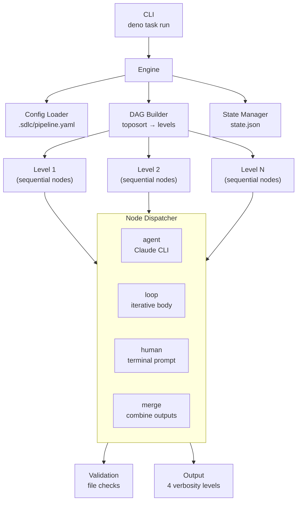

# SDS: Engine

## 1. Intro

- **Purpose:** Implementation details for the domain-agnostic DAG pipeline
  engine.
- **Rel to SRS:** Implements FRs from `documents/requirements-engine.md`.

## 2. Architecture

- **Diagram:**

### 2.1 Configurable Node Engine (Deno/TypeScript)



- **Subsystems:**
  - **Pipeline Engine** (`engine/`): Deno/TypeScript DAG-based executor
    with YAML config, template interpolation, sequential levels, loop nodes,
    human nodes, resume support
  - **Artifact Store**: Git-tracked files in `.sdlc/runs/<run-id>/[<phase>/]<node-id>/`
    (phase subdir present when node has `phase` field in config)
  - **Validation Engine**: Rule-based checks (file_exists, file_not_empty,
    contains_section, custom_script, frontmatter_field)
  - **Continuation Engine**: `--resume` based re-invocation on validation
    failure or safety-check violation (shared `max_continuations` budget)

## 3. Components

### 3.1 Pipeline Engine (`engine/`)

- **Purpose:** Configurable DAG-based pipeline executor. Replaces hardcoded
  shell script orchestration with YAML-driven node graph.
- **Modules:**
  - `types.ts` — type declarations (incl. `ValidationRule.type` union,
    `NodeConfig.run_on` (`"always"|"success"|"failure"`), `NodeConfig.phase`,
    `NodeConfig.env`, `NodeConfig.model` (per-node Claude model override),
    `PipelineDefaults.model` (default model for all nodes),
    `LoopNodeConfig.nodes` (inline body node definitions),
    `LoopResult.bodyResults`, `ErrorCategory` (structured failure enum),
    `NodeState.error_category`, `NodeState.cost_usd` (FR-32 per-node cost),
    `RunState.total_cost_usd` (FR-32 aggregated run cost),
    `PipelineDefaults.on_failure_script` (FR-34 configurable failure hook),
    `HitlConfig.artifact_source` (renamed from `issue_source`),
    `HitlConfig.exclude_login` (renamed from `bot_login`),
    `Verbosity` union: `"quiet"|"normal"|"semi-verbose"|"verbose"` (FR-41))
  - `template.ts` — `{{var}}` interpolation for prompts/paths
  - `config.ts` — YAML parsing, schema validation, defaults merge,
    `run_on` normalization. `validateNode()`: if `run_on` present, must be
    one of `"always"|"success"|"failure"`; error:
    `Node '<id>' has invalid run_on value '<val>'. Must be one of: always, success, failure`.
    `normalizeRunOn()` pass (in `mergeDefaults()`):
    if `node.run_always === true && !node.run_on` → sets `run_on = "always"`;
    if both present, `run_on` wins; deletes `run_always` from config
    post-normalization (downstream code only sees `run_on`).
    Loop nodes: parses `nodes` sub-object, validates body node ordering
    (>1 entry requires `inputs` declarations), validates `condition_node`
    references valid key in `nodes`. Skips top-level existence check for
    body node IDs referenced in `inputs`.
  - `dag.ts` — topological sort, cycle detection, level grouping.
    Excludes loop body nodes (from `nodes` sub-object) from top-level
    graph; loop node itself remains in DAG with its declared `inputs`.
  - `validate.ts` — artifact validation rules (file_exists, not_empty,
    contains_section, custom_script, frontmatter_field)
  - `state.ts` — RunState persistence to `state.json`, resume logic,
    phase registry (`setPhaseRegistry()`, `getPhaseForNode()`,
    `clearPhaseRegistry()` — see §3.2),
    cost aggregation (`updateRunCost()` sums
    `nodes[*].cost_usd` → `total_cost_usd`; called from
    `markNodeCompleted()` when optional `costUsd` param provided, FR-32).
    `markNodeCompleted()` also accepts optional `result?: string` param
    (FR-E22) — persists excerpt to `NodeState.result` in `state.json`.
    **`copyDir(src, dest)` (FR-E24):** exported free function — recursive
    directory copy utility. Used by `executeMergeNode()` in `engine.ts`.
    Moved from `engine.ts` as part of module size reduction
  - `agent.ts` — Claude CLI invocation, continuation loop, retry.
    `AgentRunOptions.model` and `InvokeOptions.model`: optional string for
    per-node model selection. `buildClaudeArgs()` emits `--model <value>` when
    `opts.model` is set AND `opts.resumeSessionId` is NOT set (resume inherits
    original model from session). Resolution: `node.model ?? defaults.model ??
    undefined` (computed in engine.ts/loop.ts, passed as field).
    `executeClaudeProcess()` uses `--output-format stream-json` and reads
    stdout line-by-line. Each JSON line appended to `streamLogPath` file
    (crash-resilient incremental write via `Deno.writeFile({ append: true })`).
    **Stream log timestamps (FR-33):** `tsPrefix()` returns `[HH:MM:SS]`
    wall-clock prefix; `stampLines()` prepends it to each non-empty line (empty
    lines pass through). Applied to log file writes only — terminal output via
    `onOutput` callback receives raw text without timestamps.
    On `result` event: extracts `ClaudeCliOutput` fields (`result`,
    `session_id`, `is_error`, `total_cost_usd`, `duration_ms`,
    `duration_api_ms`, `num_turns`, `permission_denials`). `is_error` derived
    from `subtype !== "success"`. No `result` event → throws descriptive error.
    `streamLogPath` accepted as required parameter in `executeClaudeProcess()`.
    Append semantics: multiple invocations (continuation) with same path
    produce concatenated JSONL. `--verbose` flag removed from
    `buildClaudeArgs()` (unrelated to streaming, changes stderr globally).
    **Repeated file read warning (FR-39):** `FileReadTracker` class in
    `agent.ts`. `track(path): string | null` — maintains `Map<string, number>`,
    returns `[WARN] repeated file read: <path> (<N> times)` when count >
    threshold (default 2), else null. Instantiated per `executeClaudeProcess()`
    call (counter resets per invocation). In event loop: for `tool_use` blocks
    with `name === "Read"`, calls `tracker.track(block.input.file_path)`. Non-
    null result written to `logFile` via `stampLines()`. Log-file-only (terminal
    `onOutput` unchanged). Pure-logic class — unit-testable without I/O.
    **Turn separators and summary footer (FR-40):** `executeClaudeProcess()`
    maintains `turnCount` counter. On each `event.type === "assistant"`:
    increments counter, writes `--- turn N ---` line to `logFile` via
    `stampLines()` (timestamped, consistent with existing log writes). After
    `result` event extraction: writes `--- end ---` + one-line summary via
    `formatFooter(output: ClaudeCliOutput): string`. Footer format:
    `status=<ok|error> duration=<X>s cost=$<Y> turns=<N>`. Both separators and
    footer are log-file-only (terminal `onOutput` callback unchanged).
    `formatFooter()` is a pure function — unit-testable without CLI.
    **Repeated file read warning (FR-40):** `executeClaudeProcess()` maintains
    `readCounts: Map<string, number>` tracking per-path `Read` tool-use events.
    On each `assistant` event: iterates `message.content` blocks, detects
    `tool_use` with `name === "Read"`, extracts `input.file_path`, increments
    count. When count > 2: writes warning to `logFile` via `stampLines()`.
    `checkRepeatedRead(readCounts, filePath): string | null` — helper: increments
    map, returns formatted warning when count > 2, else null.
    `formatRepeatedReadWarning(path, count): string` — pure function returning
    `[WARN] repeated file read: <path> (<N> times)`. Exported for unit testing.
    Warning is log-only (no `onOutput` callback). Counters reset per invocation
    (map is local to `executeClaudeProcess()` call). Execution not blocked.
    **Semi-verbose filtering (FR-41):** `formatEventForOutput(event,
    verbosity?)` accepts optional `Verbosity` param. When
    `verbosity === "semi-verbose"`, skips `tool_use` content blocks in
    `assistant` events — emits only `text` blocks. Default `undefined` =
    all blocks (backward-compatible). Log file writes call without verbosity
    (full output preserved). `onOutput` callback path passes verbosity from
    `AgentRunOptions` so terminal output is filtered at source.
    **`executeAgentNode(params: AgentNodeParams)` (FR-E24):** exported free
    function — extracted from `Engine` class in `engine.ts`. Accepts explicit
    params object (`nodeId`, `nodeConfig`, `state`, `config`, `output`,
    `options`, `ctx`, `runDir`, `streamLogPath`). Contains agent invocation,
    HITL detection/resume, continuation loop, session_id/log persistence.
    Mutates `state` via reference. `engine.ts` `executeNode()` imports and
    delegates to this function for `type: "agent"` nodes
  - `loop.ts` — loop node execution with condition extraction, per-iteration
    `AgentResult` accumulation into `LoopResult.bodyResults`.
    `buildLoopBodyOrder()` reads from inline `nodes` sub-object (replaces
    `body` array), topo-sorts body nodes by their `inputs` declarations.
    `buildContext()` resolves `inputs` against both sibling body nodes and
    top-level nodes. Accepts `streamLogPath` pattern from engine; computes
    iteration-qualified path `${nodeId}-iter-${i}.jsonl` per body node
    invocation; forwards to inner `runAgent()` calls.
    **`executeLoopNode(params: LoopNodeParams)` (FR-E24):** exported free
    function — extracted from `Engine` class in `engine.ts`. Accepts explicit
    params object (`nodeId`, `nodeConfig`, `state`, `config`, `output`,
    `options`, `ctx`, `runDir`). Contains loop execution orchestration,
    `onNodeComplete` callback for log saving and result display,
    `markNodeCompleted()` calls with result excerpts. Mutates `state` via
    reference. `engine.ts` `executeNode()` imports and delegates for
    `type: "loop"` nodes
  - `hitl.ts` — HITL detection (`detectHitlRequest`) and poll loop
    (`runHitlLoop`); injectable `scriptRunner`/`claudeRunner` for testing
  - `human.ts` — terminal user input, abort logic
  - ~~`git.ts`~~ — **deleted** (FR-29: domain-specific git code removed from
    engine). Functions relocated to `.sdlc/scripts/rollback-uncommitted.sh`.
    Failure handling replaced by configurable `on_failure_script` hook
  - `output.ts` — terminal output manager (quiet/normal/semi-verbose/verbose),
    verbose methods for detailed agent-node diagnostics.
    `nodeOutput()` gate: shown when `verbosity === "verbose"` or
    `verbosity === "semi-verbose"`. In semi-verbose, tool-call lines already
    excluded upstream by `formatEventForOutput()` — `nodeOutput()` passes
    through whatever it receives.
    `dryRunPlan(levels, labels, postPipelineNodeIds?, runOnMap?)`: renders
    regular DAG levels, then optional "Post-pipeline" section listing `run_on`
    nodes with their conditions (FR-28).
    `extractResultExcerpt(text: string, maxLines?: number, maxChars?: number): string`
    (FR-E15): pure function — filters empty lines, takes first N non-empty
    (default 3), joins with ` | ` separator, truncates to maxChars (default
    400). Used by `nodeResult()` and `engine.ts` for state persistence.
    `nodeResult(nodeId, output: ClaudeCliOutput)`: one-line agent result
    summary (FR-E15). Guarded by `verbosity !== "quiet"`. Format:
    `[HH:MM:SS] <nodeId padded>  RESULT: <excerpt ≤400 chars> | cost=$X.XXXX | duration=Xs | turns=N`.
    Uses `extractResultExcerpt()` for multi-line extraction (replaces
    first-line-only `split("\n")[0].slice(0, 120)` truncation).
    `RunSummary.nodeResults?: Record<string, string>` (FR-E22): optional
    per-node result excerpts. `summary()` renders per-node result lines after
    "Nodes:" when `nodeResults` present: `  <nodeId padded>  <excerpt>`.
    Imports `ClaudeCliOutput` from `types.ts`.
    **`printSummary(state: RunState, config: PipelineConfig)` (FR-E24):**
    method on `OutputManager` — extracted from `Engine` class in `engine.ts`.
    Builds `nodeResults` from `state.nodes[*].result`, passes to `summary()`
    for per-node result rendering in final summary block. `engine.ts` calls
    `this.output.printSummary(this.state, this.config)` instead of private
    method
  - `engine.ts` — main executor: level iteration, sequential dispatch,
    node type delegation to extracted functions (FR-E24), verbose
    input resolution, phase registry init via `setPhaseRegistry(config)` at
    engine startup, pre-post-pipeline `on_failure_script` execution.
    **Module size reduction (FR-E24):** `executeAgentNode()` extracted to
    `agent.ts`, `executeLoopNode()` extracted to `loop.ts`,
    `printSummary()` extracted to `OutputManager` in `output.ts`,
    `copyDir()` extracted to `state.ts`. `executeNode()` dispatches to
    imported free functions for `agent` and `loop` node types. Target:
    <500 LOC (from 654 → ~477).
    `executeNode()`: passes `extractResultExcerpt(result.output.result)` to
    `markNodeCompleted()` as `result` param (FR-E22).
    Dry-run path (FR-28): applies `collectPostPipelineNodes()` +
    `sortPostPipelineNodes()` + level filtering before calling
    `dryRunPlan()`, passing filtered levels and post-pipeline node IDs with
    `run_on` conditions — mirrors normal execution path's filtering logic.
    On config load: iterates all nodes; for loop nodes with `nodes`
    sub-object, flattens nested body node IDs into master ID list passed
    to `createRunState()` (ensures state.json tracks both top-level and
    nested body node IDs).
    Computes `streamLogPath = ${runDir}/logs/${nodeId}.jsonl` for each agent
    node; passes to `runAgent()`. For loop nodes: passes path pattern to
    loop executor for iteration-qualified derivation
  - `cli.ts` — CLI entry point: argument parsing, .env loading
  - `mod.ts` — public API re-exports
- **`scripts/check.ts` CLI help (FR-E23):** `printUsage()` static function
  outputs: description of checks performed, usage line, note about no accepted
  options, example. `--help`/`-h` in `Deno.args` → `printUsage()` +
  `Deno.exit(0)`. Any other arg → error referencing `--help` + `Deno.exit(1)`.
  Follows `engine/cli.ts` format. Exported `printUsage()`/`checkArgs()` for
  unit testing
- **Interfaces:**
  - CLI: `deno task run [--prompt <text>] [--config <path>] [--resume <run-id>]
    [--dry-run] [-v|-s|-q] [--env KEY=VAL] [--skip nodes] [--only nodes]`
  - Config: `.sdlc/pipeline.yaml` (YAML, version "1")
  - State: `.sdlc/runs/<run-id>/state.json` (JSON)
- **Node types:** `agent`, `merge`, `loop` (with inline `nodes` sub-object
    for body node definitions), `human`
- **Node flags:**
  - `run_on?: "always" | "success" | "failure"` — execution condition for
    post-pipeline nodes. When set, node is excluded from DAG levels and executes
    in a post-pipeline step after all DAG levels complete:
    - `"always"` — execute regardless of pipeline outcome.
    - `"success"` — execute only if pipeline succeeded.
    - `"failure"` — execute only if pipeline failed. Skipped nodes get
      `markNodeSkipped()` status.
    Backward compat: `run_always: true` in YAML normalized to `run_on: "always"`
    by config loader (see `config.ts` normalization). `run_always` deleted
    post-normalization — not visible to engine runtime.
  - `phase?: string` — optional phase grouping label (e.g., `plan`, `impl`,
    `report`). When set, node artifacts are stored under
    `<run-dir>/<phase>/<node-id>/` instead of `<run-dir>/<node-id>/`. User-
    defined (no enum constraint). Validated: must be non-empty string if present.
    Backward-compatible: omitting `phase` preserves flat layout.
  - `env?: Record<string, string>` — optional node-level environment variables.
    Merged with global env (node-level overrides global defaults). Accessible
    in template context via `{{env.<key>}}`.
  - `model?: string` — per-node Claude model override (FR-27, implemented).
    Overrides `defaults.model`. Absent = defaults.model or CLI default (no flag).
    Emitted as `--model <value>` on initial invocations only; `--resume` calls
    exclude `--model` (session inherits original). Resolution chain:
    `node.model ?? defaults.model ?? undefined`. Centralized in
    `buildClaudeArgs()` via `InvokeOptions.model` field.
- **Commit strategy:** Engine does not auto-commit. Developer agent owns commits
  (`git add`, `git commit`, `git push` per task). No dedicated committer nodes.
- **Verbose Output (Direct Injection pattern):**
  - `output.ts` exposes 4 verbose-guarded methods on `OutputManager`:
    `verbosePrompt(nodeId, prompt)`,
    `verboseInputs(nodeId, inputs: {path, sizeBytes}[])`,
    `verboseValidation(nodeId, results: {rule, passed, detail?}[])`,
    `verboseContinuation(nodeId, attempt, max, failures)`.
    `verboseSafety()` and `verboseCommit()` removed (engine no longer performs
    safety checks or commits — FR-29 domain-agnostic cleanup).
    All no-op when `verbosity !== "verbose"`. Output: human-readable stderr with
    section headers. Note: AC #5 (agent stdout streaming) already implemented
    via existing `nodeOutput()` method — no new work needed.
  - `agent.ts`: `AgentRunOptions` gains optional `output?: OutputManager` and
    `nodeId?: string`. `runAgent()` calls `verbosePrompt()` after prompt
    construction, `verboseValidation()` after each `runValidations()` call,
    `verboseContinuation()` before resume invocation. Guarded by `if (output)`.
  - `loop.ts`: `LoopRunOptions` gains optional `output?: OutputManager`.
    Forwarded to `runAgent()` calls. Enables prompt/validation/continuation
    verbose for loop body nodes. Safety/commit verbose for loop body nodes:
    deferred (loop body bypasses `executeAgentNode()`).
  - `engine.ts`: `executeNode()` resolves input artifact paths+sizes by
    walking `ctx.input` directories via `Deno.stat()`; calls
    `this.output.verboseInputs()` before delegating to `executeAgentNode()`.
    Passes `this.output` and `nodeId` via params. Safety check and commit
    verbose removed (engine no longer performs these — FR-29).
    `runFailureHook(script?)`: private method (~10 lines), executes
    `on_failure_script` via `Deno.Command()` on pipeline failure. Swallows
    errors (failure hook must not crash engine). Replaces hard-wired
    `rollbackUncommitted()`.
  - All existing callers pass no `output` arg — zero behavioral change.
- **Deps:** `claude` CLI, `deno`, `git`, `jsr:@std/yaml`.

### 3.2 Phase Registry (`state.ts`) — IMPLEMENTED

- **Status:** Implemented. `getNodeDir()` in `engine/state.ts` resolves
  phase-aware artifact paths. Evidence: `engine/state.ts:20-36`
  (`setPhaseRegistry()` — builds nodeId→phase map from config),
  `engine/state.ts:98-104` (`getNodeDir()` — phase-aware path resolution),
  `engine/state.ts:44-46` (`getPhaseForNode()` — lookup),
  `engine/engine.ts:135` (`setPhaseRegistry(config)` call at engine init).
- **Purpose:** Module-scoped mapping from nodeId → phase string, enabling
  `getNodeDir()` to resolve phase-aware artifact paths without signature change.
- **Data:** `phaseRegistry: Map<string, string>` — populated from
  `PipelineConfig` nodes' `phase` fields.
- **Interfaces:**
  - `setPhaseRegistry(config: PipelineConfig)` — iterates config nodes, builds
    map from `nodeId → node.phase` (skips nodes without `phase`). Called once at
    engine init (both fresh-run and `--resume` paths).
  - `clearPhaseRegistry()` — resets map. Used in tests for isolation.
  - `getPhaseForNode(nodeId: string): string | undefined` — lookup.
  - `getNodeDir(runId, nodeId)` — signature unchanged. Internally: if registry
    has phase for nodeId, returns `${runDir}/${phase}/${nodeId}/`; otherwise
    `${runDir}/${nodeId}/` (backward-compatible fallback).
- **Deps:** `types.ts` (`PipelineConfig`, `NodeConfig`).
- **Design rationale:** Module-scoped global state (not instance state) because
  `getNodeDir()` is a free function called from multiple contexts (engine,
  templates, tests). Single-instance engine guarantee prevents sequential
  mutation. `clearPhaseRegistry()` ensures test isolation.

## 4. Data

- **Entities:**
  - Run State: JSON (`.sdlc/runs/<run-id>/state.json`)
  - Pipeline Config: YAML (`.sdlc/pipeline.yaml`). Top-level keys: `name`,
    `version`, `defaults`, `phases`, `nodes`. `phases` key declares
    named phase groups with member stage IDs. Engine treats `phases` as opaque
    config data.
  - ValidationRule: `{ type: "file_exists"|"file_not_empty"|"contains_section"|
    "custom_script"|"frontmatter_field", path?, field?, allowed?, ... }`
  - LoopResult: `{ ..., bodyResults: AgentResult[] }` — accumulated per-iteration
    agent results; consumed by `executeLoopNode()` callback for log saving
  - LoopNodeConfig: `{ ..., nodes: Record<string, NodeConfig> }` — inline
    body node definitions replacing `body: string[]`. Each key is a body
    node ID, value is its full node config. `condition_node` must reference
    a key in `nodes`. Body node ordering derived from `inputs` declarations
    via topo-sort (>1 entry requires at least one `inputs` reference to
    prevent disconnected graph with arbitrary order).
  - NodeState: `{ ..., cost_usd?: number, result?: string }` — per-node cost
    from `ClaudeCliOutput.total_cost_usd` and result excerpt (≤400 chars) from
    `extractResultExcerpt()`, both set at completion via
    `markNodeCompleted()` optional params (FR-32, FR-E22)
  - RunState: `{ ..., total_cost_usd?: number }` — sum of all
    `nodes[*].cost_usd`, recomputed by `updateRunCost()` on each node
    completion (FR-32)
  - NodeConfig: `{ ..., run_on?: "always"|"success"|"failure", phase?: string,
    env?: Record<string, string>, model?: string }` — `run_on` for conditional
    post-pipeline execution; `phase` for artifact directory grouping; `env` for
    node-level env vars; `model` for per-node Claude model override (FR-27)
- **ERD:** N/A (file-based, no database).
- **Migration:** N/A.

### 4.1 Inter-Node Data Flow

- **Mechanism:** Filesystem-based. Each node reads input via `{{input.<node-id>}}`
  template variable pointing to predecessor's output directory. No manifest.
- **Directory structure:** `.sdlc/runs/<run-id>/[<phase>/]<node-id>/` per node
  output. Phase subdir present when node's `phase` field is set in config.
- **Validation:** Engine validates output via configurable rules (file_exists,
  file_not_empty, contains_section, custom_script, frontmatter_field) after
  each node. Validation failures trigger continuation (resume with error
  context) rather than immediate node failure.
  - `frontmatter_field`: Reads artifact file, extracts YAML frontmatter via
    `^---\n([\s\S]*?)\n---` regex, parses target field, checks value against
    allowed set. Config: `{ type: "frontmatter_field", path, field, allowed }`.
  - `contains_section`: Checks artifact file for presence of a markdown section.
    Supports `on_error: continue` (non-fatal).
  - `custom_script`: Validation via external script execution, enabling
    continuation-on-failure for check errors.
- **Context management:** Claude CLI auto-compression handles large input sets.
- **Template variables:** `{{node_dir}}`, `{{input.*}}`, `{{run_dir}}`,
  `{{run_id}}`, `{{args.*}}`, `{{env.*}}`, `{{loop.iteration}}`.
- **After-hook conventions:** Commands run from repo root (no `cd {{run_dir}}`
  prefix needed). Use `|| true` suffix to prevent hook failure from killing
  the node.

## 5. Logic

- **Algos:**
  - **Continuation Loop**: invoke agent -> validate -> if fail: resume with
    error context -> repeat (max N). If limit reached: fail node.
  - **Verbose Output Flow** (`-v` mode, agent nodes only): In
    `executeNode()`: (1) resolve input artifact file paths+sizes from
    `ctx.input` dirs via `Deno.stat()` → `verboseInputs()`, (2) delegate to
    `executeAgentNode()` (in `agent.ts`) which emits `verbosePrompt()` →
    Claude CLI executes → `verboseValidation()` → on failure:
    `verboseContinuation()` → retry.
    All verbose methods guarded by `verbosity !== "verbose"` — no-op in
    default/quiet. Output: human-readable stderr lines with section headers.
  - **Loop Node Log Saving** (callback-based, no I/O in `loop.ts`):
    `runLoop()` accumulates `AgentResult` per body-node iteration into
    `LoopResult.bodyResults[]` (pure data, no filesystem ops). In
    `executeLoopNode()` (`loop.ts`), the `onNodeComplete` callback iterates
    `bodyResults`, calling `saveAgentLog()` with iteration-qualified nodeId
    (`${id}-iter-${i}`). Guard: only on `result.success && result.output`.
    `saveAgentLog()` errors caught and warned (non-fatal) — audit I/O must not
    break loop execution. `runDir` resolved via `getRunDir(this.state.run_id)`
    (already in engine scope).
  - **Node Result Summary** (FR-E15, FR-E22): After agent node completion,
    engine displays one-line result summary via `OutputManager.nodeResult()`.
    `nodeResult()` uses `extractResultExcerpt()` for multi-line extraction
    (≤3 non-empty lines, ≤400 chars, collapsed via ` | ` separator).
    Two call sites: (1) `executeNode()` — after `markNodeCompleted()`, for
    top-level agent nodes; `executeAgentNode()` returns `AgentResult | null`
    (was `boolean`), `executeNode()` extracts `.output` field. Passes
    `extractResultExcerpt(result.output.result)` to `markNodeCompleted()`
    for state persistence.
    (2) `executeLoopNode()` `onNodeComplete` callback — calls `nodeResult()`
    when `result.output` exists; passes excerpt to `markNodeCompleted()`.
    Suppressed in quiet mode. Shown in default and verbose modes.
    `printSummary()` (on `OutputManager`) builds `nodeResults` from persisted
    `state.nodes[*].result` and passes to `summary()` for per-node result
    lines in final summary block.
  - **Verbose Edge Cases** (behavioral contracts verified by tests):
    - **Default mode (no `-v`):** All 4 verbose methods produce zero stderr
      output. `OutputManager` constructed with `verbose=false` suppresses all
      verbose calls unconditionally.
    - **Empty input dir:** `resolveInputArtifacts()` returns empty list →
      `verboseInputs()` reports `0 files` without error. No `Deno.stat()` calls.
    - **Missing file stat:** `Deno.stat()` failure on input artifact →
      graceful skip, verbose output includes error detail for affected path.
  - **Post-Pipeline Node Collection & Ordering**: `collectPostPipelineNodes()`
    collects nodes where `run_on !== undefined` (replaces `run_always`-based
    collection). `sortPostPipelineNodes()` sorts them topologically using
    `inputs` field (reuses `toposort()` from `dag.ts`).
  - **Post-Pipeline Node Filtering**: Before executing each post-pipeline node,
    engine applies per-node filter based on `run_on` value and
    `pipelineSuccess`:
    - `run_on: "always"` → execute unconditionally.
    - `run_on: "success"` → skip if `!pipelineSuccess`, call
      `markNodeSkipped()`.
    - `run_on: "failure"` → skip if `pipelineSuccess`, call
      `markNodeSkipped()`.
  - **HITL via AskUserQuestion Interception** (FR-21):
    Engine detects agent HITL requests by inspecting `permission_denials` in
    Claude CLI JSON output. Flow:
    1. Agent node completes → engine parses JSON `result` event.
    2. If `permission_denials[]` contains entry with
       `tool_name == "AskUserQuestion"`: extract `tool_input.questions` (structured
       question with `question`, `header`, `options[]`, `multiSelect`) and
       `session_id` from result.
    3. Engine calls `defaults.hitl.ask_script` (external pipeline script) with
       question JSON + context args (repo, issue, run-id, node-id).
    4. Engine sets node state to `waiting` in `state.json`, saves `session_id`.
    5. Engine enters poll loop: `sleep(poll_interval)` → call
       `defaults.hitl.check_script` → if exit 0, read reply from stdout.
    6. Engine resumes agent: `claude --resume <session_id> -p "<reply>"
       --output-format json`. Agent sees full previous context + reply as new
       user message.
    7. On `timeout` exceeded: node marked `failed`.
    Pipeline config example:
    ```yaml
    defaults:
      on_failure_script: .sdlc/scripts/rollback-uncommitted.sh
      hitl:
        ask_script: .sdlc/scripts/hitl-ask.sh
        check_script: .sdlc/scripts/hitl-check.sh
        artifact_source: plan/pm/01-spec.md
        poll_interval: 60
        timeout: 7200
    ```
  - **Phase Registry Init**: `setPhaseRegistry(config)` called at engine
    startup before `ensureRunDirs()` in `engine.ts` `run()`. `getNodeDir()`
    resolves phase-aware paths: `${runDir}/${phase}/${nodeId}` when phase
    registered, `${runDir}/${nodeId}` otherwise. Evidence:
    `engine/state.ts:20-36`, `engine/engine.ts:135`.
  - **Failure Hook Before Post-Pipeline Nodes (FR-34)**: When
    `pipelineSuccess === false`, engine executes `config.defaults.on_failure_script`
    (if configured) via `runFailureHook()` before post-pipeline nodes. Script
    is pipeline-specific. Engine treats it as opaque
    `Deno.Command` invocation — domain-agnostic. Failed node IDs available via
    `state.json` (`nodes[*].status === "failed"`) — no engine-written artifacts.
  - **Semi-verbose filtering (FR-41):** `formatEventForOutput(event,
    verbosity?)` accepts optional `Verbosity` param. When
    `verbosity === "semi-verbose"`, skips `tool_use` content blocks in
    `assistant` events — emits only `text` blocks. Default `undefined` =
    all blocks (backward-compatible). Log file writes call without verbosity
    (full output preserved). `onOutput` callback path passes verbosity from
    `AgentRunOptions` so terminal output is filtered at source.
- **Rules:**
  - Artifacts overwritten on re-run (git history preserves previous).
  - QA iteration numbering restarts on re-run.

## 6. Non-Functional

- **Scale:** Single pipeline per run. Sequential stages (no parallel agents).
- **Fault:** Node failure stops pipeline (unless `on_error: continue`). Failure
  reported via state.json. Configurable `on_failure_script` hook runs before
  post-pipeline nodes.
- **Logs:** Full transcripts per node in `.sdlc/runs/<run-id>/logs/`.

## 7. Constraints

- **Simplified:** Pipeline runs sequentially (no parallel stages in v1).
- **Deferred:** Multi-repo support. Parallel pipelines for multiple issues.
  Issue size/complexity limits. Cost budget limits and alerts (per-node cost
  aggregation implemented in FR-32; budget enforcement deferred).
