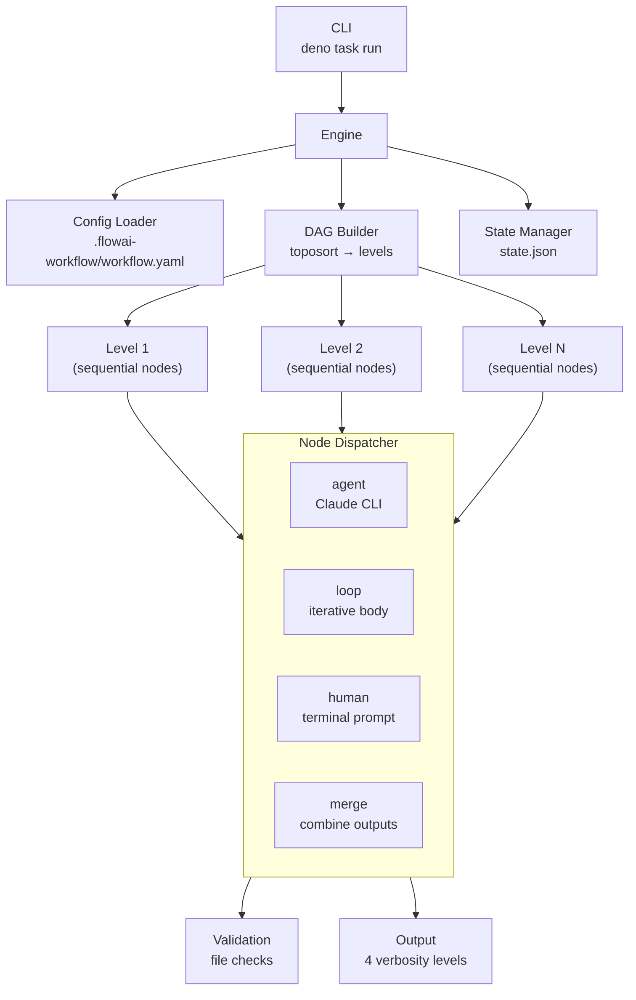

<!-- section file — index: [documents/design-engine.md](../design-engine.md) -->

# SDS Engine — Intro and Architecture

# SDS: Engine

## 1. Intro

- **Purpose:** Implementation details for the domain-agnostic DAG workflow
  engine.
- **Rel to SRS:** Implements FRs from `documents/requirements-engine.md`.

## 2. Architecture

- **Diagram:**

### 2.1 Configurable Node Engine (Deno/TypeScript)

- **Subsystems:**
  - **Workflow Engine** (`engine/`): Deno/TypeScript DAG-based executor
    with YAML config, template interpolation, sequential levels, loop nodes,
    human nodes, resume support, and runtime abstraction (`claude` default,
    `opencode` supported)
  - **Artifact Store**: Git-tracked files in `.flowai-workflow/runs/<run-id>/[<phase>/]<node-id>/`
    (phase subdir present when node has `phase` field in config)
  - **Validation Engine**: Rule-based checks (file_exists, file_not_empty,
    contains_section, custom_script, frontmatter_field)
  - **Continuation Engine**: `--resume` based re-invocation on validation
    failure or safety-check violation (shared `max_continuations` budget)
  - **Binary Distribution** (FR-E39): `deno compile`-based build workflow.
    `scripts/compile.ts` generates self-contained executables for 4 platform
    targets. `.github/workflows/release.yml` publishes GitHub Release assets
    on version tag push
  - **Auto-Update & Release Pipeline** (FR-E41): CLI self-update via GitHub
    Releases API. Two-workflow CI: `ci.yml` (check + auto-bump + tag on main)
    → `release.yml` (compile + publish on tag). Version bumping via
    `standard-version` + conventional commits. `deno.json` version field as
    source of truth

## 3. Components

