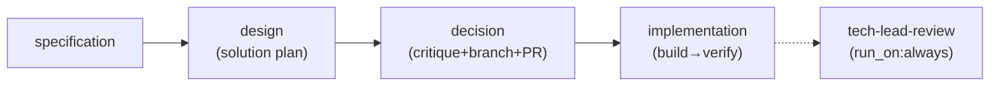

# SDS: SDLC Pipeline

## 1. Intro

- **Purpose:** Implementation details for the SDLC workflow (example use case
  of flowai-workflow engine).
- **Rel to SRS:** Implements FRs from `documents/requirements-sdlc.md`.

## 2. Architecture

### 2.1 Legacy: Shell Script Pipeline (REMOVED — superseded by FR-S15)

Legacy 9-stage shell workflow (`Stage 1–9`) removed. Stages 3 (Reviewer),
4 (Architect), 5 (SDS Update), 8 (Presenter) absorbed/eliminated per FR-S15.
Current architecture: see §2.2 Pipeline DAG.

### 2.2 Pipeline DAG (FR-S15, FR-E18)



- **Node ID convention (FR-E18):** Activity-based IDs reflect what work is done,
  not who does it. Mapping: `pm`→`specification`, `architect`→`design`,
  `tech-lead`→`decision`, `impl-loop`→`implementation`, `developer`→`build`,
  `qa`→`verify`, `tech-lead-review`→`tech-lead-review`.
- **Phases (FR-E18):** Top-level `phases:` key in `workflow.yaml` declares named
  phase groups. Each phase lists member stage IDs:
  - `plan`: [specification, design, decision]
  - `impl`: [implementation]
  - `report`: [tech-lead-review]
  Phase grouping is declarative config; engine treats it as opaque data. Enables
  future phase-level `run_on` semantics and cleaner artifact reporting.

- **Subsystems:**
  - **Agent Runtime**: Claude Code CLI invocations with role-specific prompts
    from `.flowai-workflow/agents/agent-<name>/SKILL.md` (canonical location per
    FR-S26; legacy `.claude/skills/` symlinks removed per FR-S33)
  - **Artifact Store**: Git-tracked files in `.flowai-workflow/runs/<run-id>/[<phase>/]<node-id>/`
    (phase subdir present when node has `phase` field in config). Note: runs
    directory remains at `.flowai-workflow/runs/` — engine-controlled hardcoded path;
    configurable `runs_dir` deferred to separate engine FR.
    - **Artifact File Numbering (FR-S32):** Gapless sequential prefixes
      `01`–`06` reflecting workflow execution order. Convention:
      `<NN>-<base-name>.md`. Current mapping:
      - `01-spec.md` (specification)
      - `02-plan.md` (design)
      - `03-decision.md` (decision)
      - `04-impl-summary.md` (build)
      - `05-qa-report.md` (verify)
      - `06-review.md` (tech-lead-review)
      All workflow YAML, agent prompts, SRS, and SDS references MUST use these
      canonical filenames. Alphabetical sorting = execution order.
  - **Legacy Shell Scripts** (`.flowai-workflow/scripts/`): Deprecated stage scripts
    deleted per FR-S26. HITL, rollback, and dashboard wrapper scripts retained.
    `run-dashboard.sh` wraps `deno task dashboard` with warning logging on
    failure (FR-S36). ~~`reset-to-main.sh`~~ **Superseded** — engine FR-E24
    worktree isolation replaces `pre_run:` script. `reset-to-main.sh` no longer
    invoked; `pre_run` field removed from engine config.

## 3. Components

### 3.1 Docker Image

- **Purpose:** Single runtime environment for all stages.
- **Interfaces:** Contains `claude` CLI, `deno`, `git`, `gh`, `gitleaks`.
- **Deps:** Node.js (for claude CLI install), Deno runtime.

### 3.2 Stage Scripts — DELETED (FR-S26)

- **Status:** Deleted. Legacy stage orchestration scripts (`stage-*.sh`) and
  associated tests removed per FR-S26. Superseded by Deno/TypeScript workflow
  engine (`engine/`). Use `deno task run`.
- **Legacy `test:*` deno.json tasks:** Removed alongside scripts. No backward
  compatibility retention needed — engine execution via `deno task run` is the
  sole workflow entry point.

### 3.3 Shared Library (`.flowai-workflow/scripts/lib.sh`)

- **Purpose:** Common functions for all stage scripts.
- **Interfaces:** Functions: `log()`, `run_agent()`, `validate_artifact()`,
  `continuation_loop()`, `commit_artifacts()`, `report_status()`,
  `safety_check_diff()`, `retry_with_backoff()`.
  - `retry_with_backoff()`: Generic retry wrapper for external CLI calls
    (`claude`, `gh`). Max 3 attempts, 5s initial delay, 2x backoff. Retries on
    non-zero exit (network/rate-limit errors). Does not retry validation
    failures.
- **Deps:** `claude` CLI, `git`, `gh`.

### 3.4 Agent Skills (`.flowai-workflow/agents/agent-*`) (FR-S17, FR-S26)

- **Purpose:** Versioned system prompts defining each agent's role and behavior.
  Each agent lives in `.flowai-workflow/agents/agent-<name>/SKILL.md` (canonical
  location per FR-S26). Pipeline-driven only: prompts injected via
  `{{file(...)}}` in `task_template` (FR-S38); legacy `prompt:` field removed.
  Redundant `# BEFORE YOU DO ANYTHING` / "Read shared-rules.md" block removed
  from all 6 SKILL.md files (FR-S39) — content already injected at prompt
  construction time. Agent-specific "first tool call MUST be" instruction
  (5 of 6 agents) preserved as standalone paragraph before `# Role:`.
  Legacy `.claude/skills/` symlinks removed per FR-S33 — interactive
  `/agent-<name>` slash commands no longer supported (workflow-only agents
  should not be exposed as interactive skills).
- **Directory structure:** `.flowai-workflow/agents/agent-<name>/SKILL.md` — 6 agents:
  - `agent-pm` — triages open GitHub issues, selects highest-priority, produces
    spec. **Issue Author Filter (FR-S31):** PM filters candidates by author at
    two points: (1) `gh issue list --author korchasa` in STEP 2a (triage path),
    (2) `gh issue view --json author` + fail-fast guard in STEP 2c (resume/
    direct-branch path). Hardcoded `korchasa`; configurability deferred.
  - `agent-architect` — design-solution role: produces implementation plan with
    2-3 variants, affected files, effort estimates, risk analysis.
    **Codebase Exploration (FR-S43):** Before variant design, launches 2–3
    parallel `Agent` sub-agents with distinct focus areas (prior art,
    architecture layers, integration points). Sub-agents run within same
    session — no separate workflow node. Exploration findings provide concrete
    file:line evidence consumed by variant design phase. Explicit `Agent` tool
    allowance overrides `shared-rules.md` default prohibition.
  - `agent-tech-lead` — critique + decision + SDS update + branch creation
    (`git checkout -b sdlc/issue-<N>`) or rebase existing branch onto
    `origin/main` (`git rebase origin/main`, with conflict resolution) +
    draft PR (`gh pr create --draft`) + task breakdown from selected variant.
    Uses `{{run_id}}` for `--prompt` mode fallback branch `sdlc/{{run_id}}`.
  - `agent-developer` — implements tasks. Owns `git add`, `git commit`,
    `git push` after each task. Commit messages follow `sdlc(impl): <summary>`
    format.
  - `agent-qa` — verifies developer output. Posts verdict as PR review
    (`gh pr review`: approve/request-changes). **Check suite extension
    (FR-S31):** May autonomously add new verification functions to
    `scripts/check.ts` when recurring quality issues are detected. Constrained
    to evidence-based additions only, standalone function pattern, label to
    stdout, `Deno.exit(1)` on failure, zero false positives confirmed by
    running extended suite post-addition.
    **Confidence Scoring (FR-S44):** Applies 0–100 confidence score to each
    finding. Findings ≥ 80 → verdict-affecting (included in main report).
    Findings < 80 → listed in `## Observations` section (non-blocking, do not
    affect verdict). QA report frontmatter gains optional
    `high_confidence_issues: <N>` field.
    **Multi-Focus Parallel Review (FR-S45):** Launches 2–3 parallel `Agent`
    sub-agents with distinct focus: (1) correctness/bugs, (2) simplicity/DRY,
    (3) conventions/abstractions. Sub-agents run within same QA session — no
    new workflow node. Findings consolidated into per-focus sections in QA
    report. All findings subject to confidence scoring per FR-S44. Explicit
    `Agent` tool allowance overrides `shared-rules.md` default prohibition.
  - `agent-tech-lead-review` — post-workflow: final code review + CI gate
    check + merge. `run_on: always`. Handles missing-PR case gracefully.
- **Removed agents (FR-S15):** `tech-lead-reviewer`, `tech-lead-sds`,
  `committer`, `code-reviewer`.
- **Removed agents (FR-S9, issue #127):** `agent-meta-agent` — prompt
  optimization removed due to unreviewed SKILL.md edit risk and marginal value.
  Superseded by two-layer per-agent reflection (FR-S32).
- **Shared Reflection Protocol (FR-S32):**
  `.flowai-workflow/agents/reflection-protocol.md` — single source of truth for
  two-layer reflection protocol (MEMORY + HISTORY). Referenced by each agent's
  `## Reflection Memory` section in SKILL.md and reinforced via `task_template`
  in `workflow.yaml`. See §3.4.1 for details.
- **SKILL.md frontmatter (agentskills.io-compliant):**
  ```yaml
  ---
  name: "agent-<name>"
  description: "<one-line role description>"
  compatibility: ["claude-code"]
  allowed-tools: []
  ---
  ```
  - `compatibility: ["claude-code"]` — declares runtime compatibility.
  - `allowed-tools: []` — no automatic tool grants; agents use tools available
    in their execution context.
- **Interfaces:**
  - Pipeline (FR-S38): `prompt:` field removed from all 6 agent nodes.
    SKILL.md and shared-rules.md injected via `{{file(...)}}` in
    `task_template`. Template structure per node:
    ```yaml
    task_template: |
      {{file(".flowai-workflow/agents/shared-rules.md")}}
      ---
      {{file(".flowai-workflow/agents/agent-<name>/SKILL.md")}}
      ---
      <task-specific content>
    ```
    Content delivered as user message (`-p`) — no `--system-prompt` flag.
    Engine `file()` template function resolves paths at runtime, inlines
    file content into task prompt before CLI invocation.
  - Interactive: Removed (FR-S33). Legacy `.claude/skills/agent-<name>`
    symlinks deleted. Pipeline-only agents are no longer discoverable as
    interactive Claude Code skills.
- **Agent Execution Summary (FR-S20, FR-S21, FR-S42):** All 6 agents must
  produce a `## Summary` section in their output artifacts. Content: 2-5 bullet
  points (actions taken, key decisions, artifacts produced, issues encountered).
  5 agents (PM, Architect, Tech Lead, QA, Tech Lead Review) append `## Summary`
  to their markdown artifact files. Developer includes summary in commit message
  body (no separate artifact file). Pipeline enforces via composite `artifact`
  validation rule (FR-S42) on all 6 agent nodes — each node declares a single
  `type: artifact` rule combining `file_exists` + `file_not_empty` +
  `contains_section` (via `sections` array). `build` also retains
  `custom_script: deno task check`. `specification` additionally validates
  sections `Problem Statement` and `Scope`. `verify` retains separate
  `frontmatter_field: verdict` rule. `specification` retains separate
  `frontmatter_field` rules for `issue` and `scope`.
- **Voice Convention (FR-S20, FR-S22):** Each SKILL.md contains a `## Voice`
  section (after `# Role:` heading, before `## Responsibilities`) mandating
  first-person narrative ("I") in all agent outputs. Scope explicitly includes
  GitHub issue comments, PR descriptions, and status updates (FR-S22). Passive/
  third-person prohibited in narrative text. YAML frontmatter and code blocks
  excluded. Each agent's section includes 3 role-specific correct vs incorrect
  example pairs: 2 anchored to artifacts/reports, 1 targeting GitHub
  interactions specifically (e.g., PM: "I started the specification phase" not
  "Specification phase started"; QA: "I verified all criteria" not "All criteria
  were verified"). Hardcoded `gh issue comment --body` templates in SKILL.md
  files must also use first-person (FR-S22).
- **Migration (FR-S17, FR-S26, FR-S33):** Three migrations completed:
  1. FR-S17: `agents/<name>/` → `.flowai-workflow/agents/agent-<name>/` (symlinks
     eliminated, `.claude/skills/` became canonical).
  2. FR-S26: `.flowai-workflow/agents/agent-<name>/` → `.flowai-workflow/agents/agent-<name>/`
     (consolidated into workflow directory; `.claude/skills/agent-<name>`
     symlinks created for Claude Code discovery).
  3. FR-S33: `.claude/skills/agent-<name>` symlinks removed. Canonical path
     `.flowai-workflow/agents/agent-<name>/SKILL.md` is sole discovery mechanism.
     `scripts/check.ts` symlink validation block removed (engine `loadConfig()`
     covers prompt file existence).
- **Voice directive (FR-S20):** Each SKILL.md contains `## Voice` section
  (before `## Rules`) mandating first-person ("I") narrative in all prose
  output. Shared 3-line core directive (first-person mandate, prohibited
  patterns, scope exclusions for YAML/code/tables) + 1 agent-specific
  correct/incorrect example pair per file. Applies to: handoff artifacts,
  PR/issue comments, QA reports, spec files. Excludes: YAML frontmatter,
  code blocks, structured data, tables.
- **Comment Identification (FR-S29):** Each SKILL.md contains a
  `## Comment Identification` section defining the prefix rule: all `gh issue
  comment` and `gh pr review` body strings MUST start with
  `**[<Agent> · <phase>]**`. Each agent's section specifies its prefix value:
  PM→`**[PM · specify]**`, Architect→`**[Architect · plan]**`,
  Tech Lead→`**[Tech Lead · decide]**`, Developer→`**[Developer · implement]**`,
  QA→`**[QA · verify]**`, Tech Lead Review→`**[Tech Lead Review · review]**`.
  Section is separate from `## Voice` (FR-S22/FR-S22) — Voice governs tone,
  Comment Identification governs attribution. Covers both hardcoded templates
  and dynamically generated comment bodies. Developer has no existing templates;
  section serves as instruction for future `gh` calls.
- **Deps:** None (static content, versioned in git).

### 3.4.1 Two-Layer Agent Reflection Memory (FR-S28, FR-S32)

- **Purpose:** Cross-run learning via per-agent memory and history files.
  Replaces single-layer reflection (FR-S28) with two-layer design (FR-S32).
  Eliminates meta-agent dependency — each agent manages its own learning.
- **Shared Protocol:** `.flowai-workflow/agents/reflection-protocol.md` — single
  source of truth for the two-layer reflection protocol. Referenced by each
  agent's `## Reflection Memory` section in SKILL.md (~3-5 line reference
  block) and reinforced via `task_template` in `workflow.yaml`. Contains:
  - Layer 1 (MEMORY) format and rules
  - Layer 2 (HISTORY) format and rules
  - Lifecycle instructions
  - Size constraints
- **Layer 1 — MEMORY** (edit-in-place operative knowledge):
  - **Directory:** `.flowai-workflow/memory/` — 6 files, one per agent:
    `agent-pm.md`, `agent-architect.md`, `agent-tech-lead.md`,
    `agent-developer.md`, `agent-qa.md`, `agent-tech-lead-review.md`.
  - **Lifecycle:** Read at session start → execute task → full rewrite at
    session end. Current-state snapshot, not append log. <=50 lines.
  - **Content categories:** Anti-patterns encountered, effective strategies,
    environment quirks, baseline metrics.
- **Layer 2 — HISTORY** (append-only run log):
  - **Directory:** `.flowai-workflow/memory/` — 6 files:
    `agent-pm-history.md`, `agent-architect-history.md`, etc.
  - **Lifecycle:** Read at session start → append one entry at session end.
    FIFO trim to <=20 most recent entries.
  - **Entry format:** Timestamp, issue#, turns, cost, outcome, key learnings.
    Agent-specific fields (e.g., PM: issue selected; QA: verdict).
  - **Purpose:** Enables trend detection — recurring errors, metric drift,
    pattern identification across runs.
- **SKILL.md integration:** Each agent's `## Reflection Memory` section
  replaced with ~3-5 line reference block:
  - "Follow `.flowai-workflow/agents/reflection-protocol.md`."
  - Memory path: `.flowai-workflow/memory/<agent>.md`
  - History path: `.flowai-workflow/memory/<agent>-history.md`
  - Agent-specific HISTORY format hint.
- **Pipeline integration:** Each agent's `task_template` in `workflow.yaml`
  includes both memory and history file paths as reinforcement.
- **Git tracking:** Memory and history files are git-tracked (not gitignored).
  Each agent reads/writes only its own files — no cross-agent access.
- **Interfaces:** File I/O only. No engine awareness — memory is workflow-level
  concern. Agents read/write via standard file tools.
- **Deps:** None (static files, versioned in git).

### 3.5 HITL Pipeline Scripts (`.flowai-workflow/scripts/hitl-*.sh`)

- **Purpose:** Deliver agent questions to humans and poll for replies. Pipeline-
  specific (GitHub), not engine code. Engine invokes via configurable paths.
- **Scripts:**
  - `hitl-ask.sh` — render question JSON → markdown, post to GitHub issue.
    - Input: `--run-dir`, `--artifact-source`, `--run-id`, `--node-id`,
      `--question-json`.
    - Extracts issue: `yq '.issue' "$RUN_DIR/$ISSUE_SOURCE"`.
    - Auto-detects repo: `gh repo view --json nameWithOwner`.
    - Renders: header, blockquoted question, numbered options, HTML marker
      `<!-- hitl:<run-id>:<node-id> -->`.
    - Posts via `gh issue comment <N> --body "$md"`.
    - Deps: `jq`, `yq`, `gh`.
  - `hitl-check.sh` — poll GitHub issue for human reply after marker.
    - Input: `--run-dir`, `--artifact-source`, `--run-id`, `--node-id`,
      `--exclude-login`.
    - Extracts issue: `yq '.issue' "$RUN_DIR/$ISSUE_SOURCE"`.
    - Auto-detects repo: `gh repo view --json nameWithOwner`.
    - Fetches comments: `gh api repos/{owner}/{repo}/issues/<N>/comments`.
    - jq filter: find comment with marker, then first subsequent non-bot comment.
    - Exit 0 + body on stdout = reply found. Exit 1 = no reply yet.
    - Deps: `jq`, `yq`, `gh`.
- **Interfaces:** Called by engine via `defaults.hitl.ask_script` /
  `defaults.hitl.check_script` paths in `workflow.yaml`.

### 3.6 Pipeline Trigger

- **Purpose:** Single entry point for workflow. PM agent autonomously triages
  open GitHub issues.
- **Author constraint (FR-S31):** Only issues authored by `korchasa` are valid
  workflow inputs. Enforced in PM agent prompt (§3.4), not engine-level.
  Two enforcement points: `gh issue list --author` (triage) and
  `gh issue view --json author` (resume guard).
- **Interfaces:** CLI: `deno task run [--prompt "..."]`. PM selects
  highest-priority open issue via `gh`.
- **Deps:** Devcontainer, Claude CLI auth (OAuth or API key), `GITHUB_TOKEN`.

### 3.7 Dashboard Generator (`scripts/generate-dashboard.ts`) (FR-E18, FR-S16, FR-S19, FR-S20, FR-S26, issue #15, issue #93)

- **Purpose:** Generate self-contained HTML dashboard summarizing workflow run
  results. Reads `state.json` + per-node `logs/*.json`. Produces `index.html`
  in run directory with all CSS inlined (no CDN deps).
- **Functions:**
  - `readRunState(runDir)` — parse `state.json` → `RunState`
  - `readNodeLog(runDir, nodeId)` — parse `logs/<nodeId>.json` →
    `CliRunOutput`
  - `groupNodesByPhase(nodeIds, phases?)` — extract phase-grouping logic into
    standalone exported function (FR-S26). Signature:
    `groupNodesByPhase(nodeIds: string[], phases?: Record<string, string[]>): Array<{ label: string; ids: string[] }>`.
    Iterates `phases` entries, filters to nodes present in `nodeIds`, collects
    ungrouped nodes into `"other"` group. When `phases` absent/empty, returns
    single group with all `nodeIds` (empty label). Array return type preserves
    phase ordering by construction. Unit-tested independently (4 scenarios:
    phased grouping, unphased "other" group, empty nodeIds, no phases config).
  - `readStreamLog(path, maxHead?, maxTail?)` — reads `stream.log`, truncates
    if lines exceed `maxHead + maxTail` (defaults: 200, 50). Returns first
    `maxHead` lines + `--- truncated ---` marker + last `maxTail` lines. Empty
    string on missing file. Exported for unit testing (FR-S34)
  - `renderCard(nodeId, state, log, streamLogHref?, logContent?)` — HTML card:
    status badge, timing, cost, result summary via `<details><summary>` (first
    3 lines preview, full text in details body). Single-line results render
    without `<details>` wrapper. When `streamLogHref` provided: renders
    `<a class="log-link" href="${escHtml(streamLogHref)}">stream log</a>` after
    card-meta div. When `logContent` provided (FR-S34): renders inline
    `<details><summary>stream log</summary><pre class="log-content">
    ${escHtml(logContent)}</pre></details>` after link. `.log-content` CSS:
    monospace, max-height 400px, overflow-y scroll. Omitted when absent
    (backward-compatible)
  - `renderHtml(runDir, state, logs, streamLogHrefs?, logContents?,
    runOnAlwaysNodes?)` — full page: run metadata header, phase-grouped card
    grid, inlined CSS. Delegates phase-grouping to
    `groupNodesByPhase(Object.keys(state.nodes), phases)` — no inline
    phase-grouping logic remains. Single `groups.map()` path generates
    `<section>` HTML per group (collapses former if/else branch).
    `streamLogHrefs?: Record<string, string>` maps nodeId → relative href;
    `logContents?: Record<string, string>` maps nodeId → truncated log text
    (FR-S34); both threaded to each `renderCard()` call. Header status (FR-S34):
    `<strong class="${state.status}">` with distinct CSS per value — `completed`
    (green), `failed` (red), `aborted` (orange), `running` (blue). Phase
    aggregate status (FR-S34): each phase section header renders core-node
    aggregate badge + optional always-node badge via `computePhaseStatus()`.
    `runOnAlwaysNodes?: Set<string>` identifies always-nodes for separation
  - `computePhaseStatus(nodeIds, nodeStates, alwaysNodes)` — separates phase
    members into core (non-always) and always groups. Core status: all completed
    → "completed", any failed → "failed", else "running". Always-node status
    computed independently, returned as optional secondary value. Returns
    `{coreStatus: string, alwaysStatus?: string}`. Exported for unit testing
    (FR-S34)
  - `escHtml(str)` — escape `<>&"'` for XSS-safe HTML embedding
  - `computeTimeline(state: RunState)` — iterates `state.nodes`, parses
    `started_at` ISO timestamps, computes `offsetPct`/`widthPct` relative to
    run start/total duration. Identifies bottleneck (max `duration_ms`). Omits
    nodes with missing timing. Returns `{nodeId, offsetPct, widthPct,
    durationMs, isBottleneck}[]`
  - `renderTimeline(bars)` — generates Gantt-style HTML timeline section:
    container with relative positioning, bars absolutely-positioned per row
    (sorted by `started_at`). Bottleneck bar gets `.timeline-bottleneck` CSS
    class. Labels sanitized via `escHtml()`. Timeline CSS appended to existing
    `CSS` const (inlined, no CDN deps). Integrated into `renderHtml()` between
    header and card grid (FR-S19)
- **Stream log link flow (issue #15):** CLI entry point scans each node
  directory for `stream.log` existence via `Deno.stat()`. For nodes with phases,
  computes relative path as `<phase>/<nodeId>/stream.log`; without phase:
  `<nodeId>/stream.log`. Builds `Record<string, string>` href map, passes to
  `renderHtml()` → threaded to `renderCard()`. CSS: `.log-link` class (monospace,
  smaller font, muted color — distinct from result text).
- **Inline log content flow (FR-S34, issue #149):** CLI entry reads each
  `stream.log` via `readStreamLog()` (truncated to 200+50 lines). Builds
  `Record<string, string>` content map, passes to `renderHtml()` → threaded to
  `renderCard()`. Extracts `run_on` from workflow config nodes to build
  `Set<string>` of always-nodes, passed to `renderHtml()` for phase aggregate.
  Header status CSS: 4 distinct rules for `completed`/`failed`/`aborted`/
  `running`.
- **Functions (continued):**
  - `computeCostBars(state: RunState)` — filters `state.nodes` by
    `cost_usd > 0`, computes proportional `widthPct` relative to max cost.
    Returns `{nodeId: string, costUsd: number, widthPct: number}[]` (FR-S20)
  - `renderCostChart(bars, totalCost)` — inline SVG horizontal bar chart.
    Each bar: `<rect>` with proportional width, `<text>` label (node ID via
    `escHtml()`), cost value annotation. Total cost header. Empty bars →
    "No cost data" message (mirrors timeline empty-state). Cost chart CSS
    appended to `CSS` const. Integrated into `renderHtml()` between timeline
    and `<main>` card grid (FR-S20)
- **CLI help (FR-S26):** `printUsage()` static function outputs: description,
  usage line (`deno task dashboard --run-dir <path>`), options (`--run-dir`),
  examples. `--help`/`-h` → `printUsage()` + `Deno.exit(0)`. Unknown flags →
  error referencing `--help` + `Deno.exit(1)`. Follows `engine/cli.ts` format.
  Exported `printUsage()`/`checkArgs()` for unit testing
- **Interfaces:**
  - CLI: `deno task dashboard --run-dir <path>`
  - Hook: `after:` on `tech-lead-review` node via `run-dashboard.sh` wrapper
    (FR-S36 — replaces `|| true` with explicit warning logging)
- **Deps:** `engine/types.ts` (imports `RunState` and `CliRunOutput` — the
  latter re-exported from `@korchasa/ai-ide-cli/types`). No runtime engine
  dependency — reads JSON files directly.

### 3.8 Pipeline Config Validation (FR-S24)

- **Purpose:** Validate `.flowai-workflow/workflow.yaml` against engine schema as part
  of `deno task check`. Prevents config drift causing runtime failures.
- **Implementation:** `workflowIntegrity()` in `scripts/check.ts` delegates to
  engine's `loadConfig()` (`engine/config.ts`). The engine validation covers:
  - Node type validation (agent, merge, loop, human)
  - Required field validation per node type
  - `inputs` reference validation (referenced nodes must exist)
  - `run_on` enum validation
  - Loop body node validation
  - Phase configuration validation
  - Prompt file existence check
- **Validation flow:** `workflowIntegrity()` → `loadConfig()` →
  `validateSchema()` → `validateNode()` (per node). Errors thrown as exceptions
  with descriptive messages; `workflowIntegrity()` catches and reports.
- **Interfaces:** Called as part of `deno task check` sequence. No separate CLI
  entry point (deferred).
- **Deps:** `engine/config.ts` (`loadConfig` function).

### 3.8.1 HITL Artifact Source Validation (FR-S35)

- **Purpose:** Validate `defaults.hitl.artifact_source` uses `{{input.<node-id>}}`
  template syntax instead of a hardcoded path. Prevents silent breakage when
  specification node is renamed or artifact layout changes.
- **Implementation:** `hitlArtifactSource()` in `scripts/check.ts`:
  1. Loads workflow config via `loadConfig()`.
  2. Reads `config.defaults?.hitl?.artifact_source`.
  3. If field present and does not contain `{{input.`: reports error
     "hitl.artifact_source must use template syntax".
  4. If field absent: skips (no error).
- **Validation flow:** `hitlArtifactSource()` → `loadConfig()` → string match
  for `{{input.` → error collection → report. Pattern follows
  `workflowIntegrity()` (§3.8): catch + report, non-throwing.
- **Interfaces:** Called as part of `deno task check` sequence in
  `scripts/check.ts` main sequence, alongside `workflowIntegrity()` and
  `agentListAccuracy()`.
- **Deps:** `engine/config.ts` (`loadConfig` function).

### 3.9 SDLC Utility Scripts CLI Help (FR-S26)

- **Purpose:** `--help`/`-h` support for `scripts/self-runner.ts` and
  `scripts/loop-in-claude.ts`. Each script gets inline `printUsage()` following
  `engine/cli.ts` format (description, usage, options, examples).
- **`scripts/self-runner.ts`:** `printUsage()` describes workflow loop runner.
  Usage: `deno task loop [interval] [-- claude-args...]`. `--help`/`-h` →
  print + exit 0. Unknown `--`-prefixed flags → error + exit 1. Exported
  `printUsage()`/`checkArgs()` for unit testing.
- **`scripts/loop-in-claude.ts`:** `printUsage()` describes in-Claude workflow
  runner. Usage: `deno task loop-in-claude [claude-args...]`. `--help`/`-h`
  detected before passthrough to Claude CLI. Exported helpers for unit testing.
- **Pattern:** Identical to `engine/cli.ts`: static string, `Deno.args` scan,
  `Deno.exit(0)` on help, `Deno.exit(1)` on unknown flag with message
  referencing `--help`.

### 3.10 SDLC Script Module JSDoc (FR-S30)

- **Purpose:** Module-level `/** @module */` JSDoc coverage for all 4 SDLC
  utility scripts. Each module gets a docstring declaring purpose,
  responsibility, and dependencies.
- **Files:** `scripts/check.ts`, `scripts/claude-stream-formatter.ts`,
  `scripts/generate-dashboard.ts`, `scripts/self-runner.ts`.
- **Scope:** Module-level JSDoc only. Function-level JSDoc and why-comments
  excluded (covered by FR-E30 for engine modules only).
- **Deps:** None (documentation-only change).

### 3.11 AGENTS.md Agent List Validation (FR-S29)

- **Purpose:** Validate `AGENTS.md` lists exactly 6 active agents with no
  deprecated entries. Runs as part of `deno task check` alongside
  `workflowIntegrity()` (§3.8).
- **Implementation:** `agentListAccuracy()` in `scripts/check.ts`:
  1. Reads `AGENTS.md` content.
  2. Extracts agent list from Project Vision section (parenthetical list after
     "specialized AI agents").
  3. Verifies all 6 expected agents present: PM, Architect, Tech Lead,
     Developer, QA, Tech Lead Review.
  4. Verifies no deprecated agent names appear as active: Presenter, Reviewer,
     SDS Update, Meta-Agent.
  5. Reports pass/fail with descriptive messages per check.
- **Validation flow:** `agentListAccuracy()` → `Deno.readTextFile("AGENTS.md")`
  → string matching against expected/deprecated lists → error collection →
  report. Pattern follows `workflowIntegrity()`: catch + report, non-throwing.
- **Interfaces:** Called as part of `deno task check` sequence in
  `scripts/check.ts` main sequence. No separate CLI entry point.
- **Deps:** None (reads `AGENTS.md` directly, no engine dependency).

### 3.12 Project Init Scaffolder (`flowai-init/`, FR-S46)

- **Purpose:** Scaffold a self-contained `.flowai-workflow/` directory in a
  target project. Pure deterministic file copy with placeholder substitution
  — no AI calls, no network. Invoked via `flowai-workflow init`. Dispatched
  from `engine/cli.ts` via dynamic import to preserve engine purity
  (FR-E14 / engine MUST NOT contain domain-specific code).
- **Package:** `@korchasa/flowai-workflow-init`. Separate workspace member
  under `flowai-init/` with its own `deno.json`, `scripts/check.ts`, and JSR
  publish config. Templates and scaffold logic ship together as one JSR
  artifact.
- **Module layout:**
  - `mod.ts` — public entry `runInit(argv, opts)`, flag parser
    (`parseInitArgs`), help text, and orchestration of all phases.
  - `types.ts` — `Answers`, `TemplateManifest`, `TemplateQuestion`,
    `CopyRule`, `TemplateRequirement`, `DetectKey` interfaces.
  - `scaffold.ts` — `substitutePlaceholders` (regex `/__[A-Z][A-Z0-9_]*__/g`,
    throws on unknown key), `copyTemplate` (tracked writes for unwind),
    `unwindScaffold` (reverse-order delete of tracked paths),
    `writeTemplateMetadata` (`.template.json`).
  - `autodetect.ts` — per-language handlers exposed as `detectFns` record:
    `project_name`, `default_branch`, `test_cmd`, `lint_cmd`. Handlers
    inspect `deno.json`, `package.json`, `go.mod`, `pyproject.toml`,
    `Cargo.toml` in priority order + read-only git plumbing
    (`git symbolic-ref`, `git remote get-url`). Never execute build tools.
  - `preflight.ts` — environment checks: binary presence (git/gh/claude),
    `git rev-parse --is-inside-work-tree`, origin remote host validation
    via `parseGithubRemote` (supports HTTPS, SCP-SSH, URL-SSH forms),
    `.flowai-workflow/` absence, clean-tree check (skippable with
    `--allow-dirty`). All failures collected into a single summary.
  - `manifest.ts` — YAML parser + structural validator for `template.yaml`
    with path-aware error messages (e.g. `questions[2].detect: unknown
    handler`).
  - `wizard.ts` — dual-mode resolution: non-interactive (`--answers
    <file.yaml>`) reads and validates answer YAML, interactive mode uses
    stdin prompts with autodetected defaults pre-filled. Pure helpers
    (`parseAnswersYaml`, `mergeAnswers`, `resolveFinalAnswers`) are
    factored out for unit-testing; `runWizard` is the only function that
    touches stdin.
- **Template layout (`flowai-init/templates/sdlc-claude/`):**
  - `template.yaml` — manifest (wizard questions, requirements, file copy
    rules).
  - `README.md` — placeholder list, usage notes, hard dependencies.
  - `files/.flowai-workflow/` — full self-contained workflow tree:
    - `workflow.yaml` — generic 6-agent SDLC DAG with `__PROJECT_NAME__`,
      `__DEFAULT_BRANCH__`, `__TEST_CMD__`, `__LINT_CMD__` placeholders.
      Agent prompts referenced via `{{file(".flowai-workflow/agents/
      agent-*.md")}}` (NOT `.claude/agents/`).
    - `agents/agent-{pm,architect,tech-lead,developer,qa,tech-lead-review}.md`
      — framework-independent role definitions with no `FR-E/FR-S`,
      `scope: engine|sdlc`, or flowai-workflow-specific references.
    - `memory/agent-*.md` + `agent-*-history.md` — empty stubs with a
      single header line; agents rewrite them via the reflection protocol
      on first run.
    - `memory/reflection-protocol.md` — generic two-layer memory protocol.
    - `scripts/hitl-ask.sh`, `hitl-check.sh` — GitHub HITL scripts (auto-
      detect repo via `gh`, no project-specific hardcoding).
    - `.gitignore` — single line `runs/`, scoped so git reads it at the
      `.flowai-workflow/` level without touching the project root
      `.gitignore` (self-containment invariant).
    - `tasks/.gitkeep` — placeholder for `.flowai-workflow/tasks/`.
- **Engine dispatch:** `engine/cli.ts` adds an early branch inside its
  `if (import.meta.main)` block: when `Deno.args[0] === "init"`, it
  dynamically `import("@korchasa/flowai-workflow-init")` and delegates
  with `{ engineVersion: VERSION }`. Dynamic import keeps the init code
  and bundled templates out of the engine module graph when a user runs
  any other subcommand.
- **Wizard flow:**
  1. Preflight — collect all failures up-front (single pass).
  2. Load manifest from `./templates/<name>/template.yaml` relative to the
     package's `import.meta.url` (works in local/JSR/compiled modes).
  3. Autodetect — aggregate handler results into `Partial<Answers>`.
  4. Resolve answers — merge detected + file + question defaults, validate
     required fields.
  5. Interactive mode only: prompt user per question with detected default,
     confirm before scaffold.
  6. Dry-run short-circuit prints file list and exits 0.
  7. Scaffold — walk `files.copy` rules, substitute placeholders, write
     files with tracked paths.
  8. Write `.template.json` metadata (template name/version, engine
     version, ISO 8601 timestamp, answers).
  9. Print success message with next-steps (`flowai-workflow --config
     .flowai-workflow/workflow.yaml`).
- **Error handling:**
  - Preflight failure → print bullet list + exit 1.
  - Wizard abort or missing required field → print error + exit 1.
  - Scaffold mid-flight failure → `unwindScaffold(createdPaths)` deletes
    only files the scaffolder touched (never walks directory trees),
    then exit 1.
  - Flag parse error → exit 3.
- **Exit codes:** 0 (success / help / dry-run), 1 (preflight / scaffold
  failure), 3 (invalid CLI argument).
- **Root check delegation:** `scripts/check.ts` delegates to
  `flowai-init/scripts/check.ts` via `deno task check` with `cwd=flowai-init`,
  following the `ai-ide-cli` pattern. Each workspace member owns its own
  fmt/lint/type-check/tests/doc-lint/publish-dry-run pipeline.
- **Deps:** `@std/yaml` (manifest parser), `@std/path`. Engine module
  dispatcher imports `@korchasa/flowai-workflow-init` via workspace package
  name (no static coupling — dynamic `await import()` lazy-loads only on
  `init` subcommand).

## 4. Data

### 4.1 Commit Strategy

- **Branch:** Feature branch created by tech-lead agent (`git checkout -b
  sdlc/issue-<N>`). If branch already exists, tech-lead rebases onto
  `origin/main` (`git rebase origin/main`) with manual conflict resolution
  (up to 2 attempts; abort on failure). Fallback for `--prompt` mode:
  `sdlc/{{run_id}}`.
- **Commit cadence (FR-S15):** Developer-owned commits. No dedicated committer
  agent nodes. Developer runs `git add`, `git commit`, `git push` after each
  task. Commit messages follow `sdlc(impl): <summary>` format.
- **PR creation:** Tech-lead creates draft PR (`gh pr create --draft`) before
  impl-loop. Developer pushes to same branch. QA posts PR review verdicts.
- **Post-workflow:** Tech-lead-review performs final review + CI gate + merge.
- **Engine invariant:** Engine does NOT auto-commit (FR-S11 preserved). All git
  operations happen inside agent prompts.
- **Failure behavior:** Failed nodes produce no commits. On_error: "fail" stops
  workflow; "continue" proceeds to next nodes. Each failed `NodeState` gets
  `error_category?: ErrorCategory` — domain-agnostic enum:
  `continuations_exhausted | timeout | cli_crash | hook_failure | hitl_timeout |
  aborted | unknown`. Set by engine at failure point; downstream agents map
  categories to domain actions.
- **Resume:** `--resume <run-id>` skips completed nodes per state.json.

## 5. Logic

- **Developer+QA Loop**: Developer implements -> QA verifies -> if FAIL:
  Developer reads QA report, fixes -> repeat (max 3). Body nodes defined
  inline via loop's `nodes` sub-object (not top-level). Execution order
  determined by topo-sort of body nodes' `inputs` declarations.
  **Verify node verdict validation (FR-S37):** `verify` node's `validate`
  block MUST include `frontmatter_field` rule for `verdict` field with
  `allowed: ["PASS", "FAIL"]`. Ensures QA agent cannot silently omit the
  verdict frontmatter — validation fails before loop reads `condition_field`.
  Combined with engine FR-E36 parse-time cross-check, guarantees
  `condition_field: verdict` is contractually declared in the condition node.
- **~~Pre-Run Auto-Stash (FR-S41)~~:** Superseded by engine FR-E24 (worktree
  isolation). Engine creates a git worktree per run — original working tree
  untouched. `pre_run` field removed; `reset-to-main.sh` no longer invoked.
- **Secret Detection**: `gitleaks detect --no-git` runs as part of
  `deno task check` (`scripts/check.ts`). `allowFailure=true` — skips if
  gitleaks binary not found. Engine-level `safetyCheckDiff()` removed.
- **Tech-Lead-Review Node**: Post-workflow agent (`run_on: always`). Performs
  final code review, checks CI gates, merges PR if all pass. Handles
  missing-PR case gracefully (no-op with clear message when workflow failed
  before tech-lead created PR). **After-hook observability (FR-S36):**
  `after:` field invokes `.flowai-workflow/scripts/run-dashboard.sh {{run_dir}}`
  (replaces `deno task dashboard ... || true`). Wrapper runs dashboard
  command, emits `[WARN] dashboard generation failed (exit $code)` to stderr
  on non-zero exit, always exits 0. Warning captured in `stream.log`, visible
  via inline log viewer (FR-S34). Node status remains "completed" — no false
  failure signal.
- **HITL via AskUserQuestion Interception** (FR-E8):
  Engine detects agent HITL requests by inspecting `permission_denials` in
  Claude CLI JSON output. Flow:
  1. Agent node completes → engine parses JSON `result` event.
  2. If `permission_denials[]` contains entry with
     `tool_name == "AskUserQuestion"`: extract `tool_input.questions` (structured
     question with `question`, `header`, `options[]`, `multiSelect`) and
     `session_id` from result.
  3. Engine calls `defaults.hitl.ask_script` (external workflow script) with
     question JSON + context args (repo, issue, run-id, node-id).
  4. Engine sets node state to `waiting` in `state.json`, saves `session_id`.
  5. Engine enters poll loop: `sleep(poll_interval)` → call
     `defaults.hitl.check_script` → if exit 0, read reply from stdout.
  6. Engine resumes agent: `claude --resume <session_id> -p "<reply>"
     --output-format json`. Agent sees full previous context + reply as new
     user message.
  7. On `timeout` exceeded: node marked `failed`.
  Workflow config:
  ```yaml
  defaults:
    on_failure_script: .flowai-workflow/scripts/rollback-uncommitted.sh
    hitl:
      ask_script: .flowai-workflow/scripts/hitl-ask.sh
      check_script: .flowai-workflow/scripts/hitl-check.sh
      artifact_source: "{{input.specification}}/01-spec.md"
      poll_interval: 60
      timeout: 7200
  ```
- **Rules:**
  - Artifacts overwritten on re-run (git history preserves previous).
  - QA iteration numbering restarts on re-run.

## 6. Non-Functional

- **Scale:** Single workflow per issue. Sequential stages (no parallel agents).
- **Fault:** Stage failure stops workflow, failure reported on issue.
- **Sec:** Secret detection via `gitleaks detect --no-git` in `deno task check`
  (`scripts/check.ts`). Engine-level scope checks removed. Agents run with
  local user's permissions.
- **Logs:** Full transcripts per stage in `.flowai-workflow/runs/<run-id>/logs/`. Note:
  logs path remains engine-controlled (`.flowai-workflow/runs/`); configurable `runs_dir`
  deferred to separate engine FR.

## 7. Constraints

- **Simplified:** Pipeline runs sequentially (no parallel stages in v1).
- **Deferred:** Multi-repo support. Parallel workflows for multiple issues.
  Issue size/complexity limits. Cost budget limits and alerts (per-node cost
  aggregation implemented in FR-E17; budget enforcement deferred).
- **Deferred prompt deduplication (ex ADR-001 C4):** Analysis of 6 SKILL.md
  files (~1700 lines) found ~600 lines (35%) duplicated across agents in 13
  rule groups. Automation tiers:
  - Tier 1 (~120 lines): `--disallowedTools` per node for tool restrictions
    (Bash, Agent, ToolSearch). `pipeline.yaml` `disallowed_tools` field.
  - Tier 2 (~200 lines): shared prompt fragments via `{{include "rules/..."}}`.
    Rules: no-grep-after-read, one-read-per-file, no-offset-limit,
    first-person-voice, git-add-force.
  - Tier 3 (~110 lines): pipeline config injection — scope-aware doc reads
    (`{{scope_docs}}`), comment prefix, reflection memory protocol.
  - Tier 4 (~100 lines): engine enforcement hooks — bash command whitelist,
    allowed file modification paths (partially covered by FR-E37).

## 8. SRS Evidence Status

All FR evidence for issue #15 is complete:

- **FR-S16 (Dashboard Result Summary Display):** Implemented. SRS section 3.34
  evidence recorded — `scripts/generate-dashboard.ts` (`renderCard`,
  `escHtml`). Tests in `scripts/generate-dashboard_test.ts`.
- **FR-S19 (Timeline Visualization):** Implemented. SRS section 3.37 evidence
  recorded — `scripts/generate-dashboard.ts` (`computeTimeline`,
  `renderTimeline`, `.timeline-bottleneck` CSS). Tests in
  `scripts/generate-dashboard_test.ts`. Evidence committed in `e493cbb`.
- **FR-E20 (Repeated File Read Warning):** Implemented. SRS section 3.38
  evidence recorded — `engine/agent.ts` (`FileReadTracker` class). Tests in
  `engine/agent_test.ts`. Evidence committed in `e493cbb`.
- **FR-S20 (Dashboard Stream Log Links):** Implemented. SRS section 3.39
  evidence recorded — `scripts/generate-dashboard.ts` (`streamLogHref`,
  `.log-link` CSS). Tests in `scripts/generate-dashboard_test.ts`.
- **FR-S21 (Agent Output Summary):** Already implemented. All 6 agent SKILL.md
  files document `## Summary` in output format. `workflow.yaml` enforces
  `contains_section: Summary` on 5 agent nodes (`specification`, `design`,
  `decision`, `verify`, `tech-lead-review`); Developer (`build`) enforced via
  `custom_script: deno task check`. Evidence:
  `.flowai-workflow/agents/agent-*/SKILL.md` (6 files), `.flowai-workflow/workflow.yaml`.
- **FR-S22 (Agent First-Person Voice — GitHub Interactions):** Voice sections
  strengthened with explicit GitHub interaction scope + third example pair per
  agent. Hardcoded `gh issue comment --body` templates in PM, Architect, Tech
  Lead SKILL.md files updated to first-person. Evidence:
  `.flowai-workflow/agents/agent-*/SKILL.md` (6 files, `## Voice` sections).

FR-S1 evidence (issue #100):

- **FR-S1 (Pipeline Trigger):** All 4 acceptance criteria marked `[x]` with
  evidence. `engine/cli.ts:36-76` (CLI entry point, flags),
  `.flowai-workflow/agents/agent-pm/SKILL.md` (issue frontmatter mandate).

Engine FR evidence (issue #99):

- **FR-E2, FR-E10, FR-E11, FR-E13, FR-E19:** Documentation-only — mark
  existing implementations with evidence in `documents/requirements-engine.md`.
  No code or design changes. Variant A (batch single-pass) selected. FR-E11
  completed (commits `ba99362`, `232dc53`). Remaining: FR-E2 (2 ACs), FR-E10
  (12 ACs), FR-E13 (6 ACs), FR-E19 (7 ACs) — 27 ACs total.

FR-S24 evidence (issue #96):

- **FR-S24 (Pipeline Config Validation):** Existing implementation satisfies
  all acceptance criteria. `scripts/check.ts:84-96` (`workflowIntegrity()`
  calls `loadConfig()`), `engine/config.ts:43-103` (schema validation),
  `engine/config.ts:105-249` (node validation — types, inputs, run_on).
  No new code required — Variant A (evidence-only) selected.
- **FR-S11 (Inter-Stage Data Flow):** SRS text updated by PM to reflect
  phase-aware artifact path `.flowai-workflow/runs/<run-id>/[<phase>/]<node-id>/`.
  SDS §2.2 already documents phase-aware layout. Engine FR-E9 implementation
  deferred (separate issue).
- **FR-S25 (Phase-Organized SDLC Artifact Directories):** FR-E9 phase registry
  implemented (`engine/state.ts:20-36`, `engine/engine.ts:129-130`). Artifact
  paths resolve to `.flowai-workflow/runs/<run-id>/<phase>/<node-id>/` for nodes with
  `phase:` field. SDLC workflow nodes have `phase:` fields in `workflow.yaml`
  (`plan`, `impl`, `report`). ACs #1-3 marked with evidence. ACs #4-5 pending
  verification (end-to-end run + `deno task check`). Selected Variant A
  (Verification-Only) — no code changes, evidence marking only. Dashboard
  phase-aware path computation deferred. FR-E5 and FR-E7 deferred.

FR-S40 documentation sync (issue #158):

- **FR-S40 (Pipeline Format Change Documentation Sync):** Documentation-only.
  SDS verified post-FR-S38: §2.2 `phases:` description accurate, §3.4
  `prompt:` correctly marked as removed with `{{file(...)}}` replacement
  documented, §3.4 Interfaces shows current `task_template` pattern. No stale
  `phases:` or `prompt:` references found in SDS. SRS, workflow-report, and
  spec-unified-task-template corrections handled by developer.

FR-S42 workflow validate migration (issue #174):

- **FR-S42 (Migrate Pipeline Validate Rules to Composite Artifact Type):**
  All 6 agent node validate blocks in `workflow.yaml` migrated from separate
  `file_exists` + `file_not_empty` + `contains_section` rules to single
  composite `type: artifact` rule per node. `build` node gains implicit
  `file_not_empty` check (no-op tightening — file with `## Summary` cannot
  be empty). `frontmatter_field` and `custom_script` rules unchanged.
  Variant C selected. Evidence: `.flowai-workflow/workflow.yaml` validate blocks.

Engine refactoring (issue #92):

- **engine.ts module size reduction:** Pure engine-scope refactoring — no SDLC
  workflow impact. Variant A selected: extract `engine/hitl-handler.ts` (HITL
  orchestration) and `engine/post-workflow.ts` (post-workflow executor) from
  `engine/engine.ts`. Target: ≤500 LOC (from 849). Engine public interfaces
  unchanged; SDLC workflow transparent to internal restructuring.
