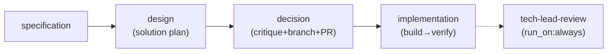

# SDS: SDLC Pipeline

## 1. Intro

- **Purpose:** Implementation details for the SDLC pipeline (example use case
  of auto-flow engine).
- **Rel to SRS:** Implements FRs from `documents/requirements-sdlc.md`.

## 2. Architecture

### 2.1 Legacy: Shell Script Pipeline (REMOVED — superseded by FR-S15)

Legacy 9-stage shell pipeline (`Stage 1–9`) removed. Stages 3 (Reviewer),
4 (Architect), 5 (SDS Update), 8 (Presenter) absorbed/eliminated per FR-S15.
Current architecture: see §2.2 Pipeline DAG.

### 2.2 Pipeline DAG (FR-26, FR-33)



- **Node ID convention (FR-33):** Activity-based IDs reflect what work is done,
  not who does it. Mapping: `pm`→`specification`, `architect`→`design`,
  `tech-lead`→`decision`, `impl-loop`→`implementation`, `developer`→`build`,
  `qa`→`verify`, `tech-lead-review`→`tech-lead-review`.
- **Phases (FR-33):** Top-level `phases:` key in `pipeline.yaml` declares named
  phase groups. Each phase lists member stage IDs:
  - `plan`: [specification, design, decision]
  - `impl`: [implementation]
  - `report`: [tech-lead-review]
  Phase grouping is declarative config; engine treats it as opaque data. Enables
  future phase-level `run_on` semantics and cleaner artifact reporting.

- **Subsystems:**
  - **Agent Runtime**: Claude Code CLI invocations with role-specific prompts
    from `.auto-flow/agents/agent-<name>/SKILL.md` (canonical location;
    symlinked from `.claude/skills/agent-<name>` for Claude Code interactive
    discovery per FR-S26)
  - **Artifact Store**: Git-tracked files in `.auto-flow/runs/<run-id>/[<phase>/]<node-id>/`
    (phase subdir present when node has `phase` field in config). Note: runs
    directory remains at `.auto-flow/runs/` — engine-controlled hardcoded path;
    configurable `runs_dir` deferred to separate engine FR.
  - **Legacy Shell Scripts** (`.auto-flow/scripts/`): Deprecated stage scripts
    deleted per FR-S26. HITL and rollback scripts retained.

## 3. Components

### 3.1 Docker Image

- **Purpose:** Single runtime environment for all stages.
- **Interfaces:** Contains `claude` CLI, `deno`, `git`, `gh`, `gitleaks`.
- **Deps:** Node.js (for claude CLI install), Deno runtime.

### 3.2 Stage Scripts — DELETED (FR-S26)

- **Status:** Deleted. Legacy stage orchestration scripts (`stage-*.sh`) and
  associated tests removed per FR-S26. Superseded by Deno/TypeScript pipeline
  engine (`engine/`). Use `deno task run`.
- **Legacy `test:*` deno.json tasks:** Removed alongside scripts. No backward
  compatibility retention needed — engine execution via `deno task run` is the
  sole pipeline entry point.

### 3.3 Shared Library (`.auto-flow/scripts/lib.sh`)

- **Purpose:** Common functions for all stage scripts.
- **Interfaces:** Functions: `log()`, `run_agent()`, `validate_artifact()`,
  `continuation_loop()`, `commit_artifacts()`, `report_status()`,
  `safety_check_diff()`, `retry_with_backoff()`.
  - `retry_with_backoff()`: Generic retry wrapper for external CLI calls
    (`claude`, `gh`). Max 3 attempts, 5s initial delay, 2x backoff. Retries on
    non-zero exit (network/rate-limit errors). Does not retry validation
    failures.
- **Deps:** `claude` CLI, `git`, `gh`.

### 3.4 Agent Skills (`.auto-flow/agents/agent-*`) (FR-36, FR-S26)

- **Purpose:** Versioned system prompts defining each agent's role and behavior.
  Each agent lives in `.auto-flow/agents/agent-<name>/SKILL.md` (canonical
  location per FR-S26). Symlinked from `.claude/skills/agent-<name>` →
  `../../.auto-flow/agents/agent-<name>` for Claude Code interactive discovery.
  Dual-use: pipeline-driven (via engine `prompt:` config) and interactive (via
  Claude Code `/agent-<name>` slash commands through symlinks).
- **Directory structure:** `.auto-flow/agents/agent-<name>/SKILL.md` — 6 agents:
  - `agent-pm` — triages open GitHub issues, selects highest-priority, produces
    spec. **Issue Author Filter (FR-S31):** PM filters candidates by author at
    two points: (1) `gh issue list --author korchasa` in STEP 2a (triage path),
    (2) `gh issue view --json author` + fail-fast guard in STEP 2c (resume/
    direct-branch path). Hardcoded `korchasa`; configurability deferred.
  - `agent-architect` — design-solution role: produces implementation plan with
    2-3 variants, affected files, effort estimates, risk analysis.
  - `agent-tech-lead` — critique + decision + SDS update + branch creation
    (`git checkout -b sdlc/issue-<N>`) or rebase existing branch onto
    `origin/main` (`git rebase origin/main`, with conflict resolution) +
    draft PR (`gh pr create --draft`) + task breakdown from selected variant.
    Uses `{{run_id}}` for `--prompt` mode fallback branch `sdlc/{{run_id}}`.
  - `agent-developer` — implements tasks. Owns `git add`, `git commit`,
    `git push` after each task. Commit messages follow `sdlc(impl): <summary>`
    format.
  - `agent-qa` — verifies developer output. Posts verdict as PR review
    (`gh pr review`: approve/request-changes). **Check suite extension
    (FR-S31):** May autonomously add new verification functions to
    `scripts/check.ts` when recurring quality issues are detected. Constrained
    to evidence-based additions only, standalone function pattern, label to
    stdout, `Deno.exit(1)` on failure, zero false positives confirmed by
    running extended suite post-addition.
  - `agent-tech-lead-review` — post-pipeline: final code review + CI gate
    check + merge. `run_on: always`. Handles missing-PR case gracefully.
- **Removed agents (FR-26):** `tech-lead-reviewer`, `tech-lead-sds`,
  `committer`, `code-reviewer`.
- **Removed agents (FR-S9, issue #127):** `agent-meta-agent` — prompt
  optimization removed due to unreviewed SKILL.md edit risk and marginal value.
  Superseded by two-layer per-agent reflection (FR-S32).
- **Shared Reflection Protocol (FR-S32):**
  `.auto-flow/agents/reflection-protocol.md` — single source of truth for
  two-layer reflection protocol (MEMORY + HISTORY). Referenced by each agent's
  `## Reflection Memory` section in SKILL.md and reinforced via `task_template`
  in `pipeline.yaml`. See §3.4.1 for details.
- **SKILL.md frontmatter (agentskills.io-compliant):**
  ```yaml
  ---
  name: "agent-<name>"
  description: "<one-line role description>"
  compatibility: ["claude-code"]
  allowed-tools: []
  ---
  ```
  - `compatibility: ["claude-code"]` — declares runtime compatibility.
  - `allowed-tools: []` — no automatic tool grants; agents use tools available
    in their execution context.
- **Interfaces:**
  - Pipeline: engine reads `prompt:` path from `pipeline.yaml` (now
    `.auto-flow/agents/agent-<name>/SKILL.md`), caches file content at config
    load time (`prompt_content`), passes inline via
    `claude --append-system-prompt`. Fallback to `--append-system-prompt-file`
    for template paths.
  - Interactive: Claude Code discovers skills via symlinks at
    `.claude/skills/agent-<name>` → `../../.auto-flow/agents/agent-<name>`.
    User invokes `/agent-<name>`. Symlinks required (canonical location moved
    from `.claude/skills/` per FR-S26).
- **Agent Execution Summary (FR-40, FR-42):** All 6 agents must produce a
  `## Summary` section in their output artifacts. Content: 2-5 bullet points
  (actions taken, key decisions, artifacts produced, issues encountered).
  5 agents (PM, Architect, Tech Lead, QA, Tech Lead Review) append `## Summary`
  to their markdown artifact files. Developer includes summary in commit message
  body (no separate artifact file). Pipeline enforces via `contains_section:
  Summary` validation on 5 nodes (`specification`, `design`, `decision`,
  `verify`, `tech-lead-review`). Developer (`build`) excluded from file-based
  validation — uses existing `custom_script: deno task check`.
- **Voice Convention (FR-40, FR-43):** Each SKILL.md contains a `## Voice`
  section (after `# Role:` heading, before `## Responsibilities`) mandating
  first-person narrative ("I") in all agent outputs. Scope explicitly includes
  GitHub issue comments, PR descriptions, and status updates (FR-43). Passive/
  third-person prohibited in narrative text. YAML frontmatter and code blocks
  excluded. Each agent's section includes 3 role-specific correct vs incorrect
  example pairs: 2 anchored to artifacts/reports, 1 targeting GitHub
  interactions specifically (e.g., PM: "I started the specification phase" not
  "Specification phase started"; QA: "I verified all criteria" not "All criteria
  were verified"). Hardcoded `gh issue comment --body` templates in SKILL.md
  files must also use first-person (FR-43).
- **Migration (FR-36, FR-S26):** Two migrations completed:
  1. FR-36: `agents/<name>/` → `.auto-flow/agents/agent-<name>/` (symlinks
     eliminated, `.claude/skills/` became canonical).
  2. FR-S26: `.auto-flow/agents/agent-<name>/` → `.auto-flow/agents/agent-<name>/`
     (consolidated into pipeline directory; `.claude/skills/agent-<name>`
     symlinks created for Claude Code discovery).
- **Voice directive (FR-40):** Each SKILL.md contains `## Voice` section
  (before `## Rules`) mandating first-person ("I") narrative in all prose
  output. Shared 3-line core directive (first-person mandate, prohibited
  patterns, scope exclusions for YAML/code/tables) + 1 agent-specific
  correct/incorrect example pair per file. Applies to: handoff artifacts,
  PR/issue comments, QA reports, spec files. Excludes: YAML frontmatter,
  code blocks, structured data, tables.
- **Comment Identification (FR-S29):** Each SKILL.md contains a
  `## Comment Identification` section defining the prefix rule: all `gh issue
  comment` and `gh pr review` body strings MUST start with
  `**[<Agent> · <phase>]**`. Each agent's section specifies its prefix value:
  PM→`**[PM · specify]**`, Architect→`**[Architect · plan]**`,
  Tech Lead→`**[Tech Lead · decide]**`, Developer→`**[Developer · implement]**`,
  QA→`**[QA · verify]**`, Tech Lead Review→`**[Tech Lead Review · review]**`.
  Section is separate from `## Voice` (FR-S22/FR-43) — Voice governs tone,
  Comment Identification governs attribution. Covers both hardcoded templates
  and dynamically generated comment bodies. Developer has no existing templates;
  section serves as instruction for future `gh` calls.
- **Deps:** None (static content, versioned in git).

### 3.4.1 Two-Layer Agent Reflection Memory (FR-S28, FR-S32)

- **Purpose:** Cross-run learning via per-agent memory and history files.
  Replaces single-layer reflection (FR-S28) with two-layer design (FR-S32).
  Eliminates meta-agent dependency — each agent manages its own learning.
- **Shared Protocol:** `.auto-flow/agents/reflection-protocol.md` — single
  source of truth for the two-layer reflection protocol. Referenced by each
  agent's `## Reflection Memory` section in SKILL.md (~3-5 line reference
  block) and reinforced via `task_template` in `pipeline.yaml`. Contains:
  - Layer 1 (MEMORY) format and rules
  - Layer 2 (HISTORY) format and rules
  - Lifecycle instructions
  - Size constraints
- **Layer 1 — MEMORY** (edit-in-place operative knowledge):
  - **Directory:** `.auto-flow/memory/` — 6 files, one per agent:
    `agent-pm.md`, `agent-architect.md`, `agent-tech-lead.md`,
    `agent-developer.md`, `agent-qa.md`, `agent-tech-lead-review.md`.
  - **Lifecycle:** Read at session start → execute task → full rewrite at
    session end. Current-state snapshot, not append log. <=50 lines.
  - **Content categories:** Anti-patterns encountered, effective strategies,
    environment quirks, baseline metrics.
- **Layer 2 — HISTORY** (append-only run log):
  - **Directory:** `.auto-flow/memory/` — 6 files:
    `agent-pm-history.md`, `agent-architect-history.md`, etc.
  - **Lifecycle:** Read at session start → append one entry at session end.
    FIFO trim to <=20 most recent entries.
  - **Entry format:** Timestamp, issue#, turns, cost, outcome, key learnings.
    Agent-specific fields (e.g., PM: issue selected; QA: verdict).
  - **Purpose:** Enables trend detection — recurring errors, metric drift,
    pattern identification across runs.
- **SKILL.md integration:** Each agent's `## Reflection Memory` section
  replaced with ~3-5 line reference block:
  - "Follow `.auto-flow/agents/reflection-protocol.md`."
  - Memory path: `.auto-flow/memory/<agent>.md`
  - History path: `.auto-flow/memory/<agent>-history.md`
  - Agent-specific HISTORY format hint.
- **Pipeline integration:** Each agent's `task_template` in `pipeline.yaml`
  includes both memory and history file paths as reinforcement.
- **Git tracking:** Memory and history files are git-tracked (not gitignored).
  Each agent reads/writes only its own files — no cross-agent access.
- **Interfaces:** File I/O only. No engine awareness — memory is pipeline-level
  concern. Agents read/write via standard file tools.
- **Deps:** None (static files, versioned in git).

### 3.5 HITL Pipeline Scripts (`.auto-flow/scripts/hitl-*.sh`)

- **Purpose:** Deliver agent questions to humans and poll for replies. Pipeline-
  specific (GitHub), not engine code. Engine invokes via configurable paths.
- **Scripts:**
  - `hitl-ask.sh` — render question JSON → markdown, post to GitHub issue.
    - Input: `--run-dir`, `--artifact-source`, `--run-id`, `--node-id`,
      `--question-json`.
    - Extracts issue: `yq '.issue' "$RUN_DIR/$ISSUE_SOURCE"`.
    - Auto-detects repo: `gh repo view --json nameWithOwner`.
    - Renders: header, blockquoted question, numbered options, HTML marker
      `<!-- hitl:<run-id>:<node-id> -->`.
    - Posts via `gh issue comment <N> --body "$md"`.
    - Deps: `jq`, `yq`, `gh`.
  - `hitl-check.sh` — poll GitHub issue for human reply after marker.
    - Input: `--run-dir`, `--artifact-source`, `--run-id`, `--node-id`,
      `--exclude-login`.
    - Extracts issue: `yq '.issue' "$RUN_DIR/$ISSUE_SOURCE"`.
    - Auto-detects repo: `gh repo view --json nameWithOwner`.
    - Fetches comments: `gh api repos/{owner}/{repo}/issues/<N>/comments`.
    - jq filter: find comment with marker, then first subsequent non-bot comment.
    - Exit 0 + body on stdout = reply found. Exit 1 = no reply yet.
    - Deps: `jq`, `yq`, `gh`.
- **Interfaces:** Called by engine via `defaults.hitl.ask_script` /
  `defaults.hitl.check_script` paths in `pipeline.yaml`.

### 3.6 Pipeline Trigger

- **Purpose:** Single entry point for pipeline. PM agent autonomously triages
  open GitHub issues.
- **Author constraint (FR-S31):** Only issues authored by `korchasa` are valid
  pipeline inputs. Enforced in PM agent prompt (§3.4), not engine-level.
  Two enforcement points: `gh issue list --author` (triage) and
  `gh issue view --json author` (resume guard).
- **Interfaces:** CLI: `deno task run [--prompt "..."]`. PM selects
  highest-priority open issue via `gh`.
- **Deps:** Devcontainer, Claude CLI auth (OAuth or API key), `GITHUB_TOKEN`.

### 3.7 Dashboard Generator (`scripts/generate-dashboard.ts`) (FR-33, FR-35, FR-38, FR-40, FR-S26, issue #15, issue #93)

- **Purpose:** Generate self-contained HTML dashboard summarizing pipeline run
  results. Reads `state.json` + per-node `logs/*.json`. Produces `index.html`
  in run directory with all CSS inlined (no CDN deps).
- **Functions:**
  - `readRunState(runDir)` — parse `state.json` → `RunState`
  - `readNodeLog(runDir, nodeId)` — parse `logs/<nodeId>.json` →
    `ClaudeCliOutput`
  - `groupNodesByPhase(nodeIds, phases?)` — extract phase-grouping logic into
    standalone exported function (FR-S26). Signature:
    `groupNodesByPhase(nodeIds: string[], phases?: Record<string, string[]>): Array<{ label: string; ids: string[] }>`.
    Iterates `phases` entries, filters to nodes present in `nodeIds`, collects
    ungrouped nodes into `"other"` group. When `phases` absent/empty, returns
    single group with all `nodeIds` (empty label). Array return type preserves
    phase ordering by construction. Unit-tested independently (4 scenarios:
    phased grouping, unphased "other" group, empty nodeIds, no phases config).
  - `renderCard(nodeId, state, log, streamLogHref?)` — HTML card: status badge,
    timing, cost, result summary via `<details><summary>` (first 3 lines
    preview, full text in details body). Single-line results render without
    `<details>` wrapper. When `streamLogHref` provided: renders
    `<a class="log-link" href="${escHtml(streamLogHref)}">stream log</a>` after
    card-meta div. Omitted when absent (backward-compatible).
  - `renderHtml(runDir, state, logs, streamLogHrefs?)` — full page: run metadata
    header, phase-grouped card grid, inlined CSS. Delegates phase-grouping to
    `groupNodesByPhase(Object.keys(state.nodes), phases)` — no inline
    phase-grouping logic remains. Single `groups.map()` path generates
    `<section>` HTML per group (collapses former if/else branch). 4th param
    `streamLogHrefs?: Record<string, string>` maps nodeId → relative href;
    threaded to each `renderCard()` call via lookup
  - `escHtml(str)` — escape `<>&"'` for XSS-safe HTML embedding
  - `computeTimeline(state: RunState)` — iterates `state.nodes`, parses
    `started_at` ISO timestamps, computes `offsetPct`/`widthPct` relative to
    run start/total duration. Identifies bottleneck (max `duration_ms`). Omits
    nodes with missing timing. Returns `{nodeId, offsetPct, widthPct,
    durationMs, isBottleneck}[]`
  - `renderTimeline(bars)` — generates Gantt-style HTML timeline section:
    container with relative positioning, bars absolutely-positioned per row
    (sorted by `started_at`). Bottleneck bar gets `.timeline-bottleneck` CSS
    class. Labels sanitized via `escHtml()`. Timeline CSS appended to existing
    `CSS` const (inlined, no CDN deps). Integrated into `renderHtml()` between
    header and card grid (FR-38)
- **Stream log link flow (issue #15):** CLI entry point scans each node
  directory for `stream.log` existence via `Deno.stat()`. For nodes with phases,
  computes relative path as `<phase>/<nodeId>/stream.log`; without phase:
  `<nodeId>/stream.log`. Builds `Record<string, string>` href map, passes to
  `renderHtml()` → threaded to `renderCard()`. CSS: `.log-link` class (monospace,
  smaller font, muted color — distinct from result text).
- **Functions (continued):**
  - `computeCostBars(state: RunState)` — filters `state.nodes` by
    `cost_usd > 0`, computes proportional `widthPct` relative to max cost.
    Returns `{nodeId: string, costUsd: number, widthPct: number}[]` (FR-40)
  - `renderCostChart(bars, totalCost)` — inline SVG horizontal bar chart.
    Each bar: `<rect>` with proportional width, `<text>` label (node ID via
    `escHtml()`), cost value annotation. Total cost header. Empty bars →
    "No cost data" message (mirrors timeline empty-state). Cost chart CSS
    appended to `CSS` const. Integrated into `renderHtml()` between timeline
    and `<main>` card grid (FR-40)
- **CLI help (FR-S26):** `printUsage()` static function outputs: description,
  usage line (`deno task dashboard --run-dir <path>`), options (`--run-dir`),
  examples. `--help`/`-h` → `printUsage()` + `Deno.exit(0)`. Unknown flags →
  error referencing `--help` + `Deno.exit(1)`. Follows `engine/cli.ts` format.
  Exported `printUsage()`/`checkArgs()` for unit testing
- **Interfaces:**
  - CLI: `deno task dashboard --run-dir <path>`
  - Hook: `after:` on `tech-lead-review` node (`|| true` suffix for non-fatal)
- **Deps:** `engine/types.ts` (imports `RunState`, `ClaudeCliOutput` types
  for parsing). No runtime engine dependency — reads JSON files directly.

### 3.8 Pipeline Config Validation (FR-S24)

- **Purpose:** Validate `.auto-flow/pipeline.yaml` against engine schema as part
  of `deno task check`. Prevents config drift causing runtime failures.
- **Implementation:** `pipelineIntegrity()` in `scripts/check.ts` delegates to
  engine's `loadConfig()` (`engine/config.ts`). The engine validation covers:
  - Node type validation (agent, merge, loop, human)
  - Required field validation per node type
  - `inputs` reference validation (referenced nodes must exist)
  - `run_on` enum validation
  - Loop body node validation
  - Phase configuration validation
  - Prompt file existence check
- **Validation flow:** `pipelineIntegrity()` → `loadConfig()` →
  `validateSchema()` → `validateNode()` (per node). Errors thrown as exceptions
  with descriptive messages; `pipelineIntegrity()` catches and reports.
- **Interfaces:** Called as part of `deno task check` pipeline. No separate CLI
  entry point (deferred).
- **Deps:** `engine/config.ts` (`loadConfig` function).

### 3.9 SDLC Utility Scripts CLI Help (FR-S26)

- **Purpose:** `--help`/`-h` support for `scripts/self_runner.ts` and
  `scripts/loop_in_claude.ts`. Each script gets inline `printUsage()` following
  `engine/cli.ts` format (description, usage, options, examples).
- **`scripts/self_runner.ts`:** `printUsage()` describes pipeline loop runner.
  Usage: `deno task loop [interval] [-- claude-args...]`. `--help`/`-h` →
  print + exit 0. Unknown `--`-prefixed flags → error + exit 1. Exported
  `printUsage()`/`checkArgs()` for unit testing.
- **`scripts/loop_in_claude.ts`:** `printUsage()` describes in-Claude pipeline
  runner. Usage: `deno task loop-in-claude [claude-args...]`. `--help`/`-h`
  detected before passthrough to Claude CLI. Exported helpers for unit testing.
- **Pattern:** Identical to `engine/cli.ts`: static string, `Deno.args` scan,
  `Deno.exit(0)` on help, `Deno.exit(1)` on unknown flag with message
  referencing `--help`.

### 3.10 SDLC Script Module JSDoc (FR-S30)

- **Purpose:** Module-level `/** @module */` JSDoc coverage for all 4 SDLC
  utility scripts. Each module gets a docstring declaring purpose,
  responsibility, and dependencies.
- **Files:** `scripts/check.ts`, `scripts/claude_stream_formatter.ts`,
  `scripts/generate-dashboard.ts`, `scripts/self_runner.ts`.
- **Scope:** Module-level JSDoc only. Function-level JSDoc and why-comments
  excluded (covered by FR-E30 for engine modules only).
- **Deps:** None (documentation-only change).

### 3.11 AGENTS.md Agent List Validation (FR-S29)

- **Purpose:** Validate `AGENTS.md` lists exactly 6 active agents with no
  deprecated entries. Runs as part of `deno task check` alongside
  `pipelineIntegrity()` (§3.8).
- **Implementation:** `agentListAccuracy()` in `scripts/check.ts`:
  1. Reads `AGENTS.md` content.
  2. Extracts agent list from Project Vision section (parenthetical list after
     "specialized AI agents").
  3. Verifies all 6 expected agents present: PM, Architect, Tech Lead,
     Developer, QA, Tech Lead Review.
  4. Verifies no deprecated agent names appear as active: Presenter, Reviewer,
     SDS Update, Meta-Agent.
  5. Reports pass/fail with descriptive messages per check.
- **Validation flow:** `agentListAccuracy()` → `Deno.readTextFile("AGENTS.md")`
  → string matching against expected/deprecated lists → error collection →
  report. Pattern follows `pipelineIntegrity()`: catch + report, non-throwing.
- **Interfaces:** Called as part of `deno task check` pipeline in
  `scripts/check.ts` main sequence. No separate CLI entry point.
- **Deps:** None (reads `AGENTS.md` directly, no engine dependency).

## 4. Data

### 4.1 Commit Strategy

- **Branch:** Feature branch created by tech-lead agent (`git checkout -b
  sdlc/issue-<N>`). If branch already exists, tech-lead rebases onto
  `origin/main` (`git rebase origin/main`) with manual conflict resolution
  (up to 2 attempts; abort on failure). Fallback for `--prompt` mode:
  `sdlc/{{run_id}}`.
- **Commit cadence (FR-26):** Developer-owned commits. No dedicated committer
  agent nodes. Developer runs `git add`, `git commit`, `git push` after each
  task. Commit messages follow `sdlc(impl): <summary>` format.
- **PR creation:** Tech-lead creates draft PR (`gh pr create --draft`) before
  impl-loop. Developer pushes to same branch. QA posts PR review verdicts.
- **Post-pipeline:** Tech-lead-review performs final review + CI gate + merge.
- **Engine invariant:** Engine does NOT auto-commit (FR-14 preserved). All git
  operations happen inside agent prompts.
- **Failure behavior:** Failed nodes produce no commits. On_error: "fail" stops
  pipeline; "continue" proceeds to next nodes. Each failed `NodeState` gets
  `error_category?: ErrorCategory` — domain-agnostic enum:
  `continuations_exhausted | timeout | cli_crash | hook_failure | hitl_timeout |
  aborted | unknown`. Set by engine at failure point; downstream agents map
  categories to domain actions.
- **Resume:** `--resume <run-id>` skips completed nodes per state.json.

## 5. Logic

- **Developer+QA Loop**: Developer implements -> QA verifies -> if FAIL:
  Developer reads QA report, fixes -> repeat (max 3). Body nodes defined
  inline via loop's `nodes` sub-object (not top-level). Execution order
  determined by topo-sort of body nodes' `inputs` declarations.
- **Secret Detection**: `gitleaks detect --no-git` runs as part of
  `deno task check` (`scripts/check.ts`). `allowFailure=true` — skips if
  gitleaks binary not found. Engine-level `safetyCheckDiff()` removed.
- **Tech-Lead-Review Node**: Post-pipeline agent (`run_on: always`). Performs
  final code review, checks CI gates, merges PR if all pass. Handles
  missing-PR case gracefully (no-op with clear message when pipeline failed
  before tech-lead created PR).
- **HITL via AskUserQuestion Interception** (FR-21):
  Engine detects agent HITL requests by inspecting `permission_denials` in
  Claude CLI JSON output. Flow:
  1. Agent node completes → engine parses JSON `result` event.
  2. If `permission_denials[]` contains entry with
     `tool_name == "AskUserQuestion"`: extract `tool_input.questions` (structured
     question with `question`, `header`, `options[]`, `multiSelect`) and
     `session_id` from result.
  3. Engine calls `defaults.hitl.ask_script` (external pipeline script) with
     question JSON + context args (repo, issue, run-id, node-id).
  4. Engine sets node state to `waiting` in `state.json`, saves `session_id`.
  5. Engine enters poll loop: `sleep(poll_interval)` → call
     `defaults.hitl.check_script` → if exit 0, read reply from stdout.
  6. Engine resumes agent: `claude --resume <session_id> -p "<reply>"
     --output-format json`. Agent sees full previous context + reply as new
     user message.
  7. On `timeout` exceeded: node marked `failed`.
  Pipeline config:
  ```yaml
  defaults:
    on_failure_script: .auto-flow/scripts/rollback-uncommitted.sh
    hitl:
      ask_script: .auto-flow/scripts/hitl-ask.sh
      check_script: .auto-flow/scripts/hitl-check.sh
      artifact_source: plan/pm/01-spec.md
      poll_interval: 60
      timeout: 7200
  ```
- **Rules:**
  - Artifacts overwritten on re-run (git history preserves previous).
  - QA iteration numbering restarts on re-run.

## 6. Non-Functional

- **Scale:** Single pipeline per issue. Sequential stages (no parallel agents).
- **Fault:** Stage failure stops pipeline, failure reported on issue.
- **Sec:** Secret detection via `gitleaks detect --no-git` in `deno task check`
  (`scripts/check.ts`). Engine-level scope checks removed. Agents run with
  local user's permissions.
- **Logs:** Full transcripts per stage in `.auto-flow/runs/<run-id>/logs/`. Note:
  logs path remains engine-controlled (`.auto-flow/runs/`); configurable `runs_dir`
  deferred to separate engine FR.

## 7. Constraints

- **Simplified:** Pipeline runs sequentially (no parallel stages in v1).
- **Deferred:** Multi-repo support. Parallel pipelines for multiple issues.
  Issue size/complexity limits. Cost budget limits and alerts (per-node cost
  aggregation implemented in FR-32; budget enforcement deferred).

## 8. SRS Evidence Status

All FR evidence for issue #15 is complete:

- **FR-35 (Dashboard Result Summary Display):** Implemented. SRS section 3.34
  evidence recorded — `scripts/generate-dashboard.ts` (`renderCard`,
  `escHtml`). Tests in `scripts/generate-dashboard_test.ts`.
- **FR-38 (Timeline Visualization):** Implemented. SRS section 3.37 evidence
  recorded — `scripts/generate-dashboard.ts` (`computeTimeline`,
  `renderTimeline`, `.timeline-bottleneck` CSS). Tests in
  `scripts/generate-dashboard_test.ts`. Evidence committed in `e493cbb`.
- **FR-39 (Repeated File Read Warning):** Implemented. SRS section 3.38
  evidence recorded — `engine/agent.ts` (`FileReadTracker` class). Tests in
  `engine/agent_test.ts`. Evidence committed in `e493cbb`.
- **FR-40 (Dashboard Stream Log Links):** Implemented. SRS section 3.39
  evidence recorded — `scripts/generate-dashboard.ts` (`streamLogHref`,
  `.log-link` CSS). Tests in `scripts/generate-dashboard_test.ts`.
- **FR-42 (Agent Output Summary):** Already implemented. All 6 agent SKILL.md
  files document `## Summary` in output format. `pipeline.yaml` enforces
  `contains_section: Summary` on 5 agent nodes (`specification`, `design`,
  `decision`, `verify`, `tech-lead-review`); Developer (`build`) enforced via
  `custom_script: deno task check`. Evidence:
  `.auto-flow/agents/agent-*/SKILL.md` (6 files), `.auto-flow/pipeline.yaml`.
- **FR-43 (Agent First-Person Voice — GitHub Interactions):** Voice sections
  strengthened with explicit GitHub interaction scope + third example pair per
  agent. Hardcoded `gh issue comment --body` templates in PM, Architect, Tech
  Lead SKILL.md files updated to first-person. Evidence:
  `.auto-flow/agents/agent-*/SKILL.md` (6 files, `## Voice` sections).

FR-S1 evidence (issue #100):

- **FR-S1 (Pipeline Trigger):** All 4 acceptance criteria marked `[x]` with
  evidence. `engine/cli.ts:36-76` (CLI entry point, flags),
  `.auto-flow/agents/agent-pm/SKILL.md` (issue frontmatter mandate).

Engine FR evidence (issue #99):

- **FR-E2, FR-E10, FR-E11, FR-E13, FR-E19:** Documentation-only — mark
  existing implementations with evidence in `documents/requirements-engine.md`.
  No code or design changes. Variant A (batch single-pass) selected. FR-E11
  completed (commits `ba99362`, `232dc53`). Remaining: FR-E2 (2 ACs), FR-E10
  (12 ACs), FR-E13 (6 ACs), FR-E19 (7 ACs) — 27 ACs total.

FR-S24 evidence (issue #96):

- **FR-S24 (Pipeline Config Validation):** Existing implementation satisfies
  all acceptance criteria. `scripts/check.ts:84-96` (`pipelineIntegrity()`
  calls `loadConfig()`), `engine/config.ts:43-103` (schema validation),
  `engine/config.ts:105-249` (node validation — types, inputs, run_on).
  No new code required — Variant A (evidence-only) selected.
- **FR-S11 (Inter-Stage Data Flow):** SRS text updated by PM to reflect
  phase-aware artifact path `.auto-flow/runs/<run-id>/[<phase>/]<node-id>/`.
  SDS §2.2 already documents phase-aware layout. Engine FR-E9 implementation
  deferred (separate issue).
- **FR-S25 (Phase-Organized SDLC Artifact Directories):** FR-E9 phase registry
  implemented (`engine/state.ts:20-36`, `engine/engine.ts:129-130`). Artifact
  paths resolve to `.auto-flow/runs/<run-id>/<phase>/<node-id>/` for nodes with
  `phase:` field. SDLC pipeline nodes have `phase:` fields in `pipeline.yaml`
  (`plan`, `impl`, `report`). ACs #1-3 marked with evidence. ACs #4-5 pending
  verification (end-to-end run + `deno task check`). Selected Variant A
  (Verification-Only) — no code changes, evidence marking only. Dashboard
  phase-aware path computation deferred. FR-E5 and FR-E7 deferred.

Engine refactoring (issue #92):

- **engine.ts module size reduction:** Pure engine-scope refactoring — no SDLC
  pipeline impact. Variant A selected: extract `engine/hitl-handler.ts` (HITL
  orchestration) and `engine/post-pipeline.ts` (post-pipeline executor) from
  `engine/engine.ts`. Target: ≤500 LOC (from 849). Engine public interfaces
  unchanged; SDLC pipeline transparent to internal restructuring.
