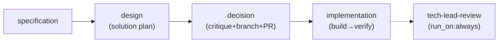

<!-- section file — index: [documents/design-sdlc.md](../design-sdlc.md) -->

# SDS SDLC — Intro and Architecture

# SDS: SDLC Pipeline

## 1. Intro

- **Purpose:** Implementation details for the SDLC workflow (example use case
  of flowai-workflow engine).
- **Rel to SRS:** Implements FRs from `documents/requirements-sdlc.md`.

## 2. Architecture

### 2.1 Legacy: Shell Script Pipeline (REMOVED — superseded by FR-S15)

Legacy 9-stage shell workflow (`Stage 1–9`) removed. Stages 3 (Reviewer),
4 (Architect), 5 (SDS Update), 8 (Presenter) absorbed/eliminated per FR-S15.
Current architecture: see §2.2 Pipeline DAG.

### 2.2 Pipeline DAG (FR-S15, FR-E18)

- **Node ID convention (FR-E18):** Activity-based IDs reflect what work is done,
  not who does it. Mapping: `pm`→`specification`, `architect`→`design`,
  `tech-lead`→`decision`, `impl-loop`→`implementation`, `developer`→`build`,
  `qa`→`verify`, `tech-lead-review`→`tech-lead-review`.
- **Phases (FR-E18):** Top-level `phases:` key in `workflow.yaml` declares named
  phase groups. Each phase lists member stage IDs:
  - `plan`: [specification, design, decision]
  - `impl`: [implementation]
  - `report`: [tech-lead-review]
  Phase grouping is declarative config; engine treats it as opaque data. Enables
  future phase-level `run_on` semantics and cleaner artifact reporting.

- **Subsystems:**
  - **Agent Runtime**: Claude Code CLI invocations with role-specific prompts
    from `.flowai-workflow/agents/agent-<name>/SKILL.md` (canonical location per
    FR-S26; legacy `.claude/skills/` symlinks removed per FR-S33)
  - **Artifact Store**: Git-tracked files in `.flowai-workflow/runs/<run-id>/[<phase>/]<node-id>/`
    (phase subdir present when node has `phase` field in config). Note: runs
    directory remains at `.flowai-workflow/runs/` — engine-controlled hardcoded path;
    configurable `runs_dir` deferred to separate engine FR.
    - **Artifact File Numbering (FR-S32):** Gapless sequential prefixes
      `01`–`06` reflecting workflow execution order. Convention:
      `<NN>-<base-name>.md`. Current mapping:
      - `01-spec.md` (specification)
      - `02-plan.md` (design)
      - `03-decision.md` (decision)
      - `04-impl-summary.md` (build)
      - `05-qa-report.md` (verify)
      - `06-review.md` (tech-lead-review)
      All workflow YAML, agent prompts, SRS, and SDS references MUST use these
      canonical filenames. Alphabetical sorting = execution order.
  - **Legacy Shell Scripts** (`.flowai-workflow/scripts/`): Deprecated stage scripts
    deleted per FR-S26. HITL, rollback, and dashboard wrapper scripts retained.
    `run-dashboard.sh` wraps `deno task dashboard` with warning logging on
    failure (FR-S36). ~~`reset-to-main.sh`~~ **Superseded** — engine FR-E24
    worktree isolation replaces `pre_run:` script. `reset-to-main.sh` no longer
    invoked; `pre_run` field removed from engine config.

## 3. Components

