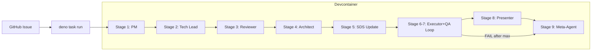
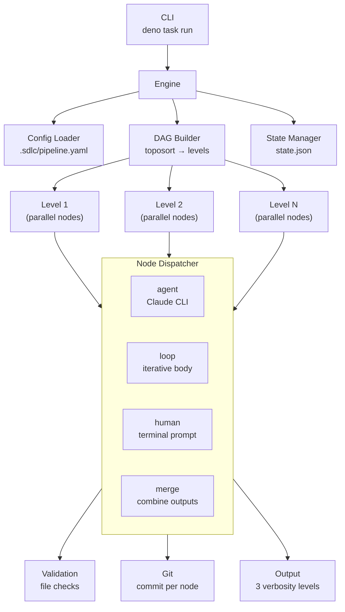

# SDS

## 1. Intro

- **Purpose:** Define implementation details for auto-flow: automated
  multi-agent SDLC pipeline.
- **Rel to SRS:** Implements all FRs from `documents/requirements.md`. Each
  component maps to one or more FRs.

## 2. Arch

- **Diagrams:**

### 2.1 Legacy: Shell Script Pipeline



### 2.2 Current: Configurable Node Engine (Deno/TypeScript)



- **Subsystems:**
  - **Pipeline Engine** (`.sdlc/engine/`): Deno/TypeScript DAG-based executor
    with YAML config, template interpolation, parallel levels, loop nodes,
    human nodes, resume support
  - **Agent Runtime**: Claude Code CLI invocations with role-specific prompts
    from `agents/<name>/SKILL.md`; also discoverable as Claude Code skills via
    `.claude/skills/agent-<name>` symlinks
  - **Artifact Store**: Git-tracked files in `.sdlc/runs/<run-id>/[<phase>/]<node-id>/`
    (phase subdir present when node has `phase` field in config)
  - **Validation Engine**: Rule-based checks (file_exists, file_not_empty,
    contains_section, custom_script, frontmatter_field)
  - **Continuation Engine**: `--resume` based re-invocation on validation
    failure or safety-check violation (shared `max_continuations` budget)
  - **Legacy Shell Scripts** (`.sdlc/scripts/`): Preserved for backward
    compatibility, superseded by engine

## 3. Components

### 3.1 Docker Image

- **Purpose:** Single runtime environment for all stages.
- **Interfaces:** Contains `claude` CLI, `deno`, `git`, `gh`, `gitleaks`.
- **Deps:** Node.js (for claude CLI install), Deno runtime.

### 3.2 Stage Scripts (`.sdlc/scripts/`)

- **Purpose:** Orchestrate each pipeline stage: prepare input, invoke agent,
  validate, continue, commit.
- **Interfaces:**
  - Input: `<issue-number>` as CLI argument.
  - Output: Committed artifacts + logs on feature branch.
- **Deps:** `lib.sh` (shared functions), `claude` CLI, `git`, `gh`.

### 3.3 Shared Library (`.sdlc/scripts/lib.sh`)

- **Purpose:** Common functions for all stage scripts.
- **Interfaces:** Functions: `log()`, `run_agent()`, `validate_artifact()`,
  `continuation_loop()`, `commit_artifacts()`, `report_status()`,
  `safety_check_diff()`, `retry_with_backoff()`.
  - `retry_with_backoff()`: Generic retry wrapper for external CLI calls
    (`claude`, `gh`). Max 3 attempts, 5s initial delay, 2x backoff. Retries on
    non-zero exit (network/rate-limit errors). Does not retry validation
    failures.
- **Deps:** `claude` CLI, `git`, `gh`.

### 3.4 Agent Prompts (`agents/`)

- **Purpose:** Versioned system prompts defining each agent's role and behavior.
  Each agent lives in `agents/<name>/SKILL.md` with YAML frontmatter enabling
  dual-use: pipeline-driven (via engine `prompt:` config) and interactive
  (via Claude Code `/agent-<name>` slash commands).
- **Directory structure:** `agents/<name>/SKILL.md` — 10 agents: `pm`,
  `tech-lead`, `tech-lead-reviewer`, `architect`, `tech-lead-sds`, `executor`,
  `qa`, `presenter`, `meta-agent`, `committer`.
- **SKILL.md frontmatter template:**
  ```yaml
  ---
  name: "agent-<name>"
  description: "<one-line role description>"
  disable-model-invocation: true
  ---
  ```
  - `disable-model-invocation: true` — prevents automatic invocation; agents
    are only triggered explicitly (pipeline or slash command).
- **Interfaces:**
  - Pipeline: engine reads `prompt:` path from `pipeline.yaml` → file content
    passed to `claude --system-prompt`.
  - Interactive: Claude Code discovers skills via `.claude/skills/agent-<name>`
    symlinks → user invokes `/agent-<name>`.
- **Deps:** None (static content, versioned in git).

### 3.5 Skill Symlinks (`.claude/skills/agent-*`)

- **Purpose:** Bridge pipeline agents into Claude Code's skill discovery system,
  enabling `/agent-<name>` slash command invocability (FR-19 AC #2, AC #6).
- **Structure:** 10 symlinks: `.claude/skills/agent-<name>` → `../../agents/<name>/`
  (relative paths for portability within repo).
- **Agents exposed:** `agent-pm`, `agent-tech-lead`, `agent-tech-lead-reviewer`,
  `agent-architect`, `agent-tech-lead-sds`, `agent-executor`, `agent-qa`,
  `agent-presenter`, `agent-meta-agent`, `agent-committer`.
- **Interfaces:** Claude Code skill loader reads symlink target directory,
  discovers `SKILL.md` frontmatter, registers slash command.
- **Deps:** `agents/<name>/SKILL.md` (symlink targets must exist).
- **Constraint:** Symlinks are Linux-native; devcontainer runtime ensures
  consistent behavior (no Windows symlink issues).

### 3.6 Pipeline Engine (`.sdlc/engine/`)

- **Purpose:** Configurable DAG-based pipeline executor. Replaces hardcoded
  shell script orchestration with YAML-driven node graph.
- **Modules:**
  - `types.ts` — type declarations (incl. `ValidationRule.type` union,
    `NodeConfig.run_always`, `NodeConfig.phase`, `LoopResult.bodyResults`)
  - `template.ts` — `{{var}}` interpolation for prompts/paths
  - `config.ts` — YAML parsing, schema validation, defaults merge
  - `dag.ts` — topological sort, cycle detection, level grouping
  - `validate.ts` — artifact validation rules (file_exists, not_empty,
    contains_section, custom_script, frontmatter_field)
  - `state.ts` — RunState persistence to `state.json`, resume logic,
    phase registry (`setPhaseRegistry()`, `clearPhaseRegistry()`,
    `getPhaseForNode()`)
  - `agent.ts` — Claude CLI invocation, continuation loop, retry
  - `loop.ts` — loop node execution with condition extraction, per-iteration
    `AgentResult` accumulation into `LoopResult.bodyResults`
  - `hitl.ts` — HITL detection (`detectHitlRequest`) and poll loop
    (`runHitlLoop`); injectable `scriptRunner`/`claudeRunner` for testing
  - `human.ts` — terminal user input, abort logic
  - `git.ts` — commit helper (used by committer agent nodes), branch query
  - `output.ts` — terminal output manager (quiet/normal/verbose), verbose
    methods for detailed agent-node diagnostics
  - `engine.ts` — main executor: level iteration, parallel dispatch, verbose
    input resolution, loop-node log saving via `onNodeComplete` callback,
    phase registry init (`setPhaseRegistry()` before `ensureRunDirs()` in both
    fresh and resume paths), phase subdir creation in `ensureRunDirs()`
  - `cli.ts` — CLI entry point: argument parsing, .env loading
  - `mod.ts` — public API re-exports
- **Interfaces:**
  - CLI: `deno task run [--prompt <text>] [--config <path>] [--resume <run-id>]
    [--dry-run] [-v|-q] [--env KEY=VAL] [--skip nodes] [--only nodes]`
  - Config: `.sdlc/pipeline.yaml` (YAML, version "1")
  - State: `.sdlc/runs/<run-id>/state.json` (JSON)
- **Node types:** `agent`, `merge`, `loop`, `human`
- **Node flags:**
  - `run_always?: boolean` — when `true`, node executes in a post-levels step
    after all DAG levels complete (including on pipeline failure). Used for
    Meta-Agent.
  - `phase?: string` — optional phase grouping label (e.g., `plan`, `impl`,
    `report`). When set, node artifacts are stored under
    `<run-dir>/<phase>/<node-id>/` instead of `<run-dir>/<node-id>/`. User-
    defined (no enum constraint). Validated: must be non-empty string if present.
    Backward-compatible: omitting `phase` preserves flat layout.
- **Commit strategy:** Engine does not auto-commit. Dedicated committer agent
  nodes handle commits at explicit pipeline points.
- **Verbose Output (Direct Injection pattern):**
  - `output.ts` exposes 6 verbose-guarded methods on `OutputManager`:
    `verbosePrompt(nodeId, prompt)`,
    `verboseInputs(nodeId, inputs: {path, sizeBytes}[])`,
    `verboseValidation(nodeId, results: {rule, passed, detail?}[])`,
    `verboseContinuation(nodeId, attempt, max, failures)`,
    `verboseSafety(nodeId, files, violations)`,
    `verboseCommit(nodeId, files, message, branch)`.
    All no-op when `verbosity !== "verbose"`. Output: human-readable stderr with
    section headers. Note: AC #5 (agent stdout streaming) already implemented
    via existing `nodeOutput()` method — no new work needed.
  - `agent.ts`: `AgentRunOptions` gains optional `output?: OutputManager` and
    `nodeId?: string`. `runAgent()` calls `verbosePrompt()` after prompt
    construction, `verboseValidation()` after each `runValidations()` call,
    `verboseContinuation()` before resume invocation. Guarded by `if (output)`.
  - `loop.ts`: `LoopRunOptions` gains optional `output?: OutputManager`.
    Forwarded to `runAgent()` calls. Enables prompt/validation/continuation
    verbose for loop body nodes. Safety/commit verbose for loop body nodes:
    deferred (loop body bypasses `executeAgentNode()`).
  - `git.ts`: No `OutputManager` dependency. Pure data enrichment only.
    `commitNodeChanges()` runs `git diff --cached --name-only` after
    `git add -A` to capture staged files. Returns enriched `CommitResult` with
    `filesStaged: string[]` and `message: string`. `safetyCheckDiff()` returns
    enriched `SafetyCheckResult` with `checkedFiles: string[]` (from
    already-computed `changedFiles`). `branch()` helper: returns current branch
    name via `git branch --show-current`. Verbose calls for safety/commit stay
    in engine.
  - `engine.ts`: `executeAgentNode()` resolves input artifact paths+sizes by
    walking `ctx.input` directories via `Deno.stat()`; calls
    `this.output.verboseInputs()` before `runAgent()`. Passes `this.output`
    and `nodeId` to `runAgent()`. After `safetyCheckDiff()`, calls
    `this.output.verboseSafety()` with `checkedFiles` and `violations`.
    `commitIfNeeded()` (called from `executeNode()` after agent returns): after
    `commitNodeChanges()` returns, calls `this.output.verboseCommit()` with
    `filesStaged`, `message`, branch. Sequencing: inputs → agent
    (prompt/validation/continuation verbose) → safety (verbose) → commit
    (verbose via `commitIfNeeded()`).
  - All existing callers pass no `output` arg — zero behavioral change.
- **Deps:** `claude` CLI, `deno`, `git`, `jsr:@std/yaml`.

### 3.7 Phase Registry (`state.ts`)

- **Purpose:** Module-scoped mapping from nodeId → phase string, enabling
  `getNodeDir()` to resolve phase-aware artifact paths without signature change.
- **Data:** `phaseRegistry: Map<string, string>` — populated from
  `PipelineConfig` nodes' `phase` fields.
- **Interfaces:**
  - `setPhaseRegistry(config: PipelineConfig)` — iterates config nodes, builds
    map from `nodeId → node.phase` (skips nodes without `phase`). Called once at
    engine init (both fresh-run and `--resume` paths).
  - `clearPhaseRegistry()` — resets map. Used in tests for isolation.
  - `getPhaseForNode(nodeId: string): string | undefined` — lookup.
  - `getNodeDir(runId, nodeId)` — signature unchanged. Internally: if registry
    has phase for nodeId, returns `${runDir}/${phase}/${nodeId}/`; otherwise
    `${runDir}/${nodeId}/` (backward-compatible fallback).
- **Deps:** `types.ts` (`PipelineConfig`, `NodeConfig`).
- **Design rationale:** Module-scoped global state (not instance state) because
  `getNodeDir()` is a free function called from multiple contexts (engine,
  templates, tests). Single-instance engine guarantee prevents concurrent
  mutation. `clearPhaseRegistry()` ensures test isolation.

### 3.8 HITL Pipeline Scripts (`.sdlc/scripts/hitl-*.sh`)

- **Purpose:** Deliver agent questions to humans and poll for replies. Pipeline-
  specific (GitHub), not engine code. Engine invokes via configurable paths.
- **Scripts:**
  - `hitl-ask.sh` — render question JSON → markdown, post to GitHub issue.
    - Input: `--run-dir`, `--issue-source`, `--run-id`, `--node-id`,
      `--question-json`.
    - Extracts issue: `yq '.issue' "$RUN_DIR/$ISSUE_SOURCE"`.
    - Auto-detects repo: `gh repo view --json nameWithOwner`.
    - Renders: header, blockquoted question, numbered options, HTML marker
      `<!-- hitl:<run-id>:<node-id> -->`.
    - Posts via `gh issue comment <N> --body "$md"`.
    - Deps: `jq`, `yq`, `gh`.
  - `hitl-check.sh` — poll GitHub issue for human reply after marker.
    - Input: `--run-dir`, `--issue-source`, `--run-id`, `--node-id`,
      `--bot-login`.
    - Extracts issue: `yq '.issue' "$RUN_DIR/$ISSUE_SOURCE"`.
    - Auto-detects repo: `gh repo view --json nameWithOwner`.
    - Fetches comments: `gh api repos/{owner}/{repo}/issues/<N>/comments`.
    - jq filter: find comment with marker, then first subsequent non-bot comment.
    - Exit 0 + body on stdout = reply found. Exit 1 = no reply yet.
    - Deps: `jq`, `yq`, `gh`.
- **Interfaces:** Called by engine via `defaults.hitl.ask_script` /
  `defaults.hitl.check_script` paths in `pipeline.yaml`.

### 3.9 Pipeline Trigger

- **Purpose:** Single entry point for pipeline. PM agent autonomously triages
  open GitHub issues.
- **Interfaces:** CLI: `deno task run [--prompt "..."]`. PM selects
  highest-priority open issue via `gh`.
- **Deps:** Devcontainer, Claude CLI auth (OAuth or API key), `GITHUB_TOKEN`.

## 4. Data

- **Entities:**
  - Handoff Artifact: Structured Markdown (01-spec.md through 07-meta-report.md)
  - Agent Log: Claude CLI JSON output (`.sdlc/runs/<run-id>/logs/<node-id>.json`)
  - Agent Prompt: SKILL.md with YAML frontmatter (`agents/<name>/SKILL.md`)
  - Run State: JSON (`.sdlc/runs/<run-id>/state.json`)
  - Pipeline Config: YAML (`.sdlc/pipeline.yaml`)
  - CommitResult: `{ commitHash, filesStaged: string[], message: string }`
    (enriched for verbose output)
  - ValidationRule: `{ type: "file_exists"|"file_not_empty"|"contains_section"|
    "custom_script"|"frontmatter_field", path?, field?, allowed?, ... }`
  - LoopResult: `{ ..., bodyResults: AgentResult[] }` — accumulated per-iteration
    agent results; consumed by `executeLoopNode()` callback for log saving
  - NodeConfig: `{ ..., run_always?: boolean, phase?: string }` — `run_always`
    for post-levels execution; `phase` for artifact directory grouping
- **ERD:** N/A (file-based, no database).
- **Migration:** N/A.

### 4.1 Inter-Node Data Flow

- **Mechanism:** Filesystem-based. Each node reads input via `{{input.<node-id>}}`
  template variable pointing to predecessor's output directory. No manifest.
- **Directory structure:** `.sdlc/runs/<run-id>/[<phase>/]<node-id>/` per node
  output. Phase subdir present when node's `phase` field is set in config.
  Example with phases: `.sdlc/runs/abc/plan/pm/`, `.sdlc/runs/abc/impl/executor/`.
  Without phase: `.sdlc/runs/abc/some-node/` (backward-compatible flat layout).
- **Validation:** Engine validates output via configurable rules (file_exists,
  file_not_empty, contains_section, custom_script, frontmatter_field) after
  each node. Validation failures trigger continuation (resume with error
  context) rather than immediate node failure.
  - `frontmatter_field`: Reads artifact file, extracts YAML frontmatter via
    `^---\n([\s\S]*?)\n---` regex, parses target field, checks value against
    allowed set. Config: `{ type: "frontmatter_field", path, field, allowed }`.
  - Executor node uses `custom_script` validation rule (not `after` hook) for
    `deno task check`, enabling continuation-on-failure for check errors.
- **Context management:** Claude CLI auto-compression handles large input sets.
- **Template variables:** `{{node_dir}}`, `{{input.*}}`, `{{run_dir}}`,
  `{{run_id}}`, `{{args.*}}`, `{{env.*}}`, `{{loop.iteration}}`.
- **After-hook conventions:** Commands run from repo root (no `cd {{run_dir}}`
  prefix needed). Use `|| true` suffix to prevent hook failure from killing
  the node. Example (sds-update diff capture):
  `git diff HEAD -- documents/design.md > {{node_dir}}/04a-sds-diff.md;
  [ -s {{node_dir}}/04a-sds-diff.md ] || echo "No changes" >
  {{node_dir}}/04a-sds-diff.md || true`.

### 4.2 Commit Strategy

- **Branch:** Feature branch, specified externally or current branch.
- **Commit cadence:** Engine does NOT auto-commit. Commits at explicit
  committer agent nodes (`agents/committer/SKILL.md`) placed at 3 points:
  `commit-plan` (after SDS update), `commit-impl` (after executor+QA loop),
  `commit-present` (after presenter).
- **Commit format:** `sdlc(<phase>): <summary>` (phase from `SDLC_PHASE` env).
- **Executor:** Instructed NOT to make git commits (pipeline-managed).
- **Failure behavior:** Failed nodes produce no commits. On_error: "fail" stops
  pipeline; "continue" proceeds to next nodes.
- **Resume:** `--resume <run-id>` skips completed nodes per state.json.

## 5. Logic

- **Algos:**
  - **Continuation Loop**: invoke agent -> validate -> if fail: resume with
    error context -> repeat (max N). If limit reached: fail node, trigger
    Meta-Agent.
  - **Executor+QA Loop**: Executor implements -> QA verifies -> if FAIL:
    Executor reads QA report, fixes -> repeat (max 3).
  - **Secret Detection**: `gitleaks detect --no-git` runs as part of
    `deno task check` (`scripts/check.ts`). `allowFailure=true` — skips if
    gitleaks binary not found. Engine-level `safetyCheckDiff()` removed.
  - **Verbose Output Flow** (`-v` mode, agent nodes only): In
    `executeAgentNode()`: (1) resolve input artifact file paths+sizes from
    `ctx.input` dirs via `Deno.stat()` → `verboseInputs()`, (2) `runAgent()`
    (with `output` + `nodeId`) emits `verbosePrompt()` → Claude CLI executes →
    `verboseValidation()` → on failure: `verboseContinuation()` → retry.
    All verbose methods guarded by `verbosity !== "verbose"` — no-op in
    default/quiet. Output: human-readable stderr lines with section headers.
    Note: safety check and auto-commit verbose removed (engine no longer
    performs these operations).
  - **Loop Node Log Saving** (callback-based, no I/O in `loop.ts`):
    `runLoop()` accumulates `AgentResult` per body-node iteration into
    `LoopResult.bodyResults[]` (pure data, no filesystem ops). In
    `executeLoopNode()` (`engine.ts`), the `onNodeComplete` callback iterates
    `bodyResults`, calling `saveAgentLog()` with iteration-qualified nodeId
    (`${id}-iter-${i}`). Guard: only on `result.success && result.output`.
    `saveAgentLog()` errors caught and warned (non-fatal) — audit I/O must not
    break loop execution. `runDir` resolved via `getRunDir(this.state.run_id)`
    (already in engine scope).
  - **Verbose Edge Cases** (behavioral contracts verified by tests):
    - **Default mode (no `-v`):** All 6 verbose methods produce zero stderr
      output. `OutputManager` constructed with `verbose=false` suppresses all
      verbose calls unconditionally.
    - **Empty input dir:** `resolveInputArtifacts()` returns empty list →
      `verboseInputs()` reports `0 files` without error. No `Deno.stat()` calls.
    - **Missing file stat:** `Deno.stat()` failure on input artifact →
      graceful skip, verbose output includes error detail for affected path.
    - **Zero staged files at commit:** `commitNodeChanges()` detects no staged
      files → `verboseCommit()` reports no-op commit. No git commit created.
  - **Phase Registry Init**: In `engine.ts` `run()`, `setPhaseRegistry(config)`
    called before `ensureRunDirs()`. On `--resume`: config re-loaded from
    `state.config_path`, then `setPhaseRegistry()` called (registry not persisted
    in `state.json` — always rebuilt from config). `ensureRunDirs()` creates
    phase subdirs (e.g., `plan/`, `impl/`, `report/`) when phases present.
    Phase assignment (default pipeline):
    - `plan`: pm, tech-lead, reviewer, architect, sds-update, commit-plan
    - `impl`: executor, qa, impl-loop, commit-impl
    - `report`: presenter, commit-present, meta-agent
  - **Meta-Agent Trigger**: Engine executes meta-agent via `run_always: true`
    mechanism. After all DAG levels complete (success or failure), engine
    collects nodes with `run_always: true` and executes them in a final
    post-levels step — outside normal DAG level iteration. Meta-agent node
    has no strict dependency on `presenter`, enabling execution even when
    upstream nodes fail. On failure: reads failed node ID from `state.json`,
    runs with failure context.
  - **HITL via AskUserQuestion Interception** (FR-21):
    Engine detects agent HITL requests by inspecting `permission_denials` in
    Claude CLI JSON output. Flow:
    1. Agent node completes → engine parses JSON `result` event.
    2. If `permission_denials[]` contains entry with
       `tool_name == "AskUserQuestion"`: extract `tool_input.questions` (structured
       question with `question`, `header`, `options[]`, `multiSelect`) and
       `session_id` from result.
    3. Engine calls `defaults.hitl.ask_script` (external pipeline script) with
       question JSON + context args (repo, issue, run-id, node-id).
    4. Engine sets node state to `waiting` in `state.json`, saves `session_id`.
    5. Engine enters poll loop: `sleep(poll_interval)` → call
       `defaults.hitl.check_script` → if exit 0, read reply from stdout.
    6. Engine resumes agent: `claude --resume <session_id> -p "<reply>"
       --output-format json`. Agent sees full previous context + reply as new
       user message.
    7. On `timeout` exceeded: node marked `failed`, Meta-Agent triggered.
    Experimentally verified (see `documents/rnd/human-in-the-loop.md`):
    - `AskUserQuestion` denied in `-p` mode regardless of `--dangerously-skip-
      permissions` (cause: no terminal, not permissions).
    - Question JSON in `permission_denials[0].tool_input`: `{questions: [{
      question, header, options: [{label, description}], multiSelect}]}`.
    - `--resume <session_id> -p "<answer>"` preserves full session context;
      agent correctly interprets answer in context of its original question.
    - Cost per HITL roundtrip: ~$0.08 (question turn + resume turn).
    Pipeline config:
    ```yaml
    defaults:
      hitl:
        ask_script: .sdlc/scripts/hitl-ask.sh
        check_script: .sdlc/scripts/hitl-check.sh
        issue_source: plan/pm/01-spec.md
        poll_interval: 60
        timeout: 7200
    ```
- **Rules:**
  - Artifacts overwritten on re-run (git history preserves previous).
  - QA iteration numbering restarts on re-run.
  - Meta-Agent runs on both success and failure.
  - Meta-Agent auto-applies prompt improvements to `agents/*/SKILL.md` and
    commits changes. Human review at PR merge.

## 6. Non-Functional

- **Scale:** Single pipeline per issue. Sequential stages (no parallel agents).
- **Fault:** Stage failure stops pipeline, Meta-Agent analyzes, failure reported
  on issue.
- **Sec:** Secret detection via `gitleaks detect --no-git` in `deno task check`
  (`scripts/check.ts`). Engine-level scope checks removed. Agents run with
  local user's permissions.
- **Logs:** Full transcripts per stage in `.sdlc/runs/<run-id>/logs/`.

## 7. Constraints

- **Simplified:** Pipeline runs sequentially (no parallel stages in v1).
- **Deferred:** Multi-repo support. Parallel pipelines for multiple issues.
  Issue size/complexity limits. Cost tracking and budget limits.
