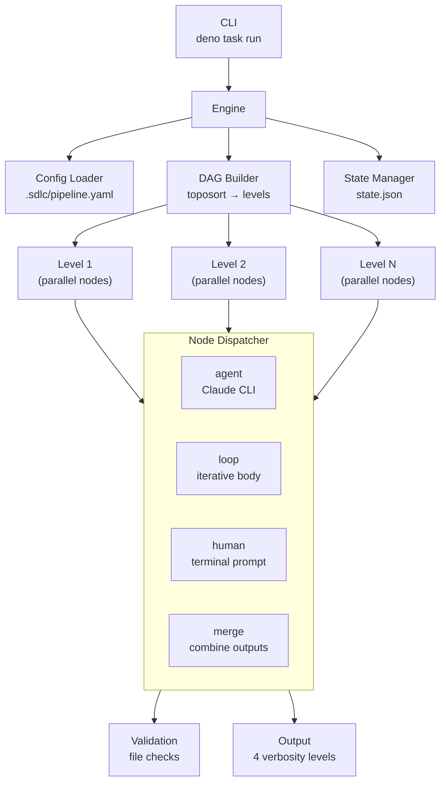
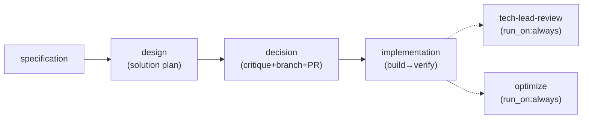

# SDS

## 1. Intro

- **Purpose:** Define implementation details for auto-flow: automated
  multi-agent SDLC pipeline.
- **Rel to SRS:** Implements all FRs from `documents/requirements.md`. Each
  component maps to one or more FRs.

## 2. Arch

- **Diagrams:**

### 2.1 Legacy: Shell Script Pipeline


### 2.2 Current: Configurable Node Engine (Deno/TypeScript)



### 2.3 Pipeline DAG (FR-26, FR-33)



- **Node ID convention (FR-33):** Activity-based IDs reflect what work is done,
  not who does it. Mapping: `pm`→`specification`, `architect`→`design`,
  `tech-lead`→`decision`, `impl-loop`→`implementation`, `developer`→`build`,
  `qa`→`verify`, `tech-lead-review`→`tech-lead-review`, `meta-agent`→`optimize`.
- **Phases (FR-33):** Top-level `phases:` key in `pipeline.yaml` declares named
  phase groups. Each phase lists member stage IDs:
  - `plan`: [specification, design, decision]
  - `impl`: [implementation]
  - `report`: [tech-lead-review, optimize]
  Phase grouping is declarative config; engine treats it as opaque data. Enables
  future phase-level `run_on` semantics and cleaner artifact reporting.

- **Subsystems:**
  - **Pipeline Engine** (`engine/`): Deno/TypeScript DAG-based executor
    with YAML config, template interpolation, parallel levels, loop nodes,
    human nodes, resume support
  - **Agent Runtime**: Claude Code CLI invocations with role-specific prompts
    from `.claude/skills/agent-<name>/SKILL.md` (canonical, agentskills.io-
    compliant; no symlinks)
  - **Artifact Store**: Git-tracked files in `.sdlc/runs/<run-id>/[<phase>/]<node-id>/`
    (phase subdir present when node has `phase` field in config)
  - **Validation Engine**: Rule-based checks (file_exists, file_not_empty,
    contains_section, custom_script, frontmatter_field)
  - **Continuation Engine**: `--resume` based re-invocation on validation
    failure or safety-check violation (shared `max_continuations` budget)
  - **Legacy Shell Scripts** (`.sdlc/scripts/`): Preserved for backward
    compatibility, superseded by engine

## 3. Components

### 3.1 Docker Image

- **Purpose:** Single runtime environment for all stages.
- **Interfaces:** Contains `claude` CLI, `deno`, `git`, `gh`, `gitleaks`.
- **Deps:** Node.js (for claude CLI install), Deno runtime.

### 3.2 Stage Scripts (`.sdlc/scripts/`) — DEPRECATED

- **Status:** Formally deprecated. Superseded by Deno/TypeScript pipeline engine
  (`engine/`). Retained for backward compatibility only. Use `deno task run`.
- **Purpose:** Legacy orchestration for each pipeline stage: prepare input,
  invoke agent, validate, continue, commit.
- **AGENT_PROMPT paths:** Updated to `.claude/skills/agent-<name>/SKILL.md`
  (canonical, post-FR-36 migration).
- **Interfaces:**
  - Input: `<issue-number>` as CLI argument.
  - Output: Committed artifacts + logs on feature branch.
- **Deps:** `lib.sh` (shared functions), `claude` CLI, `git`, `gh`.

### 3.3 Shared Library (`.sdlc/scripts/lib.sh`)

- **Purpose:** Common functions for all stage scripts.
- **Interfaces:** Functions: `log()`, `run_agent()`, `validate_artifact()`,
  `continuation_loop()`, `commit_artifacts()`, `report_status()`,
  `safety_check_diff()`, `retry_with_backoff()`.
  - `retry_with_backoff()`: Generic retry wrapper for external CLI calls
    (`claude`, `gh`). Max 3 attempts, 5s initial delay, 2x backoff. Retries on
    non-zero exit (network/rate-limit errors). Does not retry validation
    failures.
- **Deps:** `claude` CLI, `git`, `gh`.

### 3.4 Agent Skills (`.claude/skills/agent-*`) (FR-36)

- **Purpose:** Versioned system prompts defining each agent's role and behavior.
  Each agent lives in `.claude/skills/agent-<name>/SKILL.md` (canonical,
  agentskills.io-compliant). Dual-use: pipeline-driven (via engine `prompt:`
  config) and interactive (via Claude Code `/agent-<name>` slash commands).
- **Directory structure:** `.claude/skills/agent-<name>/SKILL.md` — 7 agents:
  - `agent-pm` — triages open GitHub issues, selects highest-priority, produces
    spec.
  - `agent-architect` — design-solution role: produces implementation plan with
    2-3 variants, affected files, effort estimates, risk analysis.
  - `agent-tech-lead` — critique + decision + SDS update + branch creation
    (`git checkout -b sdlc/issue-<N>`) + draft PR (`gh pr create --draft`) +
    task breakdown from selected variant. Uses `{{run_id}}` for `--prompt` mode
    fallback branch `sdlc/{{run_id}}`.
  - `agent-developer` — implements tasks. Owns `git add`, `git commit`,
    `git push` after each task. Posts PR comment with implementation summary.
  - `agent-qa` — verifies developer output. Posts verdict as PR review
    (`gh pr review`: approve/request-changes).
  - `agent-tech-lead-review` — post-pipeline: final code review + CI gate
    check + merge. `run_on: always`. Handles missing-PR case gracefully.
  - `agent-meta-agent` — prompt optimization, failure analysis.
- **Removed agents (FR-26):** `tech-lead-reviewer`, `tech-lead-sds`,
  `committer`, `code-reviewer`.
- **SKILL.md frontmatter (agentskills.io-compliant):**
  ```yaml
  ---
  name: "agent-<name>"
  description: "<one-line role description>"
  compatibility: ["claude-code"]
  allowed-tools: []
  ---
  ```
  - `compatibility: ["claude-code"]` — declares runtime compatibility.
  - `allowed-tools: []` — no automatic tool grants; agents use tools available
    in their execution context.
- **Interfaces:**
  - Pipeline: engine reads `prompt:` path from `pipeline.yaml` (now
    `.claude/skills/agent-<name>/SKILL.md`), caches file content at config load
    time (`prompt_content`), passes inline via
    `claude --append-system-prompt`. Fallback to `--append-system-prompt-file`
    for template paths.
  - Interactive: Claude Code discovers skills directly from
    `.claude/skills/agent-<name>/SKILL.md` → user invokes `/agent-<name>`.
    No symlinks required (canonical location).
- **Migration (FR-36):** Complete. Formerly `agents/<name>/SKILL.md` with
  symlinks from `.claude/skills/`. Migrated to canonical `.claude/skills/`
  layout; `agents/` directory removed; symlink indirection eliminated. Legacy
  stage scripts formally deprecated (co-location N/A for deprecated scripts).
- **Deps:** None (static content, versioned in git).

### 3.6 Pipeline Engine (`engine/`)

- **Purpose:** Configurable DAG-based pipeline executor. Replaces hardcoded
  shell script orchestration with YAML-driven node graph.
- **Modules:**
  - `types.ts` — type declarations (incl. `ValidationRule.type` union,
    `NodeConfig.run_on` (`"always"|"success"|"failure"`), `NodeConfig.phase`,
    `NodeConfig.env`, `NodeConfig.model` (per-node Claude model override),
    `PipelineDefaults.model` (default model for all nodes),
    `LoopNodeConfig.nodes` (inline body node definitions),
    `LoopResult.bodyResults`, `ErrorCategory` (structured failure enum),
    `NodeState.error_category`, `NodeState.cost_usd` (FR-32 per-node cost),
    `RunState.total_cost_usd` (FR-32 aggregated run cost),
    `PipelineDefaults.on_failure_script` (FR-34 configurable failure hook),
    `HitlConfig.artifact_source` (renamed from `issue_source`),
    `HitlConfig.exclude_login` (renamed from `bot_login`),
    `Verbosity` union: `"quiet"|"normal"|"semi-verbose"|"verbose"` (FR-41))
  - `template.ts` — `{{var}}` interpolation for prompts/paths
  - `config.ts` — YAML parsing, schema validation, defaults merge,
    `run_on` normalization. `validateNode()`: if `run_on` present, must be
    one of `"always"|"success"|"failure"`; error:
    `Node '<id>' has invalid run_on value '<val>'. Must be one of: always, success, failure`.
    `normalizeRunOn()` pass (in `mergeDefaults()`):
    if `node.run_always === true && !node.run_on` → sets `run_on = "always"`;
    if both present, `run_on` wins; deletes `run_always` from config
    post-normalization (downstream code only sees `run_on`).
    Loop nodes: parses `nodes` sub-object, validates body node ordering
    (>1 entry requires `inputs` declarations), validates `condition_node`
    references valid key in `nodes`. Skips top-level existence check for
    body node IDs referenced in `inputs`.
  - `dag.ts` — topological sort, cycle detection, level grouping.
    Excludes loop body nodes (from `nodes` sub-object) from top-level
    graph; loop node itself remains in DAG with its declared `inputs`.
  - `validate.ts` — artifact validation rules (file_exists, not_empty,
    contains_section, custom_script, frontmatter_field)
  - `state.ts` — RunState persistence to `state.json`, resume logic,
    phase registry (`setPhaseRegistry()`, `clearPhaseRegistry()`,
    `getPhaseForNode()`), cost aggregation (`updateRunCost()` sums
    `nodes[*].cost_usd` → `total_cost_usd`; called from
    `markNodeCompleted()` when optional `costUsd` param provided, FR-32)
  - `agent.ts` — Claude CLI invocation, continuation loop, retry.
    `AgentRunOptions.model` and `InvokeOptions.model`: optional string for
    per-node model selection. `buildClaudeArgs()` emits `--model <value>` when
    `opts.model` is set AND `opts.resumeSessionId` is NOT set (resume inherits
    original model from session). Resolution: `node.model ?? defaults.model ??
    undefined` (computed in engine.ts/loop.ts, passed as field).
    `executeClaudeProcess()` uses `--output-format stream-json` and reads
    stdout line-by-line. Each JSON line appended to `streamLogPath` file
    (crash-resilient incremental write via `Deno.writeFile({ append: true })`).
    **Stream log timestamps (FR-33):** `tsPrefix()` returns `[HH:MM:SS]`
    wall-clock prefix; `stampLines()` prepends it to each non-empty line (empty
    lines pass through). Applied to log file writes only — terminal output via
    `onOutput` callback receives raw text without timestamps.
    On `result` event: extracts `ClaudeCliOutput` fields (`result`,
    `session_id`, `is_error`, `total_cost_usd`, `duration_ms`,
    `duration_api_ms`, `num_turns`, `permission_denials`). `is_error` derived
    from `subtype !== "success"`. No `result` event → throws descriptive error.
    `streamLogPath` accepted as required parameter in `executeClaudeProcess()`.
    Append semantics: multiple invocations (continuation) with same path
    produce concatenated JSONL. `--verbose` flag removed from
    `buildClaudeArgs()` (unrelated to streaming, changes stderr globally).
    **Turn separators and summary footer (FR-39):** `executeClaudeProcess()`
    maintains `turnCount` counter. On each `event.type === "assistant"`:
    increments counter, writes `--- turn N ---` line to `logFile` via
    `stampLines()` (timestamped, consistent with existing log writes). After
    `result` event extraction: writes `--- end ---` + one-line summary via
    `formatFooter(output: ClaudeCliOutput): string`. Footer format:
    `status=<ok|error> duration=<X>s cost=$<Y> turns=<N>`. Both separators and
    footer are log-file-only (terminal `onOutput` callback unchanged).
    `formatFooter()` is a pure function — unit-testable without CLI.
    **Semi-verbose filtering (FR-41):** `formatEventForOutput(event,
    verbosity?)` accepts optional `Verbosity` param. When
    `verbosity === "semi-verbose"`, skips `tool_use` content blocks in
    `assistant` events — emits only `text` blocks. Default `undefined` =
    all blocks (backward-compatible). Log file writes call without verbosity
    (full output preserved). `onOutput` callback path passes verbosity from
    `AgentRunOptions` so terminal output is filtered at source
  - `loop.ts` — loop node execution with condition extraction, per-iteration
    `AgentResult` accumulation into `LoopResult.bodyResults`.
    `buildLoopBodyOrder()` reads from inline `nodes` sub-object (replaces
    `body` array), topo-sorts body nodes by their `inputs` declarations.
    `buildContext()` resolves `inputs` against both sibling body nodes and
    top-level nodes. Accepts `streamLogPath` pattern from engine; computes
    iteration-qualified path `${nodeId}-iter-${i}.jsonl` per body node
    invocation; forwards to inner `runAgent()` calls
  - `hitl.ts` — HITL detection (`detectHitlRequest`) and poll loop
    (`runHitlLoop`); injectable `scriptRunner`/`claudeRunner` for testing
  - `human.ts` — terminal user input, abort logic
  - ~~`git.ts`~~ — **deleted** (FR-29: domain-specific git code removed from
    engine). Functions relocated to `.sdlc/scripts/rollback-uncommitted.sh`.
    Failure handling replaced by configurable `on_failure_script` hook
  - `output.ts` — terminal output manager (quiet/normal/semi-verbose/verbose),
    verbose methods for detailed agent-node diagnostics.
    `nodeOutput()` gate: shown when `verbosity === "verbose"` or
    `verbosity === "semi-verbose"`. In semi-verbose, tool-call lines already
    excluded upstream by `formatEventForOutput()` — `nodeOutput()` passes
    through whatever it receives.
    `dryRunPlan(levels, labels, postPipelineNodeIds?, runOnMap?)`: renders
    regular DAG levels, then optional "Post-pipeline" section listing `run_on`
    nodes with their conditions (FR-28).
    `nodeResult(nodeId, output: ClaudeCliOutput)`: one-line agent result
    summary (FR-30). Guarded by `verbosity !== "quiet"`. Format:
    `[HH:MM:SS] <nodeId padded>  RESULT: <first line ≤120 chars> | cost=$X.XXXX | duration=Xs | turns=N`.
    Imports `ClaudeCliOutput` from `types.ts`
  - `engine.ts` — main executor: level iteration, parallel dispatch, verbose
    input resolution, node result summary display (FR-30),
    loop-node log saving via `onNodeComplete` callback,
    phase registry init (`setPhaseRegistry()` before `ensureRunDirs()` in both
    fresh and resume paths), phase subdir creation in `ensureRunDirs()`,
    pre-post-pipeline `on_failure_script` execution.
    Dry-run path (FR-28): applies `collectPostPipelineNodes()` +
    `sortPostPipelineNodes()` + level filtering before calling
    `dryRunPlan()`, passing filtered levels and post-pipeline node IDs with
    `run_on` conditions — mirrors normal execution path's filtering logic.
    On config load: iterates all nodes; for loop nodes with `nodes`
    sub-object, flattens nested body node IDs into master ID list passed
    to `createRunState()` (ensures state.json tracks both top-level and
    nested body node IDs).
    Computes `streamLogPath = ${runDir}/logs/${nodeId}.jsonl` for each agent
    node; passes to `runAgent()`. For loop nodes: passes path pattern to
    loop executor for iteration-qualified derivation
  - `cli.ts` — CLI entry point: argument parsing, .env loading
  - `mod.ts` — public API re-exports
- **Interfaces:**
  - CLI: `deno task run [--prompt <text>] [--config <path>] [--resume <run-id>]
    [--dry-run] [-v|-s|-q] [--env KEY=VAL] [--skip nodes] [--only nodes]`
  - Config: `.sdlc/pipeline.yaml` (YAML, version "1")
  - State: `.sdlc/runs/<run-id>/state.json` (JSON)
- **Node types:** `agent`, `merge`, `loop` (with inline `nodes` sub-object
    for body node definitions), `human`
- **Node flags:**
  - `run_on?: "always" | "success" | "failure"` — execution condition for
    post-pipeline nodes. When set, node is excluded from DAG levels and executes
    in a post-pipeline step after all DAG levels complete:
    - `"always"` — execute regardless of pipeline outcome. Used for meta-agent
      and tech-lead-review.
    - `"success"` — execute only if pipeline succeeded.
    - `"failure"` — execute only if pipeline failed. Skipped nodes get
      `markNodeSkipped()` status.
    Backward compat: `run_always: true` in YAML normalized to `run_on: "always"`
    by config loader (see `config.ts` normalization). `run_always` deleted
    post-normalization — not visible to engine runtime.
  - `phase?: string` — optional phase grouping label (e.g., `plan`, `impl`,
    `report`). When set, node artifacts are stored under
    `<run-dir>/<phase>/<node-id>/` instead of `<run-dir>/<node-id>/`. User-
    defined (no enum constraint). Validated: must be non-empty string if present.
    Backward-compatible: omitting `phase` preserves flat layout.
  - `env?: Record<string, string>` — optional node-level environment variables.
    Merged with global env (node-level overrides global defaults). Accessible
    in template context via `{{env.<key>}}`.
  - `model?: string` — per-node Claude model override (FR-27, implemented).
    Overrides `defaults.model`. Absent = defaults.model or CLI default (no flag).
    Emitted as `--model <value>` on initial invocations only; `--resume` calls
    exclude `--model` (session inherits original). Resolution chain:
    `node.model ?? defaults.model ?? undefined`. Centralized in
    `buildClaudeArgs()` via `InvokeOptions.model` field.
- **Commit strategy:** Engine does not auto-commit. Developer agent owns commits
  (`git add`, `git commit`, `git push` per task). No dedicated committer nodes.
- **Verbose Output (Direct Injection pattern):**
  - `output.ts` exposes 4 verbose-guarded methods on `OutputManager`:
    `verbosePrompt(nodeId, prompt)`,
    `verboseInputs(nodeId, inputs: {path, sizeBytes}[])`,
    `verboseValidation(nodeId, results: {rule, passed, detail?}[])`,
    `verboseContinuation(nodeId, attempt, max, failures)`.
    `verboseSafety()` and `verboseCommit()` removed (engine no longer performs
    safety checks or commits — FR-29 domain-agnostic cleanup).
    All no-op when `verbosity !== "verbose"`. Output: human-readable stderr with
    section headers. Note: AC #5 (agent stdout streaming) already implemented
    via existing `nodeOutput()` method — no new work needed.
  - `agent.ts`: `AgentRunOptions` gains optional `output?: OutputManager` and
    `nodeId?: string`. `runAgent()` calls `verbosePrompt()` after prompt
    construction, `verboseValidation()` after each `runValidations()` call,
    `verboseContinuation()` before resume invocation. Guarded by `if (output)`.
  - `loop.ts`: `LoopRunOptions` gains optional `output?: OutputManager`.
    Forwarded to `runAgent()` calls. Enables prompt/validation/continuation
    verbose for loop body nodes. Safety/commit verbose for loop body nodes:
    deferred (loop body bypasses `executeAgentNode()`).
  - `git.ts`: **Deleted** (FR-29). All git functions removed from engine.
    Failure rollback replaced by `on_failure_script` hook (FR-34).
    `CommitResult` type removed. Safety check and commit verbose methods
    removed from `output.ts`.
  - `engine.ts`: `executeAgentNode()` resolves input artifact paths+sizes by
    walking `ctx.input` directories via `Deno.stat()`; calls
    `this.output.verboseInputs()` before `runAgent()`. Passes `this.output`
    and `nodeId` to `runAgent()`. Safety check and commit verbose removed
    (engine no longer performs these — FR-29). `runFailureHook(script?)`:
    private method (~10 lines), executes `on_failure_script` via
    `Deno.Command()` on pipeline failure. Swallows errors (failure hook must
    not crash engine). Replaces hard-wired `rollbackUncommitted()`.
  - All existing callers pass no `output` arg — zero behavioral change.
- **Deps:** `claude` CLI, `deno`, `git`, `jsr:@std/yaml`.

### 3.7 Phase Registry (`state.ts`)

- **Purpose:** Module-scoped mapping from nodeId → phase string, enabling
  `getNodeDir()` to resolve phase-aware artifact paths without signature change.
- **Data:** `phaseRegistry: Map<string, string>` — populated from
  `PipelineConfig` nodes' `phase` fields.
- **Interfaces:**
  - `setPhaseRegistry(config: PipelineConfig)` — iterates config nodes, builds
    map from `nodeId → node.phase` (skips nodes without `phase`). Called once at
    engine init (both fresh-run and `--resume` paths).
  - `clearPhaseRegistry()` — resets map. Used in tests for isolation.
  - `getPhaseForNode(nodeId: string): string | undefined` — lookup.
  - `getNodeDir(runId, nodeId)` — signature unchanged. Internally: if registry
    has phase for nodeId, returns `${runDir}/${phase}/${nodeId}/`; otherwise
    `${runDir}/${nodeId}/` (backward-compatible fallback).
- **Deps:** `types.ts` (`PipelineConfig`, `NodeConfig`).
- **Design rationale:** Module-scoped global state (not instance state) because
  `getNodeDir()` is a free function called from multiple contexts (engine,
  templates, tests). Single-instance engine guarantee prevents concurrent
  mutation. `clearPhaseRegistry()` ensures test isolation.

### 3.8 HITL Pipeline Scripts (`.sdlc/scripts/hitl-*.sh`)

- **Purpose:** Deliver agent questions to humans and poll for replies. Pipeline-
  specific (GitHub), not engine code. Engine invokes via configurable paths.
- **Scripts:**
  - `hitl-ask.sh` — render question JSON → markdown, post to GitHub issue.
    - Input: `--run-dir`, `--artifact-source`, `--run-id`, `--node-id`,
      `--question-json`.
    - Extracts issue: `yq '.issue' "$RUN_DIR/$ISSUE_SOURCE"`.
    - Auto-detects repo: `gh repo view --json nameWithOwner`.
    - Renders: header, blockquoted question, numbered options, HTML marker
      `<!-- hitl:<run-id>:<node-id> -->`.
    - Posts via `gh issue comment <N> --body "$md"`.
    - Deps: `jq`, `yq`, `gh`.
  - `hitl-check.sh` — poll GitHub issue for human reply after marker.
    - Input: `--run-dir`, `--artifact-source`, `--run-id`, `--node-id`,
      `--exclude-login`.
    - Extracts issue: `yq '.issue' "$RUN_DIR/$ISSUE_SOURCE"`.
    - Auto-detects repo: `gh repo view --json nameWithOwner`.
    - Fetches comments: `gh api repos/{owner}/{repo}/issues/<N>/comments`.
    - jq filter: find comment with marker, then first subsequent non-bot comment.
    - Exit 0 + body on stdout = reply found. Exit 1 = no reply yet.
    - Deps: `jq`, `yq`, `gh`.
- **Interfaces:** Called by engine via `defaults.hitl.ask_script` /
  `defaults.hitl.check_script` paths in `pipeline.yaml`.

### 3.9 Pipeline Trigger

- **Purpose:** Single entry point for pipeline. PM agent autonomously triages
  open GitHub issues.
- **Interfaces:** CLI: `deno task run [--prompt "..."]`. PM selects
  highest-priority open issue via `gh`.
- **Deps:** Devcontainer, Claude CLI auth (OAuth or API key), `GITHUB_TOKEN`.

### 3.10 Dashboard Generator (`scripts/generate-dashboard.ts`) (FR-33, FR-35, FR-40, issue #49)

- **Purpose:** Generate self-contained HTML dashboard summarizing pipeline run
  results. Reads `state.json` + per-node `logs/*.json`. Produces `index.html`
  in run directory with all CSS inlined (no CDN deps).
- **Functions:**
  - `readRunState(runDir)` — parse `state.json` → `RunState`
  - `readNodeLog(runDir, nodeId)` — parse `logs/<nodeId>.json` →
    `ClaudeCliOutput`
  - `renderCard(nodeId, state, log, streamLogHref?)` — HTML card: status badge,
    timing, cost, result summary via `<details><summary>` (first 3 lines
    preview, full text in details body). Single-line results render without
    `<details>` wrapper. When `streamLogHref` provided: renders
    `<a class="log-link" href="${escHtml(streamLogHref)}">stream log</a>` after
    card-meta div. Omitted when absent (backward-compatible).
  - `renderHtml(runDir, state, logs, streamLogHrefs?)` — full page: run metadata
    header, phase-grouped card grid, inlined CSS. 4th param
    `streamLogHrefs?: Record<string, string>` maps nodeId → relative href;
    threaded to each `renderCard()` call via lookup
  - `escHtml(str)` — escape `<>&"'` for XSS-safe HTML embedding
  - `computeTimeline(state: RunState)` — iterates `state.nodes`, parses
    `started_at` ISO timestamps, computes `offsetPct`/`widthPct` relative to
    run start/total duration. Identifies bottleneck (max `duration_ms`). Omits
    nodes with missing timing. Returns `{nodeId, offsetPct, widthPct,
    durationMs, isBottleneck}[]`
  - `renderTimeline(bars)` — generates Gantt-style HTML timeline section:
    container with relative positioning, bars absolutely-positioned per row
    (sorted by `started_at`). Bottleneck bar gets `.timeline-bottleneck` CSS
    class. Labels sanitized via `escHtml()`. Timeline CSS appended to existing
    `CSS` const (inlined, no CDN deps). Integrated into `renderHtml()` between
    header and card grid (FR-38)
- **Stream log link flow (issue #49):** CLI entry point scans each node
  directory for `stream.log` existence via `Deno.stat()`. For nodes with phases,
  computes relative path as `<phase>/<nodeId>/stream.log`; without phase:
  `<nodeId>/stream.log`. Builds `Record<string, string>` href map, passes to
  `renderHtml()` → threaded to `renderCard()`. CSS: `.log-link` class (monospace,
  smaller font, muted color — distinct from result text).
- **Functions (continued):**
  - `computeCostBars(state: RunState)` — filters `state.nodes` by
    `cost_usd > 0`, computes proportional `widthPct` relative to max cost.
    Returns `{nodeId: string, costUsd: number, widthPct: number}[]` (FR-40)
  - `renderCostChart(bars, totalCost)` — inline SVG horizontal bar chart.
    Each bar: `<rect>` with proportional width, `<text>` label (node ID via
    `escHtml()`), cost value annotation. Total cost header. Empty bars →
    "No cost data" message (mirrors timeline empty-state). Cost chart CSS
    appended to `CSS` const. Integrated into `renderHtml()` between timeline
    and `<main>` card grid (FR-40)
- **Interfaces:**
  - CLI: `deno task dashboard --run-dir <path>`
  - Hook: `after:` on `optimize` node (`|| true` suffix for non-fatal)
- **Deps:** `engine/types.ts` (imports `RunState`, `ClaudeCliOutput` types
  for parsing). No runtime engine dependency — reads JSON files directly.

## 4. Data

- **Entities:**
  - Handoff Artifact: Structured Markdown (01-spec.md through 07-changelog.md)
  - Agent Log: Claude CLI JSON output (`.sdlc/runs/<run-id>/logs/<node-id>.json`)
  - Agent Prompt: SKILL.md with YAML frontmatter (`.claude/skills/agent-<name>/SKILL.md`)
  - Run State: JSON (`.sdlc/runs/<run-id>/state.json`)
  - Pipeline Config: YAML (`.sdlc/pipeline.yaml`). Top-level keys: `name`,
    `version`, `defaults`, `phases` (FR-33), `nodes`. `phases` key declares
    named phase groups with member stage IDs (e.g., `plan: [specification,
    design, decision]`). Engine treats `phases` as opaque config data.
    Node IDs use activity-based naming (FR-33): `specification`, `design`,
    `decision`, `implementation`, `build`, `verify`, `tech-lead-review`, `optimize`
  - ~~CommitResult~~: **Deleted** (FR-29: engine no longer commits)
  - ValidationRule: `{ type: "file_exists"|"file_not_empty"|"contains_section"|
    "custom_script"|"frontmatter_field", path?, field?, allowed?, ... }`
  - LoopResult: `{ ..., bodyResults: AgentResult[] }` — accumulated per-iteration
    agent results; consumed by `executeLoopNode()` callback for log saving
  - LoopNodeConfig: `{ ..., nodes: Record<string, NodeConfig> }` — inline
    body node definitions replacing `body: string[]`. Each key is a body
    node ID, value is its full node config. `condition_node` must reference
    a key in `nodes`. Body node ordering derived from `inputs` declarations
    via topo-sort (>1 entry requires at least one `inputs` reference to
    prevent disconnected graph with arbitrary order).
  - NodeState: `{ ..., cost_usd?: number }` — per-node cost from
    `ClaudeCliOutput.total_cost_usd`, set at completion via
    `markNodeCompleted()` optional param (FR-32)
  - RunState: `{ ..., total_cost_usd?: number }` — sum of all
    `nodes[*].cost_usd`, recomputed by `updateRunCost()` on each node
    completion (FR-32)
  - NodeConfig: `{ ..., run_on?: "always"|"success"|"failure", phase?: string,
    env?: Record<string, string>, model?: string }` — `run_on` for conditional
    post-pipeline execution; `phase` for artifact directory grouping; `env` for
    node-level env vars; `model` for per-node Claude model override (FR-27)
- **ERD:** N/A (file-based, no database).
- **Migration:** N/A.

### 4.1 Inter-Node Data Flow

- **Mechanism:** Filesystem-based. Each node reads input via `{{input.<node-id>}}`
  template variable pointing to predecessor's output directory. No manifest.
- **Directory structure:** `.sdlc/runs/<run-id>/[<phase>/]<node-id>/` per node
  output. Phase subdir present when node's `phase` field is set in config.
  Example with phases: `.sdlc/runs/abc/plan/specification/`, `.sdlc/runs/abc/impl/build/`.
  Without phase: `.sdlc/runs/abc/some-node/` (backward-compatible flat layout).
- **Validation:** Engine validates output via configurable rules (file_exists,
  file_not_empty, contains_section, custom_script, frontmatter_field) after
  each node. Validation failures trigger continuation (resume with error
  context) rather than immediate node failure.
  - `frontmatter_field`: Reads artifact file, extracts YAML frontmatter via
    `^---\n([\s\S]*?)\n---` regex, parses target field, checks value against
    allowed set. Config: `{ type: "frontmatter_field", path, field, allowed }`.
  - `contains_section`: Checks artifact file for presence of a markdown section.
    Supports `on_error: continue` (non-fatal). Used by meta-agent for
    "Fixes Applied" section validation.
  - Developer node uses `custom_script` validation rule (not `after` hook) for
    `deno task check`, enabling continuation-on-failure for check errors.
- **Context management:** Claude CLI auto-compression handles large input sets.
- **Template variables:** `{{node_dir}}`, `{{input.*}}`, `{{run_dir}}`,
  `{{run_id}}`, `{{args.*}}`, `{{env.*}}`, `{{loop.iteration}}`.
- **After-hook conventions:** Commands run from repo root (no `cd {{run_dir}}`
  prefix needed). Use `|| true` suffix to prevent hook failure from killing
  the node. Example (sds-update diff capture):
  `git diff HEAD -- documents/design.md > {{node_dir}}/04a-sds-diff.md;
  [ -s {{node_dir}}/04a-sds-diff.md ] || echo "No changes" >
  {{node_dir}}/04a-sds-diff.md || true`.

### 4.2 Commit Strategy

- **Branch:** Feature branch created by tech-lead agent (`git checkout -b
  sdlc/issue-<N>`). Fallback for `--prompt` mode: `sdlc/{{run_id}}`.
- **Commit cadence (FR-26):** Developer-owned commits. No dedicated committer
  agent nodes. Developer runs `git add`, `git commit`, `git push` after each
  task. Commit messages follow `sdlc(impl): <summary>` format.
- **PR creation:** Tech-lead creates draft PR (`gh pr create --draft`) before
  impl-loop. Developer pushes to same branch. QA posts PR review verdicts.
- **Post-pipeline:** Tech-lead-review performs final review + CI gate + merge.
- **Engine invariant:** Engine does NOT auto-commit (FR-14 preserved). All git
  operations happen inside agent prompts.
- **Failure behavior:** Failed nodes produce no commits. On_error: "fail" stops
  pipeline; "continue" proceeds to next nodes. Each failed `NodeState` gets
  `error_category?: ErrorCategory` — domain-agnostic enum:
  `continuations_exhausted | timeout | cli_crash | hook_failure | hitl_timeout |
  aborted | unknown`. Set by engine at failure point; downstream agents map
  categories to domain actions.
- **Resume:** `--resume <run-id>` skips completed nodes per state.json.

## 5. Logic

- **Algos:**
  - **Continuation Loop**: invoke agent -> validate -> if fail: resume with
    error context -> repeat (max N). If limit reached: fail node, trigger
    Meta-Agent.
  - **Developer+QA Loop**: Developer implements -> QA verifies -> if FAIL:
    Developer reads QA report, fixes -> repeat (max 3). Body nodes defined
    inline via loop's `nodes` sub-object (not top-level). Execution order
    determined by topo-sort of body nodes' `inputs` declarations.
  - **Secret Detection**: `gitleaks detect --no-git` runs as part of
    `deno task check` (`scripts/check.ts`). `allowFailure=true` — skips if
    gitleaks binary not found. Engine-level `safetyCheckDiff()` removed.
  - **Verbose Output Flow** (`-v` mode, agent nodes only): In
    `executeAgentNode()`: (1) resolve input artifact file paths+sizes from
    `ctx.input` dirs via `Deno.stat()` → `verboseInputs()`, (2) `runAgent()`
    (with `output` + `nodeId`) emits `verbosePrompt()` → Claude CLI executes →
    `verboseValidation()` → on failure: `verboseContinuation()` → retry.
    All verbose methods guarded by `verbosity !== "verbose"` — no-op in
    default/quiet. Output: human-readable stderr lines with section headers.
    Note: safety check and auto-commit verbose removed (engine no longer
    performs these operations).
  - **Loop Node Log Saving** (callback-based, no I/O in `loop.ts`):
    `runLoop()` accumulates `AgentResult` per body-node iteration into
    `LoopResult.bodyResults[]` (pure data, no filesystem ops). In
    `executeLoopNode()` (`engine.ts`), the `onNodeComplete` callback iterates
    `bodyResults`, calling `saveAgentLog()` with iteration-qualified nodeId
    (`${id}-iter-${i}`). Guard: only on `result.success && result.output`.
    `saveAgentLog()` errors caught and warned (non-fatal) — audit I/O must not
    break loop execution. `runDir` resolved via `getRunDir(this.state.run_id)`
    (already in engine scope).
  - **Node Result Summary** (FR-30): After agent node completion, engine
    displays one-line result summary via `OutputManager.nodeResult()`.
    Two call sites: (1) `executeNode()` — after `markNodeCompleted()`, for
    top-level agent nodes; `executeAgentNode()` returns `AgentResult | null`
    (was `boolean`), `executeNode()` extracts `.output` field.
    (2) `executeLoopNode()` `onNodeComplete` callback — calls `nodeResult()`
    when `result.output` exists. Suppressed in quiet mode. Shown in default
    and verbose modes.
  - **Verbose Edge Cases** (behavioral contracts verified by tests):
    - **Default mode (no `-v`):** All 4 verbose methods produce zero stderr
      output. `OutputManager` constructed with `verbose=false` suppresses all
      verbose calls unconditionally.
    - **Empty input dir:** `resolveInputArtifacts()` returns empty list →
      `verboseInputs()` reports `0 files` without error. No `Deno.stat()` calls.
    - **Missing file stat:** `Deno.stat()` failure on input artifact →
      graceful skip, verbose output includes error detail for affected path.
  - **Phase Registry Init**: In `engine.ts` `run()`, `setPhaseRegistry(config)`
    called before `ensureRunDirs()`. On `--resume`: config re-loaded from
    `state.config_path`, then `setPhaseRegistry()` called (registry not persisted
    in `state.json` — always rebuilt from config). `ensureRunDirs()` creates
    phase subdirs (e.g., `plan/`, `impl/`, `report/`) when phases present.
    Phase assignment (default pipeline, FR-26, FR-33):
    - `plan`: specification, design, decision
    - `impl`: implementation (body nodes `build`, `verify` defined inline via
      `nodes` sub-object)
    - `report`: optimize, tech-lead-review
  - **Failure Hook Before Post-Pipeline Nodes (FR-34)**: When
    `pipelineSuccess === false`, engine executes `config.defaults.on_failure_script`
    (if configured) via `runFailureHook()` before post-pipeline nodes. Script
    is pipeline-specific (e.g., `.sdlc/scripts/rollback-uncommitted.sh` performs
    `git checkout -- . && git reset HEAD`). Engine treats it as opaque
    `Deno.Command` invocation — domain-agnostic. Failed node IDs available via
    `state.json` (`nodes[*].status === "failed"`) — no engine-written artifacts.
  - **Post-Pipeline Node Collection & Ordering**: `collectPostPipelineNodes()`
    collects nodes where `run_on !== undefined` (replaces `run_always`-based
    collection). `sortPostPipelineNodes()` sorts them topologically using
    `inputs` field (reuses `toposort()` from `dag.ts`).
  - **Post-Pipeline Node Filtering**: Before executing each post-pipeline node,
    engine applies per-node filter based on `run_on` value and
    `pipelineSuccess`:
    - `run_on: "always"` → execute unconditionally.
    - `run_on: "success"` → skip if `!pipelineSuccess`, call
      `markNodeSkipped()`.
    - `run_on: "failure"` → skip if `pipelineSuccess`, call
      `markNodeSkipped()`.
  - **Meta-Agent Trigger**: Engine executes meta-agent via `run_on: "always"`.
    After all DAG levels complete (success or failure), engine collects
    post-pipeline nodes, sorts topologically, filters by condition (see above),
    and executes in order. Meta-agent identifies failed nodes via `state.json`
    (`nodes[*].status === "failed"`). Edits `.claude/skills/agent-*/SKILL.md` to fix diagnosed problems. Produces
    minimal `07-changelog.md` listing applied fixes. Updates persistent memory
    in `documents/meta.md`. Posts 2-3 line summary to GitHub issue.
  - **Tech-Lead-Review Node**: Post-pipeline agent (`run_on: always`). Performs
    final code review, checks CI gates, merges PR if all pass. Handles
    missing-PR case gracefully (no-op with clear message when pipeline failed
    before tech-lead created PR).
  - **HITL via AskUserQuestion Interception** (FR-21):
    Engine detects agent HITL requests by inspecting `permission_denials` in
    Claude CLI JSON output. Flow:
    1. Agent node completes → engine parses JSON `result` event.
    2. If `permission_denials[]` contains entry with
       `tool_name == "AskUserQuestion"`: extract `tool_input.questions` (structured
       question with `question`, `header`, `options[]`, `multiSelect`) and
       `session_id` from result.
    3. Engine calls `defaults.hitl.ask_script` (external pipeline script) with
       question JSON + context args (repo, issue, run-id, node-id).
    4. Engine sets node state to `waiting` in `state.json`, saves `session_id`.
    5. Engine enters poll loop: `sleep(poll_interval)` → call
       `defaults.hitl.check_script` → if exit 0, read reply from stdout.
    6. Engine resumes agent: `claude --resume <session_id> -p "<reply>"
       --output-format json`. Agent sees full previous context + reply as new
       user message.
    7. On `timeout` exceeded: node marked `failed`, Meta-Agent triggered.
    Experimentally verified (see `documents/rnd/human-in-the-loop.md`):
    - `AskUserQuestion` denied in `-p` mode regardless of `--dangerously-skip-
      permissions` (cause: no terminal, not permissions).
    - Question JSON in `permission_denials[0].tool_input`: `{questions: [{
      question, header, options: [{label, description}], multiSelect}]}`.
    - `--resume <session_id> -p "<answer>"` preserves full session context;
      agent correctly interprets answer in context of its original question.
    - Cost per HITL roundtrip: ~$0.08 (question turn + resume turn).
    Pipeline config:
    ```yaml
    defaults:
      on_failure_script: .sdlc/scripts/rollback-uncommitted.sh
      hitl:
        ask_script: .sdlc/scripts/hitl-ask.sh
        check_script: .sdlc/scripts/hitl-check.sh
        artifact_source: plan/pm/01-spec.md
        poll_interval: 60
        timeout: 7200
    ```
- **Rules:**
  - Artifacts overwritten on re-run (git history preserves previous).
  - QA iteration numbering restarts on re-run.
  - Meta-Agent runs on both success and failure.
  - Meta-Agent auto-applies prompt improvements to `.claude/skills/agent-*/SKILL.md`.
    Human review at PR merge via tech-lead-review.

## 6. Non-Functional

- **Scale:** Single pipeline per issue. Sequential stages (no parallel agents).
- **Fault:** Stage failure stops pipeline, Meta-Agent analyzes, failure reported
  on issue.
- **Sec:** Secret detection via `gitleaks detect --no-git` in `deno task check`
  (`scripts/check.ts`). Engine-level scope checks removed. Agents run with
  local user's permissions.
- **Logs:** Full transcripts per stage in `.sdlc/runs/<run-id>/logs/`.

## 7. Constraints

- **Simplified:** Pipeline runs sequentially (no parallel stages in v1).
- **Deferred:** Multi-repo support. Parallel pipelines for multiple issues.
  Issue size/complexity limits. Cost budget limits and alerts (per-node cost
  aggregation implemented in FR-32; budget enforcement deferred).
