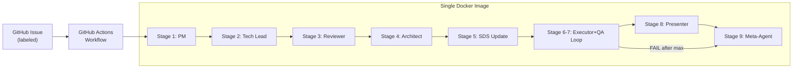

# SDS

## 1. Intro

- **Purpose:** Define implementation details for agents-flow: automated
  multi-agent SDLC pipeline.
- **Rel to SRS:** Implements all FRs from `documents/requirements.md`. Each
  component maps to one or more FRs.

## 2. Arch

- **Diagram:**

- **Subsystems:**
  - **Pipeline Orchestrator**: GitHub Actions workflow + stage shell scripts
  - **Agent Runtime**: Claude Code CLI invocations with role-specific prompts
  - **Artifact Store**: Git-tracked Markdown files in `.sdlc/pipeline/`
  - **Validation Engine**: Stage-specific checks (artifact existence,
    `deno task check`, diff safety)
  - **Continuation Engine**: `--resume` based re-invocation on validation
    failure

## 3. Components

### 3.1 Docker Image

- **Purpose:** Single runtime environment for all stages.
- **Interfaces:** Contains `claude` CLI, `deno`, `git`, `gh`, `gitleaks`.
- **Deps:** Node.js (for claude CLI install), Deno runtime.

### 3.2 Stage Scripts (`.sdlc/scripts/`)

- **Purpose:** Orchestrate each pipeline stage: prepare input, invoke agent,
  validate, continue, commit.
- **Interfaces:**
  - Input: `<issue-number>` as CLI argument.
  - Output: Committed artifacts + logs on feature branch.
- **Deps:** `lib.sh` (shared functions), `claude` CLI, `git`, `gh`.

### 3.3 Shared Library (`.sdlc/scripts/lib.sh`)

- **Purpose:** Common functions for all stage scripts.
- **Interfaces:** Functions: `log()`, `run_agent()`, `validate_artifact()`,
  `continuation_loop()`, `commit_artifacts()`, `report_status()`,
  `safety_check_diff()`, `retry_with_backoff()`.
  - `retry_with_backoff()`: Generic retry wrapper for external CLI calls
    (`claude`, `gh`). Max 3 attempts, 5s initial delay, 2x backoff. Retries on
    non-zero exit (network/rate-limit errors). Does not retry validation
    failures.
- **Deps:** `claude` CLI, `git`, `gh`.

### 3.4 Agent Prompts (`.sdlc/agents/`)

- **Purpose:** Versioned system prompts defining each agent's role and behavior.
- **Interfaces:** Markdown files consumed by `claude --system-prompt`.
- **Deps:** None (static content, versioned in git).

### 3.5 GitHub Actions Workflow

- **Purpose:** Trigger pipeline on issue label, run stages sequentially.
- **Interfaces:** `issues.labeled` event trigger. Sequential jobs using same
  Docker image.
- **Deps:** Docker image, GitHub secrets (API keys).

## 4. Data

- **Entities:**
  - Handoff Artifact: Structured Markdown (01-spec.md through 07-meta-report.md)
  - Agent Log: Full session transcript (`.sdlc/pipeline/<issue>/logs/`)
  - Agent Prompt: System prompt Markdown (`.sdlc/agents/<role>.md`)
- **ERD:** N/A (file-based, no database).
- **Migration:** N/A.

### 4.1 Inter-Stage Data Flow

- **Mechanism:** Filesystem-based. Each agent reads input files directly from
  `.sdlc/pipeline/<issue>/` and `documents/`. No manifest or registry.
- **Validation:** Stage scripts validate output artifacts (exist, non-empty)
  before committing. Agent is responsible for producing correct artifacts;
  script is responsible for verifying they exist.
- **Context management:** Claude CLI auto-compression handles large input sets.
  No manual context window management needed.

### 4.2 Commit Strategy

- **Branch:** All work on `agent/<issue-number>`. Created at Stage 1 start,
  reused on re-run.
- **Commit cadence:** One commit + push per successful stage.
- **Commit format:** `sdlc(<role>): <issue-number> — <description>`.
- **Commit scope:** Stage artifact(s) + updated project docs (if any) + stage
  log.
- **Failure behavior:** Failed stages (after exhausting continuations) produce
  no commits. Failure reported on issue via `gh`.
- **Branch lifecycle:** Created -> stages commit sequentially -> PR created by
  Presenter -> merged to `main`.

## 5. Logic

- **Algos:**
  - **Continuation Loop**: invoke agent -> validate -> if fail: resume with
    error context -> repeat (max N). If limit reached: fail stage, trigger
    Meta-Agent.
  - **Executor+QA Loop**: Executor implements -> QA verifies -> if FAIL:
    Executor reads QA report, fixes -> repeat (max 3).
  - **Diff Safety Check**: After Executor exit, check `git diff` for
    out-of-scope modifications, unauthorized deletions, secret patterns.
  - **Meta-Agent Trigger**: GHA Meta-Agent job uses `if: always()` +
    `needs: [all-stage-jobs]`. On failure: reads `SDLC_FAILED_STAGE` from
    upstream job outputs to identify failed stage. Runs
    `stage-9-meta-agent.sh` with failure context.
- **Rules:**
  - Artifacts overwritten on re-run (git history preserves previous).
  - QA iteration numbering restarts on re-run.
  - Meta-Agent runs on both success and failure.
  - Meta-Agent auto-applies prompt improvements to `.sdlc/agents/*.md` and
    commits changes. Human review at PR merge.

## 6. Non-Functional

- **Scale:** Single pipeline per issue. Sequential stages (no parallel agents).
- **Fault:** Stage failure stops pipeline, Meta-Agent analyzes, failure reported
  on issue.
- **Sec:** Diff-based safety checks. No elevated permissions beyond CI runner.
- **Logs:** Full transcripts per stage in `.sdlc/pipeline/<issue>/logs/`.

## 7. Constraints

- **Simplified:** Pipeline runs sequentially (no parallel stages in v1).
- **Deferred:** Multi-repo support. Parallel pipelines for multiple issues.
  Issue size/complexity limits. Cost tracking and budget limits.
