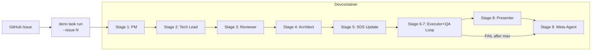
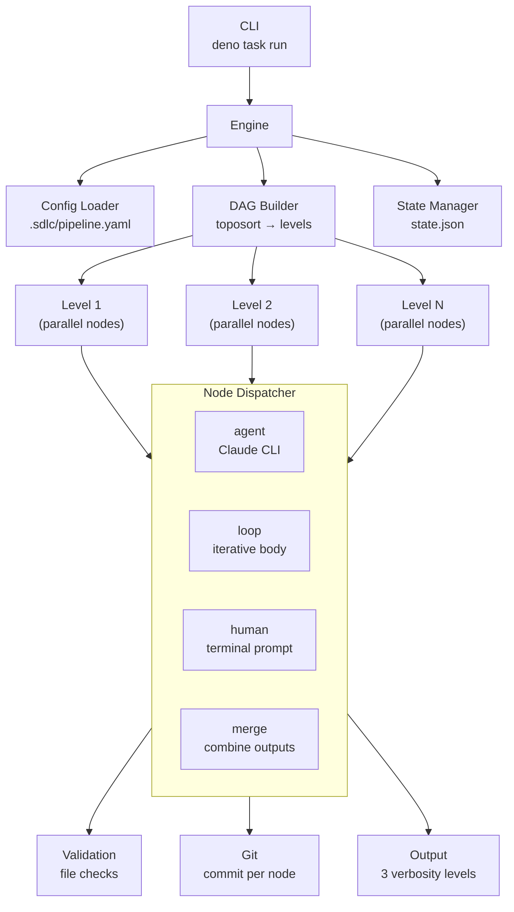

# SDS

## 1. Intro

- **Purpose:** Define implementation details for auto-flow: automated
  multi-agent SDLC pipeline.
- **Rel to SRS:** Implements all FRs from `documents/requirements.md`. Each
  component maps to one or more FRs.

## 2. Arch

- **Diagrams:**

### 2.1 Legacy: Shell Script Pipeline

### 2.2 Current: Configurable Node Engine (Deno/TypeScript)

- **Subsystems:**
  - **Pipeline Engine** (`.sdlc/engine/`): Deno/TypeScript DAG-based executor
    with YAML config, template interpolation, parallel levels, loop nodes,
    human nodes, resume support
  - **Agent Runtime**: Claude Code CLI invocations with role-specific prompts
  - **Artifact Store**: Git-tracked files in `.sdlc/runs/<run-id>/<node-id>/`
  - **Validation Engine**: Rule-based checks (file_exists, file_not_empty,
    contains_section, custom_script)
  - **Continuation Engine**: `--resume` based re-invocation on validation
    failure
  - **Legacy Shell Scripts** (`.sdlc/scripts/`): Preserved for backward
    compatibility, superseded by engine

## 3. Components

### 3.1 Docker Image

- **Purpose:** Single runtime environment for all stages.
- **Interfaces:** Contains `claude` CLI, `deno`, `git`, `gh`, `gitleaks`.
- **Deps:** Node.js (for claude CLI install), Deno runtime.

### 3.2 Stage Scripts (`.sdlc/scripts/`)

- **Purpose:** Orchestrate each pipeline stage: prepare input, invoke agent,
  validate, continue, commit.
- **Interfaces:**
  - Input: `<issue-number>` as CLI argument.
  - Output: Committed artifacts + logs on feature branch.
- **Deps:** `lib.sh` (shared functions), `claude` CLI, `git`, `gh`.

### 3.3 Shared Library (`.sdlc/scripts/lib.sh`)

- **Purpose:** Common functions for all stage scripts.
- **Interfaces:** Functions: `log()`, `run_agent()`, `validate_artifact()`,
  `continuation_loop()`, `commit_artifacts()`, `report_status()`,
  `safety_check_diff()`, `retry_with_backoff()`.
  - `retry_with_backoff()`: Generic retry wrapper for external CLI calls
    (`claude`, `gh`). Max 3 attempts, 5s initial delay, 2x backoff. Retries on
    non-zero exit (network/rate-limit errors). Does not retry validation
    failures.
- **Deps:** `claude` CLI, `git`, `gh`.

### 3.4 Agent Prompts (`.sdlc/agents/`)

- **Purpose:** Versioned system prompts defining each agent's role and behavior.
- **Interfaces:** Markdown files consumed by `claude --system-prompt`.
- **Deps:** None (static content, versioned in git).

### 3.5 Pipeline Engine (`.sdlc/engine/`)

- **Purpose:** Configurable DAG-based pipeline executor. Replaces hardcoded
  shell script orchestration with YAML-driven node graph.
- **Modules:**
  - `types.ts` — type declarations
  - `template.ts` — `{{var}}` interpolation for prompts/paths
  - `config.ts` — YAML parsing, schema validation, defaults merge
  - `dag.ts` — topological sort, cycle detection, level grouping
  - `validate.ts` — artifact validation rules (file_exists, not_empty, etc.)
  - `state.ts` — RunState persistence to `state.json`, resume logic
  - `agent.ts` — Claude CLI invocation, continuation loop, retry
  - `loop.ts` — loop node execution with condition extraction
  - `human.ts` — terminal user input, abort logic
  - `git.ts` — commit per node, diff safety checks
  - `output.ts` — terminal output manager (quiet/normal/verbose), verbose
    methods for detailed agent-node diagnostics
  - `engine.ts` — main executor: level iteration, parallel dispatch, verbose
    input resolution
  - `cli.ts` — CLI entry point: argument parsing, .env loading
  - `mod.ts` — public API re-exports
- **Interfaces:**
  - CLI: `deno task run:{issue|text|file} <arg> [--config <path>] [--resume <run-id>]
    [--dry-run] [-v|-q] [--env KEY=VAL] [--skip nodes] [--only nodes]`
  - Config: `.sdlc/pipeline.yaml` (YAML, version "1")
  - State: `.sdlc/runs/<run-id>/state.json` (JSON)
- **Node types:** `agent`, `merge`, `loop`, `human`
- **Verbose Output (Direct Injection pattern):**
  - `output.ts` exposes 6 verbose-guarded methods on `OutputManager`:
    `verbosePrompt(prompt)`, `verboseInputs(inputs: {path, sizeBytes}[])`,
    `verboseValidation(results: ValidationResult[])`,
    `verboseContinuation(attempt, max, failures)`,
    `verboseSafety(files, violations)`, `verboseCommit(files, message, branch)`.
    All no-op when `verbosity !== "verbose"`. Output: human-readable stderr with
    section headers.
  - `agent.ts`: `AgentRunOptions` gains optional `output?: OutputManager`.
    `runAgent()` calls `verbosePrompt()` after prompt construction,
    `verboseValidation()` after validation, `verboseContinuation()` at resume
    trigger. Guarded by `if (output)`.
  - `loop.ts`: `LoopRunOptions` gains optional `output?: OutputManager`.
    Forwarded to `runAgent()`. Single parameter, no callback chains.
  - `git.ts`: `commitNodeChanges()` gains optional `output?: OutputManager`.
    Resolves staged files via `git diff --cached --name-only` before commit.
    Returns enriched `CommitResult` with `filesStaged: string[]` and
    `message: string`. Calls `verboseCommit()` after successful commit.
    `safetyCheckDiff()` gains optional `output?: OutputManager`. Returns
    enriched `SafetyCheckResult` with `checkedFiles: string[]`. Calls
    `verboseSafety()` before returning.
  - `engine.ts`: `executeAgentNode()` resolves input artifact paths+sizes by
    walking `ctx.input` directories; calls `this.output.verboseInputs()` before
    `runAgent()`. Passes `this.output` to `runAgent()`, `safetyCheckDiff()`,
    `commitNodeChanges()`. Sequencing: inputs → agent (prompt/validation/
    continuation verbose) → safety (verbose) → commit (verbose).
  - All existing callers pass no `output` arg — zero behavioral change.
- **Deps:** `claude` CLI, `deno`, `git`, `jsr:@std/yaml`.

### 3.6 Pipeline Trigger (Legacy)

- **Purpose:** Trigger pipeline on issue number, run stages sequentially.
- **Interfaces:** CLI: `deno task run:issue <N>`. Fetches issue via `gh`.
- **Deps:** Devcontainer, Claude CLI auth (OAuth or API key), `GITHUB_TOKEN`.

## 4. Data

- **Entities:**
  - Handoff Artifact: Structured Markdown (01-spec.md through 07-meta-report.md)
  - Agent Log: Claude CLI JSON output (`.sdlc/runs/<run-id>/logs/<node-id>.json`)
  - Agent Prompt: System prompt Markdown (`.sdlc/agents/<role>.md`)
  - Run State: JSON (`.sdlc/runs/<run-id>/state.json`)
  - Pipeline Config: YAML (`.sdlc/pipeline.yaml`)
  - CommitResult: `{ commitHash, filesStaged: string[], message: string }`
    (enriched for verbose output)
  - SafetyCheckResult: `{ violations[], checkedFiles: string[] }` (enriched for
    verbose output)
- **ERD:** N/A (file-based, no database).
- **Migration:** N/A.

### 4.1 Inter-Node Data Flow

- **Mechanism:** Filesystem-based. Each node reads input via `{{input.<node-id>}}`
  template variable pointing to predecessor's output directory. No manifest.
- **Directory structure:** `.sdlc/runs/<run-id>/<node-id>/` per node output.
- **Validation:** Engine validates output via configurable rules (file_exists,
  file_not_empty, contains_section, custom_script) after each node.
- **Context management:** Claude CLI auto-compression handles large input sets.
- **Template variables:** `{{node_dir}}`, `{{input.*}}`, `{{run_dir}}`,
  `{{run_id}}`, `{{args.*}}`, `{{env.*}}`, `{{loop.iteration}}`.

### 4.2 Commit Strategy

- **Branch:** Feature branch, specified externally or current branch.
- **Commit cadence:** Engine commits after each successful node.
- **Commit format:** `sdlc(<node-id>): <run-id> — <node label>`.
- **Commit scope:** All changes since last commit (node output + modified docs).
- **Failure behavior:** Failed nodes produce no commits. On_error: "fail" stops
  pipeline; "continue" proceeds to next nodes.
- **Resume:** `--resume <run-id>` skips completed nodes per state.json.

## 5. Logic

- **Algos:**
  - **Continuation Loop**: invoke agent -> validate -> if fail: resume with
    error context -> repeat (max N). If limit reached: fail stage, trigger
    Meta-Agent.
  - **Executor+QA Loop**: Executor implements -> QA verifies -> if FAIL:
    Executor reads QA report, fixes -> repeat (max 3).
  - **Diff Safety Check**: After Executor exit, check `git diff` for
    out-of-scope modifications, unauthorized deletions, secret patterns.
  - **Verbose Output Flow** (`-v` mode, agent nodes only): In
    `executeAgentNode()`: (1) resolve input artifact file paths+sizes from
    `ctx.input` dirs → `verboseInputs()`, (2) `runAgent()` emits
    `verbosePrompt()` → Claude CLI executes → `verboseValidation()` → on
    failure: `verboseContinuation()` → retry, (3) `safetyCheckDiff()` →
    `verboseSafety()`, (4) `commitNodeChanges()` → `verboseCommit()`. All
    verbose methods guarded by `verbosity !== "verbose"` — no-op in
    default/quiet. Output: human-readable stderr lines with section headers.
  - **Meta-Agent Trigger**: Engine executes meta-agent as last DAG node
    (`run_always: true`). On failure: reads failed node ID from `state.json`.
    Runs meta-agent with failure context.
- **Rules:**
  - Artifacts overwritten on re-run (git history preserves previous).
  - QA iteration numbering restarts on re-run.
  - Meta-Agent runs on both success and failure.
  - Meta-Agent auto-applies prompt improvements to `.sdlc/agents/*.md` and
    commits changes. Human review at PR merge.

## 6. Non-Functional

- **Scale:** Single pipeline per issue. Sequential stages (no parallel agents).
- **Fault:** Stage failure stops pipeline, Meta-Agent analyzes, failure reported
  on issue.
- **Sec:** Diff-based safety checks. Agents run with local user's permissions.
- **Logs:** Full transcripts per stage in `.sdlc/runs/<run-id>/logs/`.

## 7. Constraints

- **Simplified:** Pipeline runs sequentially (no parallel stages in v1).
- **Deferred:** Multi-repo support. Parallel pipelines for multiple issues.
  Issue size/complexity limits. Cost tracking and budget limits.
